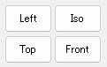
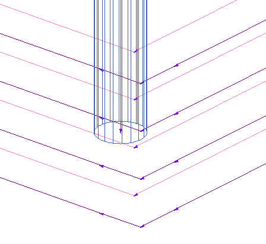
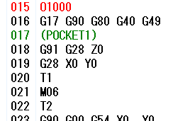

# NcViewer Manual

- 概要：2022/06/12
    1. 製品購入後の推奨使用方法の展開、周知

---

- 本文：2022/06/12、記述開始

- 目次

- [1. ソフトウェア概要、使用用途](#1-ソフトウェア概要使用用途)
    - [1.1. NCプログラムで検証可能な種類](#11-ncプログラムで検証可能な種類)
    - [1.2. 概要](#12-概要)
    - [1.3. 動作環境（基本PCスペック）](#13-動作環境基本pcスペック)
    - [1.4. 基本仕様](#14-基本仕様)
    - [1.5. サポートＮＣコード](#15-サポートｎｃコード)
    - [1.6. 起動時のオプション](#16-起動時のオプション)
    - [1.7. インストール](#17-インストール)
    - [1.8. 起動](#18-起動)
    - [1.9. 終了](#19-終了)
    - [1.10. アンインストール](#110-アンインストール)
- [2. 画面構成、基本操作](#2-画面構成基本操作)
    - [2.1. 起動画面、構成](#21-起動画面構成)
        - [2.1.1. メニューバー](#211-メニューバー)
            - [2.1.1.1. ファイル](#2111-ファイル)
            - [2.1.1.2. 編集](#2112-編集)
            - [2.1.1.3. 表示](#2113-表示)
            - [2.1.1.4. トレース](#2114-トレース)
            - [2.1.1.5. ウィンドウ](#2115-ウィンドウ)
            - [2.1.1.6. ヘルプ](#2116-ヘルプ)
        - [2.1.2. ツールバー](#212-ツールバー)
            - [2.1.2.1. 標準](#2121-標準)
            - [2.1.2.2. 設定](#2122-設定)
            - [2.1.2.3. ビュー](#2123-ビュー)
            - [2.1.2.4. 表示](#2124-表示)
            - [2.1.2.5. トレース](#2125-トレース)
            - [2.1.2.6. 操作](#2126-操作)
            - [2.1.2.7. お気に入り](#2127-お気に入り)
        - [2.1.3. レジスタリスト](#213-レジスタリスト)
        - [2.1.4. 検索バー](#214-検索バー)
        - [2.1.5. ＮＣリスト](#215-ｎｃリスト)
        - [2.1.6. レポート](#216-レポート)
        - [2.1.7. ビュー](#217-ビュー)
        - [2.1.8. 表示フィルタ](#218-表示フィルタ)
        - [2.1.9. ステータスバー](#219-ステータスバー)
    - [2.2. 基本操作、事前準備](#22-基本操作事前準備)
        - [2.2.1. マウス](#221-マウス)
            - [2.2.1.1. ビュー操作](#2211-ビュー操作)
            - [2.2.1.2. 共通操作](#2212-共通操作)
            - [2.2.1.3. コンテキストメニュー](#2213-コンテキストメニュー)
                - [2.2.1.3.1. ツールバー・ステータスバー](#22131-ツールバーステータスバー)
                - [2.2.1.3.2. ＮＣリスト](#22132-ｎｃリスト)
                - [2.2.1.3.3. レポート](#22133-レポート)
                - [2.2.1.3.4. ビュー](#22134-ビュー)
                - [2.2.1.3.5. レジスタリスト・表示フィルタ](#22135-レジスタリスト表示フィルタ)
        - [2.2.2. キーボード](#222-キーボード)
- [3. 基本操作 - 作業別](#3-基本操作---作業別)
    - [3.1. トレース](#31-トレース)
    - [3.2. 計測](#32-計測)
    - [3.3. レポート](#33-レポート)
    - [3.4. 表示フィルタ](#34-表示フィルタ)
- [4. プロパティ（ソフトウェア全体の設定）](#4-プロパティソフトウェア全体の設定)
    - [4.1. 全般](#41-全般)
        - [4.1.1. フォルダ](#411-フォルダ)
        - [4.1.2. 機械データ/リファレンス図形の自動抽出フォーマット](#412-機械データリファレンス図形の自動抽出フォーマット)
    - [4.2. レジスタリスト](#42-レジスタリスト)
    - [4.3. ＮＣリスト](#43-ｎｃリスト)
        - [4.3.1. ＮＣリスト](#431-ｎｃリスト)
        - [4.3.2. オプション](#432-オプション)
        - [4.3.3. タブ項目の位置](#433-タブ項目の位置)
    - [4.4. 表示フィルタ](#44-表示フィルタ)
        - [4.4.1. 表示フィルタ](#441-表示フィルタ)
        - [4.4.2. フローティング](#442-フローティング)
    - [4.5. ツールパス](#45-ツールパス)
        - [4.5.1. Ｇコード](#451-ｇコード)
            - [4.5.1.1. Ｇコード](#4511-ｇコード)
        - [4.5.2. ワイヤー](#452-ワイヤー)
            - [4.5.2.1. ワイヤーＵＶ/ベクトル](#4521-ワイヤーｕｖベクトル)
        - [4.5.3. 旋盤](#453-旋盤)
            - [4.5.3.1. 旋盤 補助ベクトル](#4531-旋盤-補助ベクトル)
            - [4.5.3.2. Ｇコード](#4532-ｇコード)
            - [4.5.3.3. その他](#4533-その他)
        - [4.5.4. リファレンス図形](#454-リファレンス図形)
            - [4.5.4.1. リファレンス図形](#4541-リファレンス図形)
        - [4.5.5. グリッド](#455-グリッド)
            - [4.5.5.1. グリッド](#4551-グリッド)
        - [4.5.6. ワーク矩形](#456-ワーク矩形)
            - [4.5.6.1. ワーク矩形](#4561-ワーク矩形)
        - [4.5.7. ビュー属性](#457-ビュー属性)
            - [4.5.7.1. ビュー属性](#4571-ビュー属性)
        - [4.5.8. レイアウト](#458-レイアウト)
            - [4.5.8.1. レイアウト](#4581-レイアウト)
            - [4.5.8.2. グリッド座標の表示位置](#4582-グリッド座標の表示位置)
            - [4.5.8.3. タブ項目の位置](#4583-タブ項目の位置)
        - [4.5.9. オペレーション](#459-オペレーション)
            - [4.5.9.1. オペレーション](#4591-オペレーション)
            - [4.5.9.2. その他](#4592-その他)
    - [4.6. トレース](#46-トレース)
        - [4.6.1. トレースウェイト](#461-トレースウェイト)
        - [4.6.2. トレースオプション](#462-トレースオプション)
    - [4.7. ナビゲーション](#47-ナビゲーション)
        - [4.7.1. 表示する情報](#471-表示する情報)
        - [4.7.2. 表示する座標系](#472-表示する座標系)
        - [4.7.3. 表示する位置](#473-表示する位置)
        - [4.7.4. オプション](#474-オプション)
    - [4.8. 外部アプリ](#48-外部アプリ)
        - [4.8.1. 編集用エディタの指定](#481-編集用エディタの指定)
        - [4.8.2. アプリケーションリスト](#482-アプリケーションリスト)
    - [4.9. オプション](#49-オプション)
        - [4.9.1. ファイル履歴の削除](#491-ファイル履歴の削除)
        - [4.9.2. DXF出力](#492-dxf出力)
        - [4.9.3. オプション](#493-オプション)
- [5. 機械のプロパティ（機械設定：基本・初期値）](#5-機械のプロパティ機械設定基本初期値)
    - [5.1. 機械種別](#51-機械種別)
        - [5.1.1. 機械種別](#511-機械種別)
        - [5.1.2. ファイル設定](#512-ファイル設定)
    - [5.2. 機能コード](#52-機能コード)
    - [5.3. アドレス文字](#53-アドレス文字)
    - [5.4. 置換文字列](#54-置換文字列)
    - [5.5. ミル/旋盤](#55-ミル旋盤)
    - [5.6. ワイヤー](#56-ワイヤー)
    - [5.7. パラメータ](#57-パラメータ)
    - [5.8. スケール](#58-スケール)
    - [5.9. ワーク座標系](#59-ワーク座標系)
    - [5.10. 径補正](#510-径補正)
    - [5.11. 有効範囲](#511-有効範囲)
    - [5.12. ワーニング](#512-ワーニング)
    - [5.13. 時間計算](#513-時間計算)
    - [5.14. オプション](#514-オプション)
- [6. 工具のプロパティ（工具設定）](#6-工具のプロパティ工具設定)
    - [6.1. 工具番号（ミル・旋盤）](#61-工具番号ミル旋盤)
    - [6.2. 電気条件番号（ワイヤー）](#62-電気条件番号ワイヤー)
    - [6.3. 径補正番号（ミル・旋盤・ワイヤー）](#63-径補正番号ミル旋盤ワイヤー)
    - [6.4. 長補正番号（ミル）](#64-長補正番号ミル)
    - [6.5. オプション（ミル・旋盤・ワイヤー）](#65-オプションミル旋盤ワイヤー)
- [7. 作業別操作](#7-作業別操作)
    - [7.1. 印刷をする](#71-印刷をする)
    - [7.2. 各ファイルをエクスポートする（dxf、nc、csv、Log）](#72-各ファイルをエクスポートするdxfnccsvlog)
    - [7.3. 機械へデータの送信をする（NcLinker）](#73-機械へデータの送信をするnclinker)
    - [7.4. 図面ファイルを読み込む](#74-図面ファイルを読み込む)
        - [7.4.1. ファイルの読み込み仕様](#741-ファイルの読み込み仕様)
- [8. 機械・工具設定（機械のプロパティ：応用、使用例）](#8-機械工具設定機械のプロパティ応用使用例)
    - [8.1. コメント解析 - プロパティ](#81-コメント解析---プロパティ)
    - [8.2. コメント解析 - 機械のプロパティ](#82-コメント解析---機械のプロパティ)
    - [8.3. コメント解析 - 工具のプロパティ](#83-コメント解析---工具のプロパティ)
- [9. 応用操作 - 作業別・よくある質問（問合せ）](#9-応用操作---作業別よくある質問問合せ)
    - [9.1. 正しくＮＣプログラムを認識させるには１](#91-正しくｎｃプログラムを認識させるには１)
    - [9.2. 正しくＮＣプログラムを認識させるには２](#92-正しくｎｃプログラムを認識させるには２)
    - [9.3. シミュレーションの有効活用](#93-シミュレーションの有効活用)
    - [9.4. NCプログラム読み込み時の解析エラーメッセージの確認](#94-ncプログラム読み込み時の解析エラーメッセージの確認)
    - [9.5. よくある質問リスト](#95-よくある質問リスト)
        - [9.5.1. 問合せランキング](#951-問合せランキング)
        - [9.5.2. ピックアップ](#952-ピックアップ)
- [10. 詳細情報（既存製品ヘルプ情報抜粋）](#10-詳細情報既存製品ヘルプ情報抜粋)
    - [10.1. 基本仕様](#101-基本仕様)
    - [10.2. サポートＮＣコード](#102-サポートｎｃコード)
    - [10.3. 起動時オプション](#103-起動時オプション)
    - [10.4. バージョンアップ履歴](#104-バージョンアップ履歴)
        - [10.4.1. Version 5.71 (2021/09/28)](#1041-version-571-20210928)
        - [10.4.2. Version 5.70 (2021/04/12)](#1042-version-570-20210412)
        - [10.4.3. Version 5.60 (2020/10/19)](#1043-version-560-20201019)
        - [10.4.4. Version 5.51 (2020/02/27)](#1044-version-551-20200227)
        - [10.4.5. Version 5.50 (2019/10/29)](#1045-version-550-20191029)
        - [10.4.6. Version 5.42 (2019/06/27)](#1046-version-542-20190627)
        - [10.4.7. Version 5.41 (2019/03/22)](#1047-version-541-20190322)
        - [10.4.8. Version 5.40 (2018/10/29)](#1048-version-540-20181029)
        - [10.4.9. Version 5.30 (2018/06/20)](#1049-version-530-20180620)
        - [10.4.10. Version 5.23 (2017/06/20)](#10410-version-523-20170620)
        - [10.4.11. Version 5.22 (2016/10/27)](#10411-version-522-20161027)
        - [10.4.12. Version 5.21 (2016/09/07)](#10412-version-521-20160907)
        - [10.4.13. Version 5.20 (2016/05/12)](#10413-version-520-20160512)
        - [10.4.14. Version 5.12 (2016/02/25)](#10414-version-512-20160225)
        - [10.4.15. Version 5.11 (2016/01/12)](#10415-version-511-20160112)
        - [10.4.16. Version 5.10 (2015/11/26)](#10416-version-510-20151126)
        - [10.4.17. Version 5.00 (2015/08/20)](#10417-version-500-20150820)
        - [10.4.18. Version 4.87 (2015/04/16)](#10418-version-487-20150416)
        - [10.4.19. Version 4.86 (2015/01/15)](#10419-version-486-20150115)
        - [10.4.20. Version 4.85 (2014/09/18)](#10420-version-485-20140918)
        - [10.4.21. Version 4.84 (2014/06/26)](#10421-version-484-20140626)
        - [10.4.22. Version 4.83 (2014/05/15)](#10422-version-483-20140515)
        - [10.4.23. Version 4.82 (2014/01/15)](#10423-version-482-20140115)
        - [10.4.24. Version 4.81 (2013/08/28)](#10424-version-481-20130828)
        - [10.4.25. Version 4.80 (2013/05/08)](#10425-version-480-20130508)
        - [10.4.26. Version 4.74 (2013/02/20)](#10426-version-474-20130220)
        - [10.4.27. Version 4.73 (2013/01/23)](#10427-version-473-20130123)
        - [10.4.28. Version 4.72 (2012/12/12)](#10428-version-472-20121212)
        - [10.4.29. Version 4.71 (2012/11/14)](#10429-version-471-20121114)
        - [10.4.30. Version 4.70 (2012/10/24)](#10430-version-470-20121024)
        - [10.4.31. Version 4.60 (2012/08/01)](#10431-version-460-20120801)
        - [10.4.32. Version 4.54 (2012/05/16)](#10432-version-454-20120516)
        - [10.4.33. Version 4.53 (2012/04/18)](#10433-version-453-20120418)
        - [10.4.34. Version 4.52 (2012/03/21)](#10434-version-452-20120321)
        - [10.4.35. Version 4.51 (2012/02/22)](#10435-version-451-20120222)
        - [10.4.36. Version 4.50 (2012/01/12)](#10436-version-450-20120112)
        - [10.4.37. Version 4.40 (2011/11/16)](#10437-version-440-20111116)
        - [10.4.38. Version 4.31 (2011/07/13)](#10438-version-431-20110713)
        - [10.4.39. Version 4.30 (2011/05/18)](#10439-version-430-20110518)
        - [10.4.40. Version 4.20 (2011/03/16)](#10440-version-420-20110316)
        - [10.4.41. Version 4.12 (2010/11/17)](#10441-version-412-20101117)
        - [10.4.42. Version 4.11 (2010/10/13)](#10442-version-411-20101013)
        - [10.4.43. Version 4.10 (2010/09/09)](#10443-version-410-20100909)
        - [10.4.44. Version 4.00 (2010/07/07)](#10444-version-400-20100707)
        - [10.4.45. Version 3.93 (2010/03/23)](#10445-version-393-20100323)
        - [10.4.46. Version 3.92 (2010/02/01)](#10446-version-392-20100201)
        - [10.4.47. Version 3.91 (2009/12/17)](#10447-version-391-20091217)
        - [10.4.48. Version 3.90 (2009/10/22)](#10448-version-390-20091022)
        - [10.4.49. Version 3.81 (2009/06/08)](#10449-version-381-20090608)
        - [10.4.50. Version 3.80 (2009/04/06)](#10450-version-380-20090406)
        - [10.4.51. Version 3.71 (2009/01/19)](#10451-version-371-20090119)
        - [10.4.52. Version 3.70 (2008/11/10)](#10452-version-370-20081110)
        - [10.4.53. Version 3.62 (2008/08/04)](#10453-version-362-20080804)
        - [10.4.54. Version 3.61 (2008/07/11)](#10454-version-361-20080711)
        - [10.4.55. Version 3.60 (2008/06/20)](#10455-version-360-20080620)
        - [10.4.56. Version 3.55 (2008/02/04)](#10456-version-355-20080204)
        - [10.4.57. Version 3.54 (2007/11/22)](#10457-version-354-20071122)
        - [10.4.58. Version 3.53 (2007/10/26)](#10458-version-353-20071026)
        - [10.4.59. Version 3.52 (2007/10/15)](#10459-version-352-20071015)
        - [10.4.60. Version 3.51 (2007/09/28)](#10460-version-351-20070928)
        - [10.4.61. Version 3.50 (2007/09/20)](#10461-version-350-20070920)
        - [10.4.62. Version 3.45 (2007/06/14)](#10462-version-345-20070614)
        - [10.4.63. Version 3.44 (2007/06/04)](#10463-version-344-20070604)
        - [10.4.64. Version 3.43 (2007/05/25)](#10464-version-343-20070525)
        - [10.4.65. Version 3.42 (2007/04/24)](#10465-version-342-20070424)
        - [10.4.66. Version 3.41 (2007/04/06)](#10466-version-341-20070406)
        - [10.4.67. Version 3.40 (2007/04/02)](#10467-version-340-20070402)
        - [10.4.68. Version 3.31 (2007/02/26)](#10468-version-331-20070226)
        - [10.4.69. Version 3.30 (2007/02/01)](#10469-version-330-20070201)
        - [10.4.70. Version 3.21 (2006/12/15)](#10470-version-321-20061215)
        - [10.4.71. Version 3.20 (2006/12/08)](#10471-version-320-20061208)
        - [10.4.72. Version 3.10 (2006/11/27)](#10472-version-310-20061127)
        - [10.4.73. Version 3.00 (2006/11/15)](#10473-version-300-20061115)
        - [10.4.74. Version 2.47 (2007/04/02)](#10474-version-247-20070402)
        - [10.4.75. Version 2.46 (2007/02/01)](#10475-version-246-20070201)
        - [10.4.76. Version 2.45 (2006/11/27)](#10476-version-245-20061127)
        - [10.4.77. Version 2.44 (2006/11/15)](#10477-version-244-20061115)
        - [10.4.78. Version 2.43  (2006/10/03)](#10478-version-243--20061003)
        - [10.4.79. Version 2.42  (2006/07/07)](#10479-version-242--20060707)
        - [10.4.80. Version 2.41  (2006/02/22)](#10480-version-241--20060222)
        - [10.4.81. Version 2.40  (2006/02/14)](#10481-version-240--20060214)
        - [10.4.82. Version 2.31  (2005/10/24)](#10482-version-231--20051024)
        - [10.4.83. Version 2.30  (2005/10/20)](#10483-version-230--20051020)
        - [10.4.84. Version 2.24  (2005/07/15)](#10484-version-224--20050715)
        - [10.4.85. Version 2.23  (2005/06/10)](#10485-version-223--20050610)
        - [10.4.86. Version 2.22  (2004/11/26)](#10486-version-222--20041126)
        - [10.4.87. Version 2.21  (2004/10/13)](#10487-version-221--20041013)
        - [10.4.88. Version 2.20  (2004/09/13)](#10488-version-220--20040913)
        - [10.4.89. Version 2.13  (2004/01/28)](#10489-version-213--20040128)
        - [10.4.90. Version 2.12  (2003/12/09)](#10490-version-212--20031209)
        - [10.4.91. Version 2.11  (2003/09/29)](#10491-version-211--20030929)
        - [10.4.92. Version 2.10  (2003/09/25)](#10492-version-210--20030925)
        - [10.4.93. Version 2.01  (2003/06/02)](#10493-version-201--20030602)
        - [10.4.94. Version 2.00  (2002/11/13)](#10494-version-200--20021113)
        - [10.4.95. Version 1.94  (2002/08/05)](#10495-version-194--20020805)
        - [10.4.96. Version 1.93  (2002/07/05)](#10496-version-193--20020705)
        - [10.4.97. Version 1.92  (2002/06/26)](#10497-version-192--20020626)
        - [10.4.98. Version 1.91  (2002/02/01)](#10498-version-191--20020201)
        - [10.4.99. Version 1.90  (2001/11/01)](#10499-version-190--20011101)
        - [10.4.100. Version 1.83  (2001/07/02)](#104100-version-183--20010702)
        - [10.4.101. Version 1.82  (2001/06/01)](#104101-version-182--20010601)
        - [10.4.102. Version 1.81  (2001/04/09)](#104102-version-181--20010409)
        - [10.4.103. Version 1.80  (2001/01/09)](#104103-version-180--20010109)
        - [10.4.104. Version 1.73  (2000/10/05)](#104104-version-173--20001005)
        - [10.4.105. Version 1.72  (2000/10/03)](#104105-version-172--20001003)
        - [10.4.106. Version 1.71  (2000/08/21)](#104106-version-171--20000821)
        - [10.4.107. Version 1.70  (2000/07/25)](#104107-version-170--20000725)
        - [10.4.108. Version 1.63  (2000/05/25)](#104108-version-163--20000525)
        - [10.4.109. Version 1.62  (2000/04/27)](#104109-version-162--20000427)
        - [10.4.110. Version 1.61  (2000/04/14)](#104110-version-161--20000414)
        - [10.4.111. Version 1.60  (2000/03/29)](#104111-version-160--20000329)
        - [10.4.112. Version 1.52  (2000/03/03)](#104112-version-152--20000303)
        - [10.4.113. Version 1.51  (2000/02/24)](#104113-version-151--20000224)
        - [10.4.114. Version 1.50  (2000/02/18)](#104114-version-150--20000218)
        - [10.4.115. Version 1.45  (2000/01/26)](#104115-version-145--20000126)
        - [10.4.116. Version 1.44  (2000/01/25)](#104116-version-144--20000125)
        - [10.4.117. Version 1.43  (2000/01/24)](#104117-version-143--20000124)
        - [10.4.118. Version 1.42  (2000/01/14)](#104118-version-142--20000114)
        - [10.4.119. Version 1.41  (2000/01/12)](#104119-version-141--20000112)
        - [10.4.120. Version 1.40  (1999/12/16)](#104120-version-140--19991216)
        - [10.4.121. Version 1.30  (1999/11/29)](#104121-version-130--19991129)
        - [10.4.122. Version 1.22  (1999/10/25)](#104122-version-122--19991025)
        - [10.4.123. Version 1.21  (1999/10/08)](#104123-version-121--19991008)
        - [10.4.124. Version 1.20  (1999/09/30)](#104124-version-120--19990930)
        - [10.4.125. Version 1.10  (1999/09/14)](#104125-version-110--19990914)
        - [10.4.126. Version 1.00  (1999/06/30)](#104126-version-100--19990630)
        - [10.4.127. ０．９３](#104127-０９３)
        - [10.4.128. ０．９２](#104128-０９２)
        - [10.4.129. ０．９１](#104129-０９１)
        - [10.4.130. ０．９０](#104130-０９０)
        - [10.4.131. ０．８９](#104131-０８９)
        - [10.4.132. ０．８８](#104132-０８８)
        - [10.4.133. ０．８７](#104133-０８７)
        - [10.4.134. ０．８６](#104134-０８６)
        - [10.4.135. ０．８５](#104135-０８５)
        - [10.4.136. ０．８４](#104136-０８４)
        - [10.4.137. ０．８３](#104137-０８３)
        - [10.4.138. ０．８２](#104138-０８２)
        - [10.4.139. ０．８１](#104139-０８１)
        - [10.4.140. ０．８０](#104140-０８０)

## 1. ソフトウェア概要、使用用途

### 1.1. NCプログラムで検証可能な種類

- マシニング（ミル）
    1. 基本３軸：XYZ
     
    1. 回転軸：AB(C)※制限あり
    1. 固定サイクル
- ワイヤー（ワイヤー）
    1. 基本プログラム面：XY(Z)
    1. UV面
    1. テーパー角度
- 旋盤（旋盤）
    1. 基本軸：XZ(Y)
    1. 回転軸：C(AB)※制限あり
    1. 固定サイクル
    1. 旋削サイクル（一部）
- その他（レーザー等）
    1. NCコードに近しい形式

    ※ 上記内容を確認可能なＮＣファイルを作成・用意

### 1.2. 概要

> ＮＣプログラムの事前検証はこれまで以上に重要になっていますが、膨大で複雑なＮＣプログラムを手動で検証するのは不可能に近い状態です。
> 主に、ＣＡＤ／ＣＡＭシステムのツールパス検証では内部データを元にシミュレーションしますので実加工とは異なる場合もあります。
> 「NC Viewer」は実際のＮＣプログラムからダイレクトにシミュレーションしますので、信頼のおける検証が可能となります。
>
> 強力なトレース、ナビゲーション、表示フィルタ、レポート生成などの機能を活用する事により、加工工程全体の効率化につながります。
>
> __主な特徴__
>
> - ミル加工、旋盤加工、ワイヤー加工に対応
> - トレース機能で１ステップ毎の動きを確認
> - ナビゲーション機能でマウス位置のパス情報を確認
> - 表示フィルタ、パス毎の色設定で確認作業が効率アップ
> - ＮＣプログラムのコメントから様々な情報を抽出
> - ＣＡＤ図形の読み込み機能でパスとの照合検査が効率アップ
> - 外部エディタとのシームレスな連動により修正作業が効率アップ
> - 径補正のエラーを事前にチェック

### 1.3. 動作環境（基本PCスペック）

| No  |      項目      |                                                                        内容                                                                        |        備考        |
| --- | -------------- | -------------------------------------------------------------------------------------------------------------------------------------------------- | ------------------ |
| 1   | OS             | 日本語／英語 Windows XP(32bit) Windows Vista(32bit/64bit) Windows 7(32bit/64bit) Windows 8/8.1(32bit/64bit) Windows 10(32bit/64bit) |                    |
| 2   | CPU            | Intel Core 1GHz以上のプロセッサ または互換プロセッサ                                                                                               |                    |
| 3   | メモリ         | 256MB以上                                                                                                                                          |                    |
| 4   | ディスプレイ   | 1024 x 768以上                                                                                                                                     |                    |
| 5   | ハードディスク | 100MB以上の空き容量                                                                                                                                |                    |
| 6   | 入力装置       | マウス，キーボード                                                                                                                                 | ホイール付きを推奨 |
| 7   | 出力装置       | プリンタ：Windows付属、または各メーカー提供のドライバ                                                                                              |                    |
| 8   | ライセンス     | ハードウェアプロテクタのみ                                                                                                                         | USBタイプ          |

### 1.4. 基本仕様

- [基本仕様](#基本仕様)

### 1.5. サポートＮＣコード

- [サポートＮＣコード](#サポートｎｃコード)

### 1.6. 起動時のオプション

- [起動時オプション](#起動時オプション)

### 1.7. インストール

- ＨＰよりダウンロード＆インストールします。
  - [製品版（ＨＰログイン）](http://www.system-i.co.jp/download/downloadlist.asp)
  - [体験版（ＨＰ）](http://www.system-i.co.jp/download/triallist.asp)
  - [体験版（Vector）](https://www.vector.co.jp/vpack/browse/person/an015295.html)
- 購入時提供のＣＤメディアからインストールします。
- インストールウィザードダイアログに沿ってインストールします。

    |  No   |                              手順                               |  No   |                              手順                               |
    | :---: | --------------------------------------------------------------- | :---: | --------------------------------------------------------------- |
    |   1   |  |   2   |  |
    |   3   |  |   4   |  |
    |   5   |  |  5-2  |  |
    |   6   |  |   7   |  |
    |   8   |  |       |                                                                 |

テスト

### 1.8. 起動

- デスクトップショートカットアイコンから起動します。

    

- スタートメニューから起動します。

    

- 実行フォルダのNcViewer.exeから起動します。

    

### 1.9. 終了

- ウインドウ右上の「×」ボタンを押します。
- ファイルメニュー/終了ボタンを選択します。

### 1.10. アンインストール

- インストーラを使用してインストールした場合は、｢アプリケーションの追加と削除｣から削除して下さい。
- インストーラを使用していない場合は、フォルダを削除して下さい。
- ファイルの関連付けなどを行っている場合は、関連付けを手動で解除して下さい。

## 2. 画面構成、基本操作

### 2.1. 起動画面、構成

#### 2.1.1. メニューバー

##### 2.1.1.1. ファイル

| No  |             項目             |                      内容                      |                                              詳細説明                                               | ショートカット |                                                        参考イメージ・リンク                                                        |
| --- | ---------------------------- | ---------------------------------------------- | --------------------------------------------------------------------------------------------------- | -------------- | ---------------------------------------------------------------------------------------------------------------------------------- |
| 1   | 開く                         | NCファイルを選択し開きます。                   | Ctrl、Shiftボタンで複数選択ができます。                                                             | Ctrl+O         |                                                                     |
| 2   | 追加で開く                   | サブプログラム等のNCファイルを選択し開きます。 | Ctrl、Shiftボタンで複数選択ができます。                                                             |                |                                                                     |
| 3   | もう一枚別で開く             | 別ウィンドウでNCファイルを選択し開きます。     | 複数起動が許可の時に有効です。                                                                      |                |                                                                     |
| 4   | 名前を付けて保存             | 指定の形式で保存します。                       | ファイルの種類を選択します。                                                                        |                |                                                                    |
| 4   | 名前を付けて保存             | DXF形式で保存します。                          | NCデータを図面として保存します。 DXFデータは3D座標として出力されます。（XY面の時）               |                |   |
| 5   | 名前を付けて保存             | CSV形式で保存します。                          | NCデータのXYZ座標値をCSV形式で保存します。                                                          |                |                                                                     |
| 6   | 名前を付けて保存             | LOG形式で保存します。                          | レポートの内容を保存します。                                                                        |                |                                                                     |
| 7   | 名前を付けて保存             | NC形式で保存します。                           | 読み込んでいるNCデータを別名で保存します。                                                          |                |                                                                                                                                    |
| 8   | リファレンス図形を開く       | DXFファイルを読み込みます。                    | NCデータとDXFのデータを照合しチェックを行います。[DXFデータとの干渉をチェック](#_)                  |                |                                                                                                                                    |
| 9   | リファレンス図形を追加で開く | DXFファイルを重ねて読み込みます。              | 複数のDXFファイルを同時に読み込みを行えます。[表示フィルタで切り替え](#__)                          |                |                                                                                                                                    |
| 10  | リファレンス図形を閉じる     | DXFファイルの読み込み状態を破棄します。        | 破棄とは別に非表示も可能です。[リファレンス図形の非表示](#__)                                       |                |                                                                                                                                    |
| 11  | 再読み込み                   | NCファイルを再読み込みします。                 | 外部のエディタ等で変更があった時に再読み込み合います。[プロパティ／オプション／確認再読み込み](#__) |                |                                                                                                                                    |
| 12  | ＮＣのレポート               | レポートを別ウィンドウで表示します。           |                                                                                                     |                |                                                                     |
| 13  | 印刷                         | ビューを印刷します。                           | ＮＣリスト/レポートも併せて印刷できます。（１ページ）[印刷](#__)                                    | Ctrl+P         |                                                                     |
| 14  | NC Printで印刷               | NCデータを印刷します。                         | カラー指定、列数指定可 [NC Print](#__)                                                              |                |                                                                     |
| 15  | NC Linkerで送信              | NC LinkerでNCデータを他の機器へ転送します。    | RS232Cの通信機器とNC Linkerが必要です。                                                             |                |                                                                                                                                    |
| 16  | ＮＣデータの履歴             | 読み込んだNCファイル履歴が表示されます。       |                                                                                                     |                |                                                                                                                                    |
| 17  | リファレンス図形の履歴       | 読み込んだDXFファイル履歴が表示されます。      |                                                                                                     |                |                                                                                                                                    |
| 18  | アプリケーションの終了       | NC Viewerを終了します。                        |                                                                                                     |                |                                                                                                                                    |
| 19  | 全て終了                     | 複数のNC Viewerをすべて終了します。            | 複数起動の許可と複数のウインドウを開いている時に有効です。                                          |                |                                                                                                                                    |

##### 2.1.1.2. 編集

| No  |               項目               |                      目的                       |                                                                                                                備考                                                                                                                | ショートカット |
| --- | -------------------------------- | ----------------------------------------------- | ---------------------------------------------------------------------------------------------------------------------------------------------------------------------------------------------------------------------------------- | -------------- |
| 1   | コピー                           | クリップボードにビューをコピーします。          | 分割ビューではアクティブなビューが対象です。                                                                                                                                                                                       | Ctrl+C         |
| 2   | 機械のプロパティ                 | 機械の情報を設定します。                        | 現在選択されている機械名称が右に表示されています。                                                                                                                                                                          |                |
| 3   | 工具のプロパティ                 | 工具の情報を設定します。                        | 現在選択されている工具名称が右に表示されています。                                                                                                                                                                          |                |
| 4   | プロパティ                       | NC Viewerの動作を設定します。                   |                                                                                                                                                                                                                             |                |
| 5   | エディタの呼び出し               | 編集用テキストエディタを起動します。            |                                                                                                                                                                                                                             |                |
| 6   | リファレンス図形との干渉チェック | DXFファイルとNCファイルの干渉をチェックします。 | リファレンス図形の読み込みが必要です。 表示しているリファレンス図形の実線要素を壁とみなしてカッターパスの削り込み検査を行います。 工具径及び径補正値を正しく指定する事によって、より精度の高い削り込み検査が可能になります。 |                |

##### 2.1.1.3. 表示

 

| No  |                 項目                 |                            目的                            |                                                    備考                                                     | ショートカット |
| --- | ------------------------------------ | ---------------------------------------------------------- | ----------------------------------------------------------------------------------------------------------- | -------------- |
| 1   | フィット                             | ビューをフィットします。                                   | アクティブなビューをフィット表示します。                                                                    | Home           |
| 2   | 全てフィット                         | 全てのビューをフィットします。                             | 全てのビューをフィット表示します。                                                                          |                |
| 3   | 拡大                                 | ビューを拡大します。                                       | アクティブなビューをを拡大します。                                                                          | PageUp         |
| 4   | 縮小                                 | ビューを縮小します。                                       | アクティブなビューをを縮小します。                                                                          | PageDown       |
| 5   | 上移動                               | ビューを上移動します。                                     | アクティブなビューをを上移動します。                                                                        | ↑              |
| 6   | 下移動                               | ビューを下移動します。                                     | アクティブなビューをを下移動します。                                                                        | ↓              |
| 7   | 左移動                               | ビューを左移動します。                                     | アクティブなビューをを左移動します。                                                                        | ←              |
| 8   | 右移動                               | ビューを右移動します。                                     | アクティブなビューをを右移動します。                                                                        | →              |
| 9   | 回転設定 - 記憶する                  | 現在の表示状態を記憶します。                               | フィット操作時の正面を設定します。                                                                          |                |
| 10  | 回転設定 - 記憶した状態に戻す        | 回転操作後、記憶状態を表示します。                         | フィット操作時の正面になります。                                                                            |                |
| 11  | 回転設定 - 初期状態に戻す            | 初期状態に戻します。                                       |                                                                                                             |                |
| 12  | ビュー切り替え - Top                 | Top（上面）ビューにします。                                |                                                                                                             |                |
| 13  | ビュー切り替え - Front               | Front（正面）ビューにします。                              |                                                                                                             |                |
| 14  | ビュー切り替え - Left                | Left（左側面）ビューにします。                             |                                                                                                             |                |
| 15  | ビュー切り替え - Iso                 | Iso（アイソメ）ビューにします。                            |                                                                                                             |                |
| 16  | ビュー切り替え - レイアウト１        | ４分割ビューにします。                                     |                                              |                |
| 17  | ビュー切り替え - レイアウト２        | 左分割ニューにします。                                     |                                              |                |
| 18  | ビュー切り替え - レイアウト３        | 右分割ビューにします。                                     |                                              |                |
| 19  | ビュー切り替え - レイアウト４        | 上分割ビューにします。                                     |                                              |                |
| 20  | ビュー切り替え - レイアウト５        | 下分割ビューにします。                                     |                                              |                |
| 21  | 操作切り替え - ２点間計測            | ２点間計測モードにします。                                 |                                                                                                             |                |
| 22  | 操作切り替え - 矩形選択              | 矩形選択モードにします。                                   | Shiftを押しながら矩形で選択するとその範囲がフォーカスされます。 Ctrlを押しながら矩形選択で縮小されます。 |                |
| 23  | 操作切り替え - 拡縮操作              | 拡縮操作モードにします。                                   | キーボードとマウスの認識が各祝モードに切り替わります。                                               |                |
| 24  | 操作切り替え - 移動操作              | 移動操作モードにします。                                   |                                                                                                             |                |
| 25  | 操作切り替え - 回転操作              | 回転操作モードにします。                                   |                                                                                                             |                |
| 26  | 表示フィルタ                         | 表示フィルタウインドウを表示/非表示します。                |                                  |                |
| 27  | 方向矢印                             | NCパスの方向矢印を表示/非表示します。                      |                                              |                |
| 28  | ＵＶベクトル                         | ミルNCのZ方向の動作・ワイヤーNCのUV面を表示/非表示します。 |                                              |                |
| 29  | リファレンス図形                     | リファレンス図形を表示/非表示します。                      | プロパティ/ツールパス/リファレンス図形 と連動しています。                                                   |                |
| 30  | 旋盤バイト形状の表示                 | 旋盤バイトを表示/非表示します。                            | プロパティ/ツールパス/旋盤/旋盤の塗り潰しはバイト形状で行う と連動しています。                              |                |
| 31  | 塗り潰し                             | 工具の塗り潰しを表示/非表示します。                        | プロパティ/ツールパス/Ｇコード/塗り潰し と連動しています。                                                  |                |
| 32  | 縁取り                               | 工具の縁取りを表示/非表示します。                          | プロパティ/ツールパス/Ｇコード/縁取り と連動しています。                                                    |                |
| 33  | トレース元パスの表示                 | トレース時の元パスを表示/非表示します。                    | プロパティ/ツールパス/ビュー属性/トレース元パス色 と連動しています。                                        |                |
| 34  | 干渉／ワーニング箇所のハイライト表示 | ＮＣリスト/ビューで干渉を表示/非表示します。               | リファレンス図形読み込み、干渉のチェック後に有効です。                                                      |                |
| 35  | 情報表示 - 工具番号                  | ビューのツールパスに工具番号を表示/非表示します。          | ワイヤーは電気条件番号です。                                                                                | Shift+T        |
| 36  | 情報表示 - 径補正番号                | ビューのツールパスに径補正番号を表示/非表示します。        |                                                                                                             | Shift-D        |
| 37  | 情報表示 - 長補正番号                | ビューのツールパスに長補正番号を表示/非表示します。        | ミーリングで有効です。                                                                                      | Shift+H        |
| 38  | 情報表示 - 送り                      | ビューのツールパスに送りを表示/非表示します。              |                                                                                                             | Shift+F        |
| 39  | 情報表示 - 回転                      | ビューのツールパスに回転を表示/非表示します。              | ミーリングで有効です。                                                                                      | Shift+S        |
| 40  | 情報表示 - テーパー角                | テーパー角を表示/非表示します。                            | ワイヤーで有効です。                                                                                        | SHIFT+A        |
| 41  | ツールバー                           | 各ツールバーを表示/非表示します。                          |                                                                                                             |                |
| 42  | メニューバー                         | メニューバーを表示/非表示します。                          |                                                                                                             | Shift+F1       |
| 43  | ＮＣリスト                           | ＮＣリストを表示/非表示します。                            |                                                                                                             | Shift+F2       |
| 44  | ステータスバー                       | ステータスバーを表示/非表示します。                        |                                                                                                             | SHIFT+F3       |

##### 2.1.1.4. トレース

 
| No  |             項目              |                  目的                   | 備考 | ショートカット |
| --- | ----------------------------- | --------------------------------------- | ---- | -------------- |
| 1   | 実行                          | トレースを実行します。                  |      | F5             |
| 2   | ステップ実行/一時停止         | トレースを１行づつ進む/一時停止します。 |      | F8、Space      |
| 3   | トレースの中断                | トレースを終了します。                  |      |                |
| 4   | トレース速度 - 高速           | トレースの速度を高速にします。          |      | F2             |
| 5   | トレース速度 - 中高速         | トレースの速度を中高速にします。        |      |                |
| 6   | トレース速度 - 標準           | トレースの速度を標準にします。          |      | F3             |
| 7   | トレース速度 - 中低速         | トレースの速度を中低速にします。        |      |                |
| 8   | トレース速度 - 低速           | トレースの速度を低速にします。          |      | F4             |
| 9   | ブレイクポイントのOn/Wait/Off | ＮＣリストの選択行に停止を指定します。  |      | F9             |
| 10  | ブレイクポイントの全解除      | 指定したブレイクを解除します。          |      | F6             |
| 11  | ブレイクポイントの全一時解除  | 指定したブレイクを一時的に解除します。  |      |                |

##### 2.1.1.5. ウィンドウ

 
| No  |       項目       |                        目的                         | 備考 | ショートカット |
| --- | ---------------- | --------------------------------------------------- | ---- | -------------- |
| 1   | 常に手前に表示   | 他のアプリより常に手前に表示します。                |      |                |
| 2   | 重ねて表示       | 複数のNC Viewerを重ねて表示します。                 |      |                |
| 3   | 上下に並べて表示 | 複数のNC Viewerをモニターで上下で並べて表示します。 |      |                |
| 4   | 左右に並べて表示 | 複数のNC Viewerをモニターで左右で並べて表示します。 |      |                |
| 5   | 全て最小化       | タスクバーに最小化します。                          |      |                |
| 6   | 全て復元         | 最小化・最大化したウインドウを元の表示に戻します。  |      |                |
| 7   | リスト           |                                                     |      |                |

##### 2.1.1.6. ヘルプ

 
| No  |      項目      |             目的             |                              備考                              | ショートカット |
| --- | -------------- | ---------------------------- | -------------------------------------------------------------- | -------------- |
| 1   | 目次           | ヘルプを表示します。         |  |                |
| 2   | バージョン情報 | バージョン情報を表示します。 |  |                |

#### 2.1.2. ツールバー

##### 2.1.2.1. 標準

- ファイルを開く等の標準コマンドを実行します。

 

##### 2.1.2.2. 設定

- 各プロパティの設定ダイアログの表示、切り替えを行います。

 

##### 2.1.2.3. ビュー

- ビューの操作を行います。

 

##### 2.1.2.4. 表示

- 各項目の表示状態を切り替えます。

 

##### 2.1.2.5. トレース

- トレース操作を指定します。

 

##### 2.1.2.6. 操作

- マウス・キーボード操作のモードを切り替えます。

 

##### 2.1.2.7. お気に入り

- 任意でコマンドを登録して、ツールバーで使用します。

 

#### 2.1.3. レジスタリスト

- NCデータの解析した座標情報を表示します。

 

#### 2.1.4. 検索バー

- ＮＣデータ内のコードを検索します。検索文字を入力後右側のボタンを押します。

 

#### 2.1.5. ＮＣリスト

- 読み込んだＮＣデータを表示します。

 

#### 2.1.6. レポート

- 読み込んだＮＣデータの解析結果を表示します。ワーニング発生時、その情報も表示します。

 

#### 2.1.7. ビュー

- 読み込んだＮＣデータのパスを表示します。

 

#### 2.1.8. 表示フィルタ

- 各コードや項目一覧を表示します。表示/非表示の切り替えを行います。

#### 2.1.9. ステータスバー

- ソフトウェアの状態、ＮＣデータの簡易解析情報も表示します。

 

---

### 2.2. 基本操作、事前準備

#### 2.2.1. マウス

##### 2.2.1.1. ビュー操作

| No  |     項目     |        ２点計測         |        矩形選択         |                   拡縮操作                    |                移動操作                 |                   回転操作                    |
| --- | ------------ | ----------------------- | ----------------------- | --------------------------------------------- | --------------------------------------- | --------------------------------------------- |
| 1   | ビューの移動 | ホイールドラッグ        | Alt＋ホイールドラッグ   | ホイールドラッグ、 Shift+左ドラッグ        | 左ドラッグ、 Ctrl＋ホイールドラッグ  | Ctrl＋左ドラッグ、 Shift＋ホイールドラッグ |
| 2   | ビューの回転 | Shift＋ホイールドラッグ | Shift＋ホイールドラッグ | Ctrl＋左ドラッグ、 Shift＋ホイールドラッグ | ホイールドラッグ、 Shift＋左ドラッグ | 左ドラッグ、 Ctrl＋ホイールドラッグ        |
| 3   | ビューの拡縮 | ホイール前後            | ホイール前後            | 左ドラッグ（↑/↓）、 ホイール前後         | ホイール前後 、 Ctrl＋左ドラッグ     | ホイール前後 、 ホイールドラッグ           |
| 5   | ２点間の計測 | 左クリック              | -                       | Shift＋左クリック                             | Shift＋左クリック                       | Shift＋左クリック                             |

※ 計測モードの終了は他のコマンドを選択するか、Escキーを押します。

##### 2.2.1.2. 共通操作

| No  |                        項目                        |      ＮＣリスト      |            ビュー             |     表示フィルタ     |
| --- | -------------------------------------------------- | -------------------- | ----------------------------- | -------------------- |
| 1   | 左クリック                                         | 選択                 | 選択（２点計測は除く）        | 選択                 |
| 2   | 右クリック                                         | コンテキストメニュー | コンテキストメニュー          | コンテキストメニュー |
| 3   | 左ダブルクリック                                   | エディタ起動         | ビューの切り替え（単独/分割） | プロパティダイアログ |
| 4   | ホイール前後                                       | スクロール           | 操作モードの動作              | スクロール           |
| 5   | Shift+ホイール前                                   | エディタ起動         | 操作モードの動作              | プロパティダイアログ |
| 6   | Ctrl+ホイール前後                                  | 表示文字の拡縮       | ビューの左右移動              | 表示文字の拡縮       |
| 7   | Shift+ホイール前後                                 | -                    | ビューの上下移動              | -                    |
| 8   | ホイールクリック                                   | -                    | 表示のフィット                | -                    |
| 9   | ホイールダブルクリック、 Ctrl＋ホイールクリック | -                    | 表示の正面表示                | -                    |
| 10  | マウスオーバー                                     | -                    | ツールチップ                  | -                    |

※左クリックで選択時、ＮＣリスト⇔ビューが同期しておりハイライト表示されます。
※表示フィルタの選択時、ビューの対象パスがハイライト表示されます。

##### 2.2.1.3. コンテキストメニュー

各画面・項目で右クリックを押したときのメニューです。

###### 2.2.1.3.1. ツールバー・ステータスバー

###### 2.2.1.3.2. ＮＣリスト

###### 2.2.1.3.3. レポート

###### 2.2.1.3.4. ビュー

###### 2.2.1.3.5. レジスタリスト・表示フィルタ

#### 2.2.2. キーボード

| No  |    項目     |                  内容                  | No  | 項目 |              内容              | No  |   項目    |              内容               |
| --- | ----------- | -------------------------------------- | --- | ---- | ------------------------------ | --- | --------- | ------------------------------- |
| 1   | PageUp      | ビューの拡大                           | 14  | F1   | ヘルプ表示                     | 24  | Shift＋F1 | メニューバーの表示/非表示       |
| 2   | PageDown    | ビューの縮小                           | 15  | F2   | トレース速度-高速              | 25  | Shift＋F2 | ＮＣリストの表示/非表示         |
| 3   | Up          | ビューの上移動                         | 16  | F3   | トレース速度-標準              | 26  | Shift＋F3 | ステータスバーの表示/非表示     |
| 4   | Down        | ビューの下移動                         | 17  | F4   | トレース速度-低速              | 27  | Shift＋T  | 工具（電気条件）番号表示/非表示 |
| 5   | Left        | ビューの左移動                         | 18  | F5   | トレースの実行                 | 28  | Shift＋D  | 径補正番号表示/非表示           |
| 6   | Right       | ビューの右移動                         | 19  | F6   | トレースブレイクポイントの解除 | 29  | Shift＋H  | 超補正番号表示/非表示           |
| 7   | Shift＋矢印 | ビューの回転                           | 20  | F7   | 検索                           | 30  | Shift＋F  | 送りの表示/非表示               |
| 8   | Home        | ビュー表示のフィット                   | 21  | F8   | トレースのステップ実行         | 31  | Shift＋S  | 回転の表示/非表示               |
| 9   | Tab         | ビューの切り替え（タブ）               | 22  | F9   | 選択行のブレイクポイント設定   | 32  | Shift＋A  | テーパー角の表示/非表示         |
| 10  | Enter       | ビューの切り替え（単独/分割）          | 23  | F12  | NC Viewerの終了                | 33  | S         | ビューの回転記憶                |
| 11  | Space       | トレースの一時停止、ステップ実行       |     |      |                                | 34  | R         | ビューの正面表示                |
| 12  | Escape      | トレースのリセット、２点計測の終了     |     |      |                                | 35  | I         | ビューの正面を初期化            |
| 13  | Alt         | メニューバーの一時表示（非表示設定時） |     |      |                                | 36  | T         | ビューの三面図表示              |

## 3. 基本操作 - 作業別

### 3.1. トレース

- 読み込んだＮＣファイルをシミュレーションし動作を確認します。
    1. トレース開始
        - ツールバーの実行ボタンを押します。
        - F5ボタンを押します。
        - Spaceボタンで１行づつステップ実行します。
    1. 一時停止
        - ツールバーのステップボタンを押します。
        - F8ボタンを押します。
        - Spaseボタンを押します。
        - ＮＣリスト上で右クリックを押している間（コンテキストメニュー表示中）は停止されます。
    1. トレース終了
        - ツールバーの中止ボタンを押します。
        - ESCボタンを押します。
    1. ＮＣリスト
        - 左ダブルクリックで、編集用に登録しているエディタが起動します。
        - 任意の行の左端をクリックし、ブレイクポイントのOn/Offをします。

            
            

    1. ビュー（状態・スナップ・クリック）
        - [マウス](#221-マウス) / 共通操作 / ビュー、を参照
        - [ツールチップで情報表示](#47-ナビゲーション)

### 3.2. 計測

- ビュー内のツールパス間の距離や情報を確認します。
    1. オペレーション
        - ビュー内でパスを左クリックします。
        - 計測したいパスにマウスオーバーすると、ツールチップに情報が表示されます。
        - 再度、ツールパスを選択すると、計測起点が変わります。

            

    1. 計測点
        - 計測点は直線パスの端点・中点、円弧パスの端点・中点・中心点、加工サイクルの中心点です。

### 3.3. レポート

- ＮＣを読み込むとその内容を解析し各情報をレポートとして表示します。
    1. 内容

        | No  |                                                                                                                                                                                                                                                                                                                                                                                                                                                                                                                                                                                                                                                             MILL・LATHE                                                                                                                                                                                                                                                                                                                                                                                                                                                                                                                                                                                                                                                              |                                                                                                                                                                                                                                                                                                                                                                                                                                                                                                                                                                                                                                                                               WIRE                                                                                                                                                                                                                                                                                                                                                                                                                                                                                                                                                                                                                                                                               |
        | --- | ------------------------------------------------------------------------------------------------------------------------------------------------------------------------------------------------------------------------------------------------------------------------------------------------------------------------------------------------------------------------------------------------------------------------------------------------------------------------------------------------------------------------------------------------------------------------------------------------------------------------------------------------------------------------------------------------------------------------------------------------------------------------------------------------------------------------------------------------------------------------------------------------------------------------------------------------------------------------------------------------------------------------------------------------------------------------------------------------------------------------------------------------------------------------------------------------------------------------------------------------------------------------------------------------------------------------------------ | ---------------------------------------------------------------------------------------------------------------------------------------------------------------------------------------------------------------------------------------------------------------------------------------------------------------------------------------------------------------------------------------------------------------------------------------------------------------------------------------------------------------------------------------------------------------------------------------------------------------------------------------------------------------------------------------------------------------------------------------------------------------------------------------------------------------------------------------------------------------------------------------------------------------------------------------------------------------------------------------------------------------------------------------------------------------------------------------------------------------------------------------------------------------------------------------------------------------------------------------------------------------------------------------------------------------------------------------------------------------- |
        | 1   | ファイル : FANUC_MILL3.nc フォルダ : C:\NcViewer\Samples 更新日時 : 2008/05/16 12:03 5KB(11.3m) ﾌﾟﾛｸﾞﾗﾑ  : 1000 加工時間 : 約 01H 23M 27S 切削長さ : 約 9465mm 早送り長 : 約 6599mm 移動 MAX :    67.500,   56.000,   50.000      MIN :   -67.500,  -55.000,  -20.000      SUB :   135.000,  111.000,   70.000 切削 MAX :    67.500,   56.000,    3.000      MIN :   -67.500,  -55.000,  -20.000      SUB :   135.000,  111.000,   23.000 送り範囲 : 35 < 180 回転範囲 : 1100 < 1800 >>>>>>>>>>>>>>>>>>>>>>>>>>>>>>>>>>>>>>>> 工具本数 : 8 工具交換 : 8 工具順番 : T1 -> T2 -> T3 -> T4 -> T5          : T6 -> T7 -> T8 >>>>>>>>>>>>>>>>>>>>>>>>>>>>>>>>>>>>>>>> T1       : EMS(   10.000) 加工時間 : 約 10M 11S 切削長さ : 約 1094mm 切削 MAX :    29.500,   29.500,    3.000      MIN :   -29.500,  -29.500,   -9.500      SUB :    59.000,   59.000,   12.500        H : 1        F : 100,35,110        S : 1100 >>>>>>>>>>>>>>>>>>>>>>>>>>>>>>>>>>>>>>>> T2       : EMS(    5.000) 加工時間 : 約 24M 00S 切削長さ : 約 2872mm 切削 MAX :    32.000,   32.000,   -6.500      MIN :   -32.000,  -32.000,  -10.000      SUB :    64.000,   64.000,    3.500        H : 2        F : 100,35,120        S : 1200 | ファイル : MITSUBISHI_WIRE1.nc フォルダ : C:\NcViewer\Samples 更新日時 : 2008/05/16 12:05 866Byte(2.2m) ﾌﾟﾛｸﾞﾗﾑ  : 1000 加工時間 : 約 03H 11M 02S 切削長さ : 約 490mm 早送り長 : 約 47mm 移動 MAX :     0.000,   61.572,   30.000      MIN :  -101.572,    0.000,    0.000      SUB :   101.572,   61.572,   30.000 切削 MAX :   -20.000,   61.572,   30.000      MIN :  -101.572,    8.428,    0.000      SUB :    81.572,   53.144,   30.000 最大傾斜 :     4.239 (2.965mm) 上   MAX :   -20.000,   60.000,   30.000      MIN :  -100.000,   10.000,   30.000 下   MAX :   -20.000,   62.096,  -10.000      MIN :  -102.096,    7.904,  -10.000 送り範囲 : 2 < 3.5 >>>>>>>>>>>>>>>>>>>>>>>>>>>>>>>>>>>>>>>> E923     :  加工時間 : 約 04M 30S 切削長さ : 約 9mm 切削 MAX :   -20.000,   40.000,   30.000      MIN :   -30.000,   35.000,   30.000      SUB :    10.000,    5.000,    0.000 最大傾斜 :     0.000 (0.000mm)        H : 2        F : 2 >>>>>>>>>>>>>>>>>>>>>>>>>>>>>>>>>>>>>>>> E1051    :  加工時間 : 約 01H 11M 49S 切削長さ : 約 251mm 切削 MAX :   -23.000,   60.000,   30.000      MIN :  -100.000,   10.000,   30.000      SUB :    77.000,   50.000,    0.000 最大傾斜 :     4.239 (2.965mm)        H : 1        F : 3.5 |

    1. レポートの内容調整

### 3.4. 表示フィルタ

- 各コードや、分類によって表示/非表示を切り替え確認を行いやすいように変更します。
    1. タブ
        - ダブルクリックで各項目の詳細設定を行えます。
        - 左クリックでビュー上での関連パスがハイライトされます。

        |       No       |                            イメージ                             |                              詳細                               |                   説明                   |
        | -------------- | --------------------------------------------------------------- | --------------------------------------------------------------- | ---------------------------------------- |
        | ファイル       |  |  | 対象のＮＣファイルのカラーを指定します。 |
        | 座標系         |  |                                                                 |                                          |
        | ＮＣコード     |  |  |                                          |
        | プログラム番号 |  |                                                                 |                                          |
        | シーケンス番号 |  |                                                                 |                                          |
        | 工具番号       |  |  | [工具のプロパティ](#)を参照                                         |
        | 径補正番号     |  |  | [工具のプロパティ](#)を参照                                         |
        | 長補正番号     |  |  |                                          |
        | レイヤ         |  |                                                                 |                                          |

    1. チェックボックス・選択
        チェックを外すと、対象の項目が謬上で非表示になります。
        ＮＣデータのトレース時にもその項目の動作は省略されます。
    1. ボタン
        

---

## 4. プロパティ（ソフトウェア全体の設定）

### 4.1. 全般

- 各ファイルを開く・保存や読み込み時の設定を行います。

#### 4.1.1. フォルダ

| No  |       項目       |                                        内容                                         |                                              備考                                              |
| --- | ---------------- | ----------------------------------------------------------------------------------- | ---------------------------------------------------------------------------------------------- |
| 1   | 機械データ       | 機械のプロパティファイル（mdl、ldl、wdl）の選択、保存時の既定フォルダを指定します。 | 空欄にした場合は、現在選択している機械ファイルのフォルダが使用されます。                       |
| 2   | 工具データ       | 工のプロパティファイル（tdl）の選択、保存時の既定フォルダを指定します。             | 空欄にした場合は、現在選択している工具ファイルのフォルダが使用されます。                       |
| 3   | 旋盤バイト図形   | 旋盤バイト図形(DXF)の選択を行う際のフォルダを指定します。                           | 空欄にした場合は、現在選択している工具ファイルのフォルダが使用されます。                       |
| 4   | リファレンス図形 | リファレンス図形(DXF)の選択、保存時の既定フォルダを指定します。                     | 空欄にした場合は、現在選択しているＮＣファイルのフォルダが使用されます。                       |
| 5   | NCデータ         | NCファイルの選択を行う際のフォルダを指定します。                                    | 空欄にした場合は、現在選択しているＮＣファイルのフォルダが使用されます。                       |
| 6   | NC拡張子         | NCファイルの拡張子を指定します。                                                    | 指定した場合、ＮＣファイル選択ダイアログのファイルの種類に「ユーザー指定」として表示されます。 |

#### 4.1.2. 機械データ/リファレンス図形の自動抽出フォーマット

| No  |       項目       |                                  内容                                   |                                              備考                                              |
| --- | ---------------- | ----------------------------------------------------------------------- | ---------------------------------------------------------------------------------------------- |
| 7   | ミル用           | 変数 %f を使用し機械を読み込む記述を指定します。                        |                                                                                                |
| 8   | ワイヤー用       | 変数 %f を使用し機械を読み込む記述を指定します。                        |                                                                                                |
| 9   | 旋盤用           | 変数 %f を使用し機械を読み込む記述を指定します。                        |                                                                                                |
| 10  | リファレンス図形 | 変数 %f を使用しDXFファイルを読み込む記述を指定します。                 |                                                                                                |

> NCデータのコメントから機械ファイル名及びリファレンス図形ファイル名を抽出し、自動で読み込みを行います。
> 変数は %f を使用します。
> 機械データは最初に認識したファイルが優先されます。
> リファレンス図形は複数認識可能です。
>
> 例）
> %
> (MILL=FANUC)
> (INIT=X0.Y0.Z50.)
> (T=1 DIA=3. NAME=EMB)
> (DXF=C:\A.dxf)
> (DXF=C:\B.dxf)
> (DXF=C:\C.dxf)
> O1000
> N1
>
> ※検索の順番
> 絶対パス → NCと同じフォルダ → 機械フォルダ／図形フォルダ

### 4.2. レジスタリスト

- ＮＣデータ読み込み時、内容の解析結果の情報を表示します。

    

- トレース時の各ブロックの情報が表示されます。

    

| No  |     項目     |                          内容                          |                              備考                               |
| --- | ------------ | ------------------------------------------------------ | --------------------------------------------------------------- |
| 1   | テキスト全体 | 表示の際に使用するテキストカラーと背景色を指定します。 |                                                                 |
| 2   | フォント属性 | 表示の際に使用するフォントを指定します。               |  |

### 4.3. ＮＣリスト

#### 4.3.1. ＮＣリスト

| No  |      項目      |                                                                   内容                                                                    |                                    備考                                     |
| --- | -------------- | ----------------------------------------------------------------------------------------------------------------------------------------- | --------------------------------------------------------------------------- |
| 1   | テキスト全体   | 通常のＮＣデータの表示色と背景色を指定します。                                                                                            |  |
| 2   | プログラム番号 | Ｏｘｘｘｘ で記載されている行の色を指定します。                                                                                           |  |
| 3   | 呼び出し       | Ｍ９８ Ｐｘｘｘｘ で記載されている行の色を指定します。                                                                                    |  |
| 4   | コメント行     | （コメント） 又は ／ で記載されている行の色を指定します。                                                                                 |  |
| 5   | 注釈行         | ファイル名 で表現されている行の色を指定します。                                                                                           |  |
| 6   | マーキング行   | 「[機械-オプション-マーキング文字](#)」 で認識している行の色を指定します。 この色は 「[ビューのマーカー文字色](#)」 にも適用されます。 |                                                                             |
| 7   | フォント属性   | ＮＣリスト項目の表示フォントを指定します。                                                                                                |                                                                             |
| 8   | レポート属性   | レポート項目の表示フォントを指定します。                                                                                                  |                                                                             |

#### 4.3.2. オプション

| No  |                     項目                     |                                       内容                                       |                                                                備考                                                                |
| --- | -------------------------------------------- | -------------------------------------------------------------------------------- | ---------------------------------------------------------------------------------------------------------------------------------- |
| 9   | 行番号の表示を行う                           | ＮＣデータに行番号を付加して表示します。                                         |   |
| 10  | 行番号の先頭Ｏは表示しない                   | チェックをOn/Offします。                                                         |   |
| 11  | 行頭のＮ番号は表示しない                     | ＮＣデータ内のＮ番号を表示しないように出来ます。                                 |   |
| 12  | ワード毎に区切って表示する                   | チェックをOn/Offします。                                                         |   |
| 13  | ワーニングの表示を行わない                   | ＮＣデータ読み込み時にワーニングが発生しても、ワーニングの表示を行いません。     | レポートの表示、ＮＣリストでのハイライトも非表示になります。                                                                       |
| 14  | ワーニング発生時にレポートリストへ切り替える | ＮＣデータ読み込み時にワーニングが発生した場合に、強制的にレポートを表示します。 |                                                                                                                                    |
| 15  | 関連パスをハイライト描画する                 | 現在選択されている行に対応するカッターパスを、ナビゲーション色で表示します。     |                                                                     |
| 16  | 検索バーの表示                               | ＮＣリストの上部に検索用のバーを表示します。                                     | [2.1.4. 検索バー](#214-検索バー)を参照                                                                                                                                   |

#### 4.3.3. タブ項目の位置

| No  |      項目      |               内容               |                              備考                               |
| --- | -------------- | -------------------------------- | --------------------------------------------------------------- |
| 17  | 上/下/左/右    | タブを表示する位置を選択します。 |  |
| 18  | 検索履歴の削除 | 検索バーの履歴を削除します。     |                                                                 |

### 4.4. 表示フィルタ

#### 4.4.1. 表示フィルタ

- 表示フィルタの表示/非表示が選択できます。

| No  |              項目              |                                                        内容                                                        |                                      備考                                      |
| --- | ------------------------------ | ------------------------------------------------------------------------------------------------------------------ | ------------------------------------------------------------------------------ |
| 1   | 項目を昇順に並べ替える         | ＮＣファイルを読み込んだ際に「プログラム番号」、「工具番号」、「径補正番号」、「長補正番号」を昇順に並べ替えます。 |                                                                                |
| 2   | 関連パスをハイライト描画する   | 各項目をマウスでクリックする事で、カッターパス又はリファレンス図形をナビゲーション色でハイライト表示します。       |                                                                                |
| 3   | 編集後、自動で再読み込みを行う | 工具番号、径補正番号をダブルクリックで編集した際に、自動でＮＣファイルの再読み込みを行います。                     | チェックがＯｆｆの場合、トレース実行時に再読み込みの確認ダイアログが開きます。 |
| 4   | トレースと連動させる           | トレースの際にモーダル情報と選択項目を連動させます。                                                               |                                                                                |
| 5   | フォント属性                   | 表示フィルタ項目の表示フォントを指定します。                                                                       |                                                                                |

#### 4.4.2. フローティング

| No  |            項目            |                                                 内容                                                 |                              備考                               |
| --- | -------------------------- | ---------------------------------------------------------------------------------------------------- | --------------------------------------------------------------- |
| 6   | フローティング/ドッキング  | タイトルバー付きでフレームより前面に表示されます。/ フレームの右端へ埋め込まれます。                 |                                                                 |
| 7   | フレームと一緒に移動させる | フレームを移動させた際に、フレームと表示フィルタの位置関係を保った状態で表示フィルタも移動させます。 |                                                                 |
| 8   | 自動的に隠す               | 表示フィルタがフローティング状態でフォーカスを失った際に、最小表示にします。                         |  |
| 9   | 透過度合                   | 表示フィルタがフローティングでフォーカスを失った際に、透過表示する度合を指定します。                 |  |

### 4.5. ツールパス

#### 4.5.1. Ｇコード

##### 4.5.1.1. Ｇコード

- 各コードのチェックはＯＦＦではビューで非表示になり、トレース時に動作が省略されます。
- 表示フィルタと連動しており、表示フィルタのＮＣコードでのチェック状態を変更するとこの画面へ反映されます。
- 塗り潰し・縁取りはツールバーのアイコンと連動しています。

| No  |             項目              |                                  内容                                  |                      備考                      |
| --- | ----------------------------- | ---------------------------------------------------------------------- | ---------------------------------------------- |
| 1   | 工具データの色で描画          | 工具データ毎に設定した色で描画します。                                 | [工具のプロパティ/工具の編集](#)を参照         |
| 2   | Ｇ００                        | 早送りのように切削しない動きが対象です。                               |                                                |
| 3   | Ｇ０１                        | 直線切削の動きが対象です。                                             |                                                |
| 4   | Ｇ０１Ｚ                      | 切削でＺ軸だけの動きが対象です。                                       |                                                |
| 5   | Ｇ０２                        | 円弧切削（時計回りＣＷ）が対象です。                                   |                                                |
| 6   | Ｇ０３                        | 円弧切削（反時計回りＣＣＷ）が対象です。                               |                                                |
| 7   | Ｇ４０                        | 径補正キャンセルの動きが対象です。                                     |                                                |
| 8   | Ｇ４１                        | 左側径補正の動きが対象です。                                           |                                                |
| 9   | Ｇ４１Ｄ                      | 左側径補正のオフセット計算された動きが対象です。                       |                                                |
| 10  | Ｇ４２                        | 右側径補正の動きが対象です。                                           |                                                |
| 11  | Ｇ４２Ｄ                      | 側径補正のオフセット計算された動きが対象です。                         |                                                |
| 12  | Ｇ７３～Ｇ７６,Ｇ８０～Ｇ８９ | 固定サイクルの動きが対象です。                                         |                                                |
| 13  | 縁取り                        | 工具データで指定されている工具径でカッターパスを縁取ります。           |                                                |
| 14  | 塗り潰し                      | 工具データで指定されている工具径でカッターパスを塗り潰します。         | スライダーで塗り潰しの透過度合いを指定します。 |
| 15  | 穴配置の色で描画              | ミルの穴配置色で描画します。                                           | 指定しない場合は、固定サイクル色で描画します。 |
| 16  | 穴配置Ｇ３４                  | ミルの穴配置ボルトホールサークルが対象です。                           |                                                |
| 17  | 穴配置Ｇ３５                  | ミルの穴配置ラインアットアングルが対象です。                           |                                                |
| 18  | 穴配置Ｇ３６                  | ミルの穴配置アークが対象です。                                         |                                                |
| 19  | 穴配置Ｇ３７                  | ミルの穴配置グリッドが対象です。                                       |                                                |
| 20  | ユーザー１～５                | 機械プロパティ / 機能コード / ユーザーモーダル１～５の動きが対象です。 |                                                |

#### 4.5.2. ワイヤー

##### 4.5.2.1. ワイヤーＵＶ/ベクトル

- ワイヤーＵＶ/ベクトルの表示/非表示が選択できます。

| No  |             項目             |                                 内容                                 |                                       備考                                       |
| --- | ---------------------------- | -------------------------------------------------------------------- | -------------------------------------------------------------------------------- |
| 1   | ワーク上面                   | ワーク上面の動きが対象です。                                         | [機械のプロパティ/ワイヤー/テーブル設定/ワーク上面](#)で設定されている高さです。 |
| 2   | ＵＶ面                       | ＵＶ面の動きが対象です。                                             | [機械のプロパティ/ワイヤー/テーブル設定/ＵＶ面](#)で設定されている高さです。     |
| 3   | ワーク下面                   | ワーク下面の動きが対象です。                                         | [機械のプロパティ/ワイヤー/テーブル設定/ワーク下面](#)で設定されている高さです。 |
| 4   | 導線                         | プログラム面とＵＶ面をの頂点を線分で結びます。                       |                                                                                  |
| 5   | トレース時にガイド表示を行う | トレースの工具表示がＯＮの時に、上面と下面にガイド形状を表示します。 |                                                                                  |

#### 4.5.3. 旋盤

- 機械のタイプが「旋盤」の時に有効です。

##### 4.5.3.1. 旋盤 補助ベクトル

| No  |    項目    |                          内容                          | 備考 |
| --- | ---------- | ------------------------------------------------------ | ---- |
| 1   | 反対側     | Ｚ軸に対称のパスを描画します。                         |      |
| 2   | バイト図形 | トレースの際、反対側にもバイト図形を描画します。       |      |
| 3   | 回転体     | パス軌跡の始点側、終点側に回転体を円として描画します。 |      |

##### 4.5.3.2. Ｇコード

| No  |     項目     |                               内容                               |              備考              |
| --- | ------------ | ---------------------------------------------------------------- | ------------------------------ |
| 1   | 旋盤Ｇ４０   | 旋盤のノーズＲ補正キャンセルが対象です。                         |                                |
| 2   | 旋盤Ｇ４１   | 旋盤のノーズＲ補正左の動きが対象です。                           |                                |
| 3   | 旋盤Ｇ４１Ｄ | 旋盤のノーズＲ補正左のオフセット計算された動きが対象です。       | シミュレーション時の表現です。 |
| 4   | 旋盤Ｇ４２   | 旋盤のノーズＲ補正右の動きが対象です。                           |                                |
| 5   | 旋盤Ｇ４２Ｄ | 旋盤のノーズＲ補正右のオフセット計算された動きが対象です。       | シミュレーション時の表現です。 |
| 6   | 旋盤Nose     | 旋盤のノーズＲ補正を行わない場合のノーズＲ中心の動きが対象です。 | シミュレーション時の表現です。 |
| 7   | 旋盤Ｇ３２   | 旋盤のネジ切りが対象です。                                       |                                |
| 8   | 旋盤Ｇ７４   | 旋盤の端面突切りサイクルが対象です。                             |                                |
| 9   | 旋盤Ｇ７５   | 旋盤の外径内径突切りサイクルが対象です。                         |                                |
| 10  | 旋盤Ｇ７６   | 旋盤の複合形ネジ切りサイクルが対象です。                         |                                |
| 11  | 旋盤Ｇ９０   | 旋盤の外径内径切削サイクルが対象です。                           |                                |
| 12  | 旋盤Ｇ９２   | 旋盤のネジ切りサイクルが対象です。                               |                                |
| 13  | 旋盤Ｇ９４   | 旋盤の端面切削サイクルが対象です。                               |                                |

##### 4.5.3.3. その他

| No  |               項目               |                                   内容                                   |                     備考                     |
| --- | -------------------------------- | ------------------------------------------------------------------------ | -------------------------------------------- |
| 1   | 旋盤の塗り潰しはバイト形状で行う | 工具データにバイト形状の指定がある場合、塗り潰しをバイト形状で行います。 | ツールバーのバイトアイコンと連動しています。 |
| 2   | 早送りもバイト形状で塗り潰す     | バイト形状を塗り潰す場合、早送りにも塗り潰し対象とします。               |                                              |

#### 4.5.4. リファレンス図形

##### 4.5.4.1. リファレンス図形

- リファレンス図形の表示/非表示が選択できます。ツールバーのＲ図形アイコンと連動しています。

| No  |        項目         |                         内容                         |                       備考                        |
| --- | ------------------- | ---------------------------------------------------- | ------------------------------------------------- |
| 1   | 表示色              | リファレンス図形の表示色を指定します。               |                                                   |
| 2   | 配置座標            | リファレンス図形の配置基準位置を指定します。         | 各ＸＹＺの座標値を指定します。                    |
| 3   | 配置角度            | リファレンス図形の回転角を指定します。               | 回転軸は現在の投影面に対して面直です。            |
| 4   | 表示順序            | リファレンス図形のＺオーダーを指定します。           | ビューの表示でパスに対して背面/前面を指定します。 |
| 5   | 投影面 - ミル用     | リファレンス図形の投影面を各機械種別毎に指定します。 |                                                   |
| 6   | 投影面 - ワイヤー用 |                                                      |                                                   |
| 7   | 投影面 - 旋盤用     |                                                      |                                                   |

#### 4.5.5. グリッド

- グリッドの表示/非表示を選択します。

##### 4.5.5.1. グリッド

| No  |                項目                |                            内容                            |                              備考                              |
| --- | ---------------------------------- | ---------------------------------------------------------- | -------------------------------------------------------------- |
| 1   | 表示色                             | グリッドの表示色を指定します。                             |                                                                |
| 2   | 区切り色                           | 区切り色を指定します。                                     |                                                                |
| 3   | ＸＹＺ基準                         | グリッドのＸＹＺ基準を指定します。                         |                                                                |
| 4   | ピッチ                             | グリッド線を表示する際の間隔を指定します。                 | ０，０は最小、最大矩形サイズの 1割ピッチになります。           |
| 5   | 区切り                             | グリッド線の区切り間隔を指定します。                       | ０の場合は表示しません。 １の場合は０原点にのみ表示します。 |
| 6   | グリッド座標を表示する             | グリッド線に座標値を付加します。                           |                                                                |
| 7   | グリッド座標をビューの中へ表示する | グリッド座標値をビュー矩形内に必ず収まるように表示します。 |                                                                |

#### 4.5.6. ワーク矩形

##### 4.5.6.1. ワーク矩形

- ワーク矩形の表示/非表示を選択します。

| No  |     項目     |                                内容                                |                                                                   備考                                                                   |
| --- | ------------ | ------------------------------------------------------------------ | ---------------------------------------------------------------------------------------------------------------------------------------- |
| 1   | 表示色       | ワーク矩形の表示色を指定します。                                   |                                                                                                                                          |
| 2   | ＸＹＺサイズ | ワーク矩形のサイズを指定します。                                   | ０を指定した場合、ミルと旋盤は、カッターパスの移動範囲をサイズとして使用します。 ワイヤーは、上ガイドと下ガイドの移動範囲となります。 |
| 3   | ＸＹＺ基準   | ＸＹＺサイズにが有効な場合、ワーク矩形の左下基準位置を指定します。 |                                                                                                                                          |

#### 4.5.7. ビュー属性

##### 4.5.7.1. ビュー属性

| No  |                項目                 |                                           内容                                           |                                    備考                                    |
| --- | ----------------------------------- | ---------------------------------------------------------------------------------------- | -------------------------------------------------------------------------- |
| 1   | 工具データの色で描画                | 工具イメージを工具登録の色で表示します。                                                 | 工具イメージの色は無効になります。                                         |
| 2   | ビュータイトル                      | ビューの左上に表示しているタイトルの表示/非表示と色を指定します。                        |                                                                            |
| 3   | 工具イメージ                        | トレース時に工具イメージの表示/非表示と色を指定します。                                  |                                                                            |
| 4   | 工具イメージ - 工具中心             | 工具イメージを工具中心で表示したい場合は、チェックを入れます。                           |                                                                            |
| 5   | ミルUVベクトル                      | 工具ベクトルを現在の工具長分のベクトル線分で表示します。                                 | 「機械のプロパティ - パラメータ」 の ＵＶＷ軸、ＡＢＣ軸 の制御方法を参照。 |
| 6   | 方向矢印                            | 切削移動パスに矢印を付加します。                                                         | 矢印形状は、点、矢印１、矢印２、×から選択できます。                        |
| 7   | ナビゲーション                      | マウスナビゲーションを有効にします。                                                     |                                                                            |
| 8   | バックグラウンド                    | ビューの背景色を指定します。                                                             |                                                                            |
| 9   | バックグラウンド - グラデーション   | バックグラウンドにグラデーション効果を付けます。                                         |                                                                            |
| 10  | トレース元パス色                    | トレース時に元パスを表示します。                                                         |                                                                            |
| 11  | フォント属性                        | ビュータイトル、グリッド座標値、ＸＹＺ軸などの表示に使用するフォントを指定します。       |                                                                            |
| 12  | フォント属性 - 文字の背景を塗り潰す | マーカー文字・情報文字の背景をバックグラウンド色で塗り潰します。                         |                                                                            |
| 13  | 座標軸                              | ＸＹＺの方向矢印を表示します。                                                           | 座標軸の表示位置は、座標原点、工具初期位置、左下 から選択します。          |
| 14  | 座標原点                            | ０，０原点、ワーク座標原点、Ｇ９２原点，Ｇ５２原点 を表示します。                        |                                                                            |
| 15  | 工具初期位置                        | ＸＹＺ初期値を表示します。                                                               |                                                                            |
| 16  | マーカー                            | 「機械のプロパティ - オプション」 のマーキング文字で認識された位置に Ｘ印 を表示します。 | 始点側、中点側、終点側 から選択します。                                    |

#### 4.5.8. レイアウト

##### 4.5.8.1. レイアウト

| No  |       項目       |                  内容                  |                                    備考                                     |
| --- | ---------------- | -------------------------------------- | --------------------------------------------------------------------------- |
| 1   | ビューの詳細設定 | ビューの名称・回転を指定します。       |  |
| 2   | 初期化           | ビューのレイアウト状態を初期化します。 |                                                                             |

##### 4.5.8.2. グリッド座標の表示位置

| No  |                                      項目                                      |                    内容                    | 備考 |
| --- | ------------------------------------------------------------------------------ | ------------------------------------------ | ---- |
| 1   |  | ＸＹグリッド座標値の表示位置を指定します。 |      |

##### 4.5.8.3. タブ項目の位置

| No  |                                  項目                                  |                   内容                    | 備考 |
| --- | ---------------------------------------------------------------------- | ----------------------------------------- | ---- |
| 1   |  | タブの表示位置を指定します。              |      |
| 2   | タブの表示                                                             | ビュー切り替えのタブを表示/非表示します。 |      |

#### 4.5.9. オペレーション

##### 4.5.9.1. オペレーション

| No  |                          項目                          |                             内容                             | 備考 |
| --- | ------------------------------------------------------ | ------------------------------------------------------------ | ---- |
| 1   | 移動は逆方向へ                                         |                                                              |      |
| 2   | 回転は逆方向へ                                         |                                                              |      |
| 3   | 拡縮は逆方向へ（マウスホイール操作）                   |                                                              |      |
| 4   | 拡縮の操作後、ビューの中心へマウスカーソルを移動させる | ビューの中心へ移動させます。                                 |      |
| 5   | マウスドラッグ時に、スピン動作を行う                   | 現在選択している操作を繰り返します。                         |      |
| 6   | 回転はビューの平面軸で行う                             | マウス、キーボードによる回転計算をビューの直交軸で行います。 |      |
| 7   | フィット計算は切削領域を参照する                       | 早送りやＧ９２、Ｇ５２原点を無視した領域で計算します。       |      |

##### 4.5.9.2. その他

| No  |           項目           |                                            内容                                            | 備考 |
| --- | ------------------------ | ------------------------------------------------------------------------------------------ | ---- |
| 1   | 拡縮の倍率               | 拡縮動作での倍率を設定します。                                                             |      |
| 2   | キーボード操作の回転角度 | キーボード操作(X,Y,Z,2,4,8,6など)による回転時の回転角度を 0.1 ～ 90.0 の範囲で設定します。 |      |

### 4.6. トレース

#### 4.6.1. トレースウェイト

- ＮＣをトレース実行する際のスピード（ウェイト）をミリ秒単位で指定します。 
使用しているＣＰＵとメモリ容量によっては多少の違いが発生する場合がありますが、処理速度の高いＣＰＵほど正確な値でコントロール出来ます。 
0 を指定するとＮＣコードとの同期、モーダルの表示、工具イメージの描画 を省略しますので高速なトレースが可能になりま。

| No  |  項目  |                  内容                  |                              備考                               |
| --- | ------ | -------------------------------------- | --------------------------------------------------------------- |
| 1   | 高速   | ツールバーアイコン、F2キーを押します。 |  |
| 2   | 中高速 | ツールバーアイコンを押します。         |  |
| 3   | 標準   | ツールバーアイコン、F3キーを押します。 |  |
| 4   | 中低速 | ツールバーアイコンを押します。         |  |
| 5   | 低速   | ツールバーアイコン、F4キーを押します。 |  |

#### 4.6.2. トレースオプション

| No  |                        項目                        |                                           内容                                           |                        備考                         |
| --- | -------------------------------------------------- | ---------------------------------------------------------------------------------------- | --------------------------------------------------- |
| 1   | ステップ実行での終了はメッセージボックスを表示する | 連続でスペースキー等でのステップ実行を行った場合に、繰り返し実行を阻止する為に使用します |                                                     |
| 2   | 工具イメージをスムーズに動かす                     | 自動トレース時に、工具イメージをスムーズに移動させます。                                 |                                                     |
| 3   | 工具イメージを常に回転させる                       | 一時停止中でも工具イメージを回転描画させます。                                           | ※ＣＰＵの使用率が気になる場合はＯＦＦにして下さい。 |
| 4   | 工具イメージを常にビュー内で捕捉する               | 工具の基準位置がビューからはみ出た場合、自動でスクロールを行い工具が見えるようにします。 |                                                     |
| 5   | ワーク回転はパスを回転させる                       | ＡＢＣ軸の制御方法が「Ａ軸／Ｂ軸 ロータリー」の場合に有効です。                          | ※ＣＰＵの使用率が気になる場合はＯＦＦにして下さい。 |

### 4.7. ナビゲーション

- ビュー画面でマウスオーバーでパスやリファレンス図形の情報をツールチップに表示します。
- ツールちーっぷに表示する内容と関連する設定を行います。

#### 4.7.1. 表示する情報

| No  |                              項目                              |                                  内容                                  |                                    備考                                     |
| --- | -------------------------------------------------------------- | ---------------------------------------------------------------------- | --------------------------------------------------------------------------- |
|  1   | 各項目でパスのナビゲーションチップに表示する内容を指定します。 |         |              |
|  2   | ツールチップ - ファイル名                                      |                                                                        |                                                                             |
|  3   | ツールチップ - ＮＣ行                                          | 行番号とＮＣ本文を表示します。                                         |                                                                             |
|  4   | ツールチップ - 属性                                            | Ｏ番号、Ｔ番号、Ｆ送り、Ｓ回転、Ｇモーダル、工具情報を表示します。     |                                                                             |
|  5   | ツールチップ - 始点                                            | パスの始点の座標値をＸＹＺで表示します。                               |                                                                             |
|  6   | ツールチップ - 終点                                            | パスの終点の座標値をＸＹＺで表示します。                               |                                                                             |
|  7   | ツールチップ - 移動                                            | パスの移動量をＸＹＺで表示します。                                     |                                                                             |
|  8   | ツールチップ - 長さ                                            | 長さと時間を表示します。                                               |                                                                             |
|  9   | ツールチップ - その他                                          | 角度、ヘリカル、直径（穴）、Ｚ軸（穴）、パス（ワイヤー）を表示します。 |  |

#### 4.7.2. 表示する座標系

| No  |                                 項目                                 |                                         内容                                         | 備考 |
| --- | -------------------------------------------------------------------- | ------------------------------------------------------------------------------------ | ---- |
| 1    | 基本座標系、機械座標系、ワーク座標系、ローカル座標系から選択します。 | ステータスバー、ナビゲーションに表示する座標系を選択します。                         |      |
|  2   | 機械の「制御軸のスケール地」を元に戻して表示する                     | 旋盤の直径表記など、制御軸にスケールを掛けて読み込んだ場合、元の座標値で表示します。 |      |
|   3  | 小数点以下桁数                                                       | ステータスバー等に表示される実数値の小数点以下桁数を指定します。（０～６の範囲）     |      |

#### 4.7.3. 表示する位置

| No  |                                  項目                                  |                              内容                               | 備考 |
| --- | ---------------------------------------------------------------------- | --------------------------------------------------------------- | ---- |
| 1   | ナビゲーションチップの表示位置を右上／左上／左下／右下から選択します。 |  |      |

#### 4.7.4. オプション

| No  |                  項目                  |                                  内容                                  |                                                                                                        備考                                                                                                         |
| --- | -------------------------------------- | ---------------------------------------------------------------------- | ------------------------------------------------------------------------------------------------------------------------------------------------------------------------------------------------------------------- |
| 1   | 径補正ラインも対象とする               | オフセット計算された経路もナビゲーション対象となります。               |                                                                                                                                                                                                                     |
| 2   | リファレンス図形も対象とする           | リファレンス図形として読み込まれた図面もナビゲーション対象となります。 |                                                                                                                                                                                                                     |
| 3   | アドレス文字はＮＣ表記の状態で表示する | ＮＣに表記されているアドレスの桁数で表示します。                       | 桁数が混在している場合は、最も大きな桁数を使用します。 対象となるアドレス文字は、プログラム番号(O)・工具番号(T)・径補正番号(D)・長補正番号(H) のみです。 表示フィルタ、レジスタリストも表示が切り替わります。 |

### 4.8. 外部アプリ

#### 4.8.1. 編集用エディタの指定

| No  | 項目 |                                                   内容                                                   |                                            備考                                            |
| --- | ---- | -------------------------------------------------------------------------------------------------------- | ------------------------------------------------------------------------------------------ |
| 1   | パス | ＮＣコードをダブルクリックするか、メニューの｢編集｣ - ｢エディタの呼び出し｣ を選択した場合に参照されます。 | パスが空欄の場合、秀丸エディタ　→　メモ帳　と起動を試みます。 ※引数項目は無視されます。 |
| 2   | 引数 | エディタを呼び出す時のエディタ側の引数仕様に合わせて記述します。                                         |                                                                                            |

#### 4.8.2. アプリケーションリスト

- 任意のアプリケーションを最大で３２アプリを登録できます。
  追加したアプリケーションは、「編集」メニュー と ＮＣリストのコンテキストメニューから選択起動できます。

| No  | 項目 |                       内容                       | 備考 |
| --- | ---- | ------------------------------------------------ | ---- |
| 1   | 名前 | アプリケーションの名称が表示されます。           |      |
| 2   | パス | アプリケーションのパスが表示されます。           |      |
| 3   | 引数 | 呼び出し時の引数を指定します。                   |      |
| 4   | 追加 | アプリケーションリストを追加します。             |      |
| 5   | 削除 | 選択しているアプリケーションを削除します。       |      |
| 6   | 編集 | 選択しているアプリケーションの設定を編集します。 |      |

- 引数の説明
    - %1 は現在のＮＣファイルパスに変換されます。（ドライブ名＋フォルダ名＋ファイル名＋拡張子）
      ロングファイル名を使用している場合は、"%1" のようにダブルコーテーションで囲ってください。
    - %2 は現在のＮＣ行番号に変換されます。
    - %3 は現在のＮＣフォルダ名に変換されます。（ドライブ名＋フォルダ名）
    - %4 は現在のＮＣファイル名に変換されます。（拡張子無し）
    - %5 は現在の機械名に変換されます。（拡張子無し）
    - %6 は現在の工具名に変換されます。（拡張子無し）

    - 登録例 ※引数の並びは、アプリケーション側の説明を参照して下さい。

        | No  | アプリケーション  |                      パス                       |         引数          | 備考 |
        | --- | ----------------- | ----------------------------------------------- | --------------------- | ---- |
        | 1   | 秀丸エディタ      | 秀丸エディタのインストールフォルダ\hidemaru.exe | /j%2 "%1"             |      |
        | 2   | MIFES for Windows | MIFESのインストールフォルダ\miw.exe             | "%1+%2" 又は "%1(%2)" |      |
        | 3   | WZ EDITER         | WZ EDITORのインストールフォルダ\wzeditor.exe    | /j%2 "%1"             |      |
        | 4   | サクラエディタ    | サクラエディタのインストールフォルダ\sakura.exe | -Y=%2 "%1"            |      |
        | 5   | VisualStudio Code | VSCodeのインストールフォルダ\Code.exe           | -g "%1":"%2"          |      |

### 4.9. オプション

#### 4.9.1. ファイル履歴の削除

| No  |                         項目                         |                        内容                        |                              備考                               |
| --- | ---------------------------------------------------- | -------------------------------------------------- | --------------------------------------------------------------- |
| 1   | 機械データ、工具データ、リファレンス図形、ＮＣデータ | 履歴一覧を削除します。                             |  |
| 2   | 起動時に履歴ファイルの存在チェックを行う             | 履歴ファイルが存在しない場合、履歴から削除します。 |                                                                 |

#### 4.9.2. DXF出力

| No  |                   項目                   |                                          内容                                          |            備考            |
| --- | ---------------------------------------- | -------------------------------------------------------------------------------------- | -------------------------- |
| 1   | 座標変換は行わない                       | ＮＣの３次元座標系をそのままＤＸＦ保存します。                                         | 3D-DXFとして出力されます。 |
| 2   | ＺＸ平面をＸＹ平面へ変換                 | ＮＣのＺＸ平面をＸＹ平面としてＤＸＦ保存します。 旋盤図形の場合などに使用します。   |                            |
| 3   | ＹＺ平面をＸＹ平面へ変換                 | ＮＣのＹＺ平面をＸＹ平面としてＤＸＦ保存します。                                       |                            |
| 4   | リファレンス図形の投影面をＸＹ平面へ変換 | リファレンス図形の投影面（ＸＹ，ＺＸ，－ＹＺ，ＹＺ）をＸＹ平面としてＤＸＦ保存します。 |                            |
| 5   | 縁取り表示を出力する                     | ツールパスを縁取り表示している場合、ＤＸＦに縁取り形状も出力します。                   |                            |

#### 4.9.3. オプション

| No  |                           項目                            |                                                                              内容                                                                              | 備考 |
| --- | --------------------------------------------------------- | -------------------------------------------------------------------------------------------------------------------------------------------------------------- | ---- |
| 1   | 複数起動を禁止する                                        | 本システムの２重起動を阻止します。 この設定内容は、次回起動時から有効になります。                                                                           |      |
| 2   | ＮＣファイルの更新時の再読み込み確認を無効にする          | 現在読み込まれているＮＣファイルが更新されると再読み込み用の確認ボックスが表示されますが、 その確認ボックスを表示しないで無条件に再読み込み処理を行います。 |      |
| 3   | リムーバブルドライブに対しての更新チェックを無効にする    | ＦＤディスク等に対しての更新チェックを行いません。                                                                                                             |      |
| 4   | 機械/工具を履歴から選択した場合は設定ダイアログを省略する | ツールバーの履歴（工具／機械）から選択した場合、設定ダイアログを表示しないで再読み込み処理のみを行います。                                                     |      |
| 5   | ＮＣレポートは工具交換単位で出力する                      | レポートの工具毎の情報を、工具毎にまとめて出力するか工具交換の度に出力するかを指定します。                                                                     |      |
| 6   | ＮＣのレポートに切削量を出力する                          | レポートの切削範囲に切削量を SUB として出力するかを指定します。                                                                                                |      |
| 7   | ダークモードを有効にする                                  | Windows 10 Version 1903 以降の場合に、Windowsのダークモードで動作します。                                                                                      |      |

---

## 5. 機械のプロパティ（機械設定：基本・初期値）

### 5.1. 機械種別

#### 5.1.1. 機械種別

- 切替え時に機能コード・アドレス等が初期化されます。

| No  |   項目   |              内容              | 備考 |
| --- | -------- | ------------------------------ | ---- |
| 1   | ミル     | ミル加工の時に指定します。     |      |
| 2   | 旋盤     | 旋盤加工の時に指定します。     |      |
| 3   | ワイヤー | ワイヤー加工の時に指定します。 |      |

#### 5.1.2. ファイル設定

| No  |       項目       |                                                  内容                                                  |                                                                                 備考                                                                                 |
| --- | ---------------- | ------------------------------------------------------------------------------------------------------ | -------------------------------------------------------------------------------------------------------------------------------------------------------------------- |
| 1   | 工具データ       | 機械に関連付ける工具データを指定します。                                                               |                                                                                                                                                                      |
| 2   | ＮＣ拡張子       | 機械毎の拡張子を指定します。                                                                           | 指定した場合、ＮＣファイル選択ダイアログのファイルの種類に「NC files」として表示されます。                                                                           |
| 3   | ＮＣサブフォルダ | 読み込んだＮＣファイル内に呼び出しサブプログラム番号が存在しない場合に、検索するフォルダを指定します。 | フォルダ名に \[.\\] を指定した場合、ＮＣファイルと同じフォルダを検索します。 ファイル名からサブプログラム番号を認識しますので「ファイル名の規約」を参照して下さい。 |

- ファイル名の規約：ＮＣファイル名の一文字目がアルファベットの場合は２文字目以降が数値の場合に限ります。

| No  | ファイル名  | プログラム番号 |
| --- | ----------- | -------------- |
| 1   | 1234.nc     | O1234          |
| 2   | 1234sub.nc  | O1234          |
| 3   | P1234.nc    | O1234          |
| 4   | O1234sub.nc | O1234          |

### 5.2. 機能コード

- 機械固有のＧコード、Ｍコードを指定します。
機能が存在しない場合は空欄にして下さい。
複数のコードを割り当てる場合はカンマ区切りで指定します。（例：深穴ドリルサイクル → G83,G83.1,G83.2）

| No  |                              種別                               |                            説明                            | 備考 |
| --- | --------------------------------------------------------------- | ---------------------------------------------------------- | ---- |
| 1   |  | チェックがＯＮの場合、初期モーダルとして設定されます。     |      |
| 2   |  | チェックがＯＮの場合、マーキング文字として設定されます。   |      |
| 3   |  | チェックがＯＮの場合、自動ブレイク文字として設定されます。 |      |

    # 作成作業中

- 下記一覧の「空欄」は初期値なし、「-」は機械種別により無効項目です。
- 各ＮＣコードの関連するサンプルＮＣプログラムは、 [サンプルNC](../Documents\SampleNC.nc) に用意しています。
作成予定
    1. Mill：FANUC、OSP、MELDAS、MAZAK
    1. Wire：FANUC、MITSUBISHI、SODICK、MAKINO
    1. Lathe：FANUC、OSP

| No  |                 説明                 | ミル初期値 | ワイヤー初期値 | 旋盤初期値 | サンプルNC |                                                                                          備考                                                                                           |    タイプ    |     内部変数名     |
| --- | ------------------------------------ | ---------- | -------------- | ---------- | ---------- | --------------------------------------------------------------------------------------------------------------------------------------------------------------------------------------- | ------------ | ------------------ |
| 1   | プログラムストップ                   | M00        | M00            | M00        | O0017      | Breakで停止                                                                                                                                                                             | ワンショット | M00                |
| 2   | オプショナルストップ                 | M01        | M01            | M01        |            | Breakで停止                                                                                                                                                                             | ワンショット | M01                |
| 3   | エンドオブプログラム                 | M02        | M02            | M02        |            | 発生後のコードは無視されます。（サブプログラムは例外）                                                                                                                                  | ワンショット | M02                |
| 4   | 主軸回転（正転）                     | M03        | -              | M03        |            | 回転せずに切削動作のエラーは無し、効能無し？（ワーク矩形と連携を検討）                                                                                                                  | モーダル     | M03                |
| 5   | 主軸回転（逆転）                     | M04        | -              | M04        |            | "                                                                                                                                                                                       | モーダル     | M04                |
| 6   | 主軸停止                             | M05        | -              | M05        |            |                                                                                                                                                                                         | モーダル     | M05                |
| 7   | 工具交換                             | M06        | -              | M06        |            | 同行または事前に指令されているＴ番号へ交換します。                                                                                                                                      | ワンショット | M06                |
| 8   | エンドオブプログラム（巻き戻し）     | M30        | M30            | M30        | O0017      |                                                                                                                                                                                         | ワンショット | M30                |
| 9   | サブプロ呼び出し                     | M98        | M98            | M98        | O0051      | 呼出しアドレスと番号でサブプログラムへジャンプします。パス指定は非対応                                                                                                                  | ワンショット | M98                |
| 10  | サブプロ終了                         | M99        | M99            | M99        | O0051      | 戻り先のシーケンス番号の指定が可能です。                                                                                                                                                | ワンショット | M99                |
| 11  | リジッドモード                       |            | -              | M28        |            | 効能無し？                                                                                                                                                                              | モーダル     |                    |
| 12  | 位置決め                             | G00        | G00            | G00        | O0017      | 早送り動作[機械のプロパティ/パラメータ/45度制御](#)と連動                                                                                                                               | モーダル     | G00                |
| 13  | 直線補間                             | G01        | G01            | G01        | O0017      | 補間モードの指定、単独または座標と共に指令します。                                                                                                                                      | モーダル     | G01                |
| 14  | 円弧補間ＣＷ                         | G02        | G02            | G02        | O0017      | "  IJ/R指令が可能です。                                                                                                                                                                 | モーダル     | G02                |
| 15  | 円弧補間ＣＣＷ                       | G03        | G03            | G03        | O0018      | "  IJ/R指令が可能です。                                                                                                                                                                 | モーダル     | G03                |
| 16  | ドウェル                             | G04        | G04            | G04        | O0017      | 一時停止、座標値のスケールに連動し、アドレスと共に整数・実数で停止時間を指令します。                                                                                                    | ワンショット | G04                |
| 17  | データ設定                           | G10        |                | G10        |            | ワーク座標値、径補正値を設定します。                                                                                                                                                    | ワンショット | G10                |
| 18  | 真円切削ＣＷ                         | G12.2      | -              | -          |            | TOSNUC                                                                                                                                                                                  | モーダル     | G12                |
| 19  | 真円切削ＣＣＷ                       | G13.2      | -              | -          |            | TOSNUC                                                                                                                                                                                  | モーダル     | G13                |
| 20  | ＸＹ平面選択                         | G17        | -              | G17        |            |                                                                                                                                                                                         | モーダル     | G17                |
| 21  | ＺＸ平面選択                         | G18        | -              | G18        |            |                                                                                                                                                                                         | モーダル     | G18                |
| 22  | ＹＺ平面選択                         | G19        | -              | G19        |            |                                                                                                                                                                                         | モーダル     | G19                |
| 23  | インチ表記                           | G20        | G20            | G20        |            |                                                                                                                                                                                         | モーダル     | G20                |
| 24  | メトリック表記                       | G21        | G21            | G21        |            |                                                                                                                                                                                         | モーダル     | G21                |
| 25  | リファレンス点復帰                   | G28        | G28            | G28        |            | 経由点座標と共に指令します。（G90/G91に依存）                                                                                                                                           | ワンショット | G28                |
| 26  | リファレンス点からの復帰             | G29        | G29            | G29        |            |                                                                                                                                                                                         | ワンショット | G29                |
| 27  | 径補正キャンセル                     | G40        | G40            |            |            | 工具径補正をキャンセルします。[機械のプロパティ/径補正/キャンセルの動き](#)で詳細動作を設定します。                                                                                     | モーダル     | G40                |
| 28  | 径補正左                             | G41        | G41            |            |            | アドレスと共に番号を指令します。補正値は[工具のプロパティ/径補正番号](#)で設定を行います。                                                                                              | モーダル     | G41                |
| 29  | 径補正右                             | G42        | G42            |            |            | アドレスと共に番号を指令します。補正値は[工具のプロパティ/径補正番号](#)で設定を行います。                                                                                              | モーダル     | G42                |
| 30  | 工具長補正＋                         | G43        | -              | -          |            | アドレスと共に番号を指令します。補正値は[工具のプロパティ/長補正番号](#)で設定を行います。ナビゲーションの座標値に反映するには[機械のプロパティ/ミル旋盤/オプション](#)で設定できます。 | モーダル     | G43                |
| 31  | 工具長補正－                         | G44        | -              | -          |            | アドレスと共に番号を指令します。補正値は[工具のプロパティ/長補正番号](#)で設定を行います。ナビゲーションの座標値に反映するには[機械のプロパティ/ミル旋盤/オプション](#)で設定できます。 | モーダル     | G44                |
| 32  | 工具位置オフセット 伸長              |            | -              | -          |            |                                                                                                                                                                                         | モーダル     |                    |
| 33  | 工具位置オフセット 縮小              |            | -              | -          |            |                                                                                                                                                                                         | モーダル     |                    |
| 34  | 工具位置オフセット ２倍伸長          |            | -              | -          |            |                                                                                                                                                                                         | モーダル     |                    |
| 35  | 工具位置オフセット ２倍縮小          |            | -              | -          |            |                                                                                                                                                                                         | モーダル     |                    |
| 36  | 工具長補正キャンセル                 | G49        | -              | -          |            |                                                                                                                                                                                         | モーダル     | G49                |
| 37  | スケーリングキャンセル               | G50        |                |            |            |                                                                                                                                                                                         | モーダル     | G50                |
| 38  | スケーリング                         | G51        |                |            |            |                                                                                                                                                                                         | モーダル     | G51                |
| 39  | ミラーイメージキャンセル             | G50.1      |                |            |            |                                                                                                                                                                                         | モーダル     | G501               |
| 40  | ミラーイメージ                       | G51.1      |                |            |            |                                                                                                                                                                                         | モーダル     | G511               |
| 41  | ローカル座標系設定                   | G52        |                | G52        |            |                                                                                                                                                                                         | モーダル     | G52                |
| 42  | 機械座標系選択                       |            |                |            |            |                                                                                                                                                                                         | ワンショット |                    |
| 43  | ワーク座標系１選択                   | G54        | G54            | G54        |            |                                                                                                                                                                                         | モーダル     | G54                |
| 44  | ワーク座標系２選択                   | G55        | G55            | G55        |            |                                                                                                                                                                                         | モーダル     | G55                |
| 45  | ワーク座標系３選択                   | G56        | G56            | G56        |            |                                                                                                                                                                                         | モーダル     | G56                |
| 46  | ワーク座標系４選択                   | G57        | G57            | G57        |            |                                                                                                                                                                                         | モーダル     | G57                |
| 47  | ワーク座標系５選択                   | G58        | G58            | G58        |            |                                                                                                                                                                                         | モーダル     | G58                |
| 48  | ワーク座標系６選択                   | G59        | G59            | G59        |            |                                                                                                                                                                                         | モーダル     | G59                |
| 49  | マクロモーダル呼び出し               | G66        |                | G66        |            |                                                                                                                                                                                         | モーダル     | G66                |
| 50  | マクロモーダル呼び出しキャンセル     | G67        |                | G67        |            |                                                                                                                                                                                         | モーダル     | G67                |
| 51  | 座標回転                             | G68        |                |            |            |                                                                                                                                                                                         | モーダル     | G68                |
| 52  | 座標回転キャンセル                   | G69        |                |            |            |                                                                                                                                                                                         | モーダル     | G69                |
| 53  | ステップサイクル                     |            | -              | -          |            |                                                                                                                                                                                         | モーダル     |                    |
| 54  | 逆タッピングサイクル                 | G73        | -              | -          |            |                                                                                                                                                                                         | モーダル     | G73                |
| 55  | ファインボーリング                   | G76        | -              | -          |            |                                                                                                                                                                                         | モーダル     | G76                |
| 56  | 固定サイクルキャンセル               | G80        | -              | G80        |            |                                                                                                                                                                                         | モーダル     | G80                |
| 57  | ドリル・スポットドリルサイクル       | G81        | -              | G81        |            |                                                                                                                                                                                         | モーダル     | G81                |
| 58  | ドリル・カウンターボーリングサイクル | G82        | -              | G82        |            |                                                                                                                                                                                         | モーダル     | G82                |
| 59  | 深穴ドリルサイクル                   | G83        | -              | G83        |            |                                                                                                                                                                                         | モーダル     | G83                |
| 60  | タッピングサイクル                   | G84        | -              | G84        |            |                                                                                                                                                                                         | モーダル     | G84                |
| 61  | ボーリングサイクル１                 | G85        | -              | G85        |            |                                                                                                                                                                                         | モーダル     | G85                |
| 62  | ボーリングサイクル２                 | G86        | -              | G86        |            |                                                                                                                                                                                         | モーダル     | G86                |
| 63  | バックボーリングサイクル             | G87        | -              | G87        |            |                                                                                                                                                                                         | モーダル     | G87                |
| 64  | ボーリングサイクル３                 | G88        | -              | G88        |            |                                                                                                                                                                                         | モーダル     | G88                |
| 65  | ボーリングサイクル４                 | G89        | -              | G89        |            |                                                                                                                                                                                         | モーダル     | G89                |
| 66  | 絶対値指令                           | G90        | G90            | G90        |            |                                                                                                                                                                                         | モーダル     | G90                |
| 67  | 増分値指令                           | G91        | G91            | G91        |            |                                                                                                                                                                                         | モーダル     | G91                |
| 68  | 機械座標系設定                       | G92        | G92            | G92        |            |                                                                                                                                                                                         | モーダル     | G92                |
| 69  | 毎分送り                             | G94        | -              | G94        |            |                                                                                                                                                                                         | モーダル     | G94                |
| 70  | 毎回送り                             | G95        | -              | G95        |            |                                                                                                                                                                                         | モーダル     | G95                |
| 71  | 周速一定ＯＮ                         | G96        | -              | G96        |            |                                                                                                                                                                                         | モーダル     | G96                |
| 72  | 周速一定ＯＦＦ                       | G97        | -              | G97        |            |                                                                                                                                                                                         | モーダル     | G97                |
| 73  | 固定サイクルI点復帰                  | G98        | -              | G98        |            |                                                                                                                                                                                         | モーダル     | G98                |
| 74  | 固定サイクルR点復帰                  | G99        | -              | G99        |            |                                                                                                                                                                                         | モーダル     | G99                |
| 75  | 主軸最高回転数クランプ               |            | -              |            |            |                                                                                                                                                                                         | モーダル     | G96_LIMIT          |
| 76  | 穴配置-ボルトホールサイクル          |            |                |            |            |                                                                                                                                                                                         | モーダル     | HOLE_BHC           |
| 77  | 穴配置-ラインアットアングル          |            |                |            |            |                                                                                                                                                                                         | モーダル     | HOLE_LAA           |
| 78  | 穴配置-アーク                        |            |                |            |            |                                                                                                                                                                                         | モーダル     | HOLE_ARC           |
| 79  | 穴配置-グリッド                      |            |                |            |            |                                                                                                                                                                                         | モーダル     | HOLE_GRID          |
| 80  | チャンファリングＯＮ                 | -          | -              | M23        |            |                                                                                                                                                                                         | モーダル     | LATHE_CHAMFER_ON   |
| 81  | チャンファリングキャンセル           | -          | -              | M24        |            |                                                                                                                                                                                         | モーダル     | LATHE_CHAMFER_OFF  |
| 82  | ノーズＲ補正キャンセル               | -          | -              | G40        |            |                                                                                                                                                                                         | モーダル     | LATHE_NOSER_G40    |
| 83  | ノーズＲ補正有効モード               | -          | -              |            |            |                                                                                                                                                                                         | モーダル     | LATHE_NOSER_G43    |
| 84  | 工具径補正有効モード                 | -          | -              |            |            |                                                                                                                                                                                         | モーダル     | LATHE_NOSER_G45    |
| 85  | ノーズＲ補正左                       | -          | -              | G41        |            |                                                                                                                                                                                         | モーダル     | LATHE_NOSER_G41    |
| 86  | ノーズＲ補正右                       | -          | -              | G42        |            |                                                                                                                                                                                         | モーダル     | LATHE_NOSER_G42    |
| 87  | ネジ切り                             | -          | -              | G32        |            |                                                                                                                                                                                         | モーダル     | LATHE_SCREW_G32    |
| 88  | 可変リードネジ切り                   | -          | -              | G34        |            |                                                                                                                                                                                         | モーダル     | LATHE_SCREW_G34    |
| 89  | ネジ切りサイクル                     | -          | -              | G92        |            |                                                                                                                                                                                         | モーダル     | LATHE_SCREW_G92    |
| 90  | 複合形ネジ切りサイクル               | -          | -              | G76        |            |                                                                                                                                                                                         | モーダル     | LATHE_SCREW_G76    |
| 91  | 外形内径切削サイクル                 | -          | -              |            |            |                                                                                                                                                                                         | モーダル     |                    |
| 92  | 端面切削サイクル                     | -          | -              |            |            |                                                                                                                                                                                         | モーダル     |                    |
| 93  | 端面突切りサイクル                   | -          | -              |            |            |                                                                                                                                                                                         | モーダル     |                    |
| 94  | 外形内径突切りサイクル               | -          | -              |            |            |                                                                                                                                                                                         | モーダル     |                    |
| 95  | テーパーキャンセル                   | -          | G50            | -          |            |                                                                                                                                                                                         | モーダル     | TAPER_OFF          |
| 96  | テーパー左                           | -          | G51            | -          |            |                                                                                                                                                                                         | モーダル     | TAPER_LEFT         |
| 97  | テーパー右                           | -          | G52            | -          |            |                                                                                                                                                                                         | モーダル     | TAPER_RIGHT        |
| 98  | テーパーコーナー接円弧               | -          |                | -          |            |                                                                                                                                                                                         | ワンショット | TAPER_EQ_R         |
| 99  | コーナーＲ挿入                       | -          | G60            | -          |            |                                                                                                                                                                                         | ワンショット | TAPER_INSR         |
| 100 | 上下同一Ｒ                           | -          |                | -          |            |                                                                                                                                                                                         | ワンショット | TAPER_TPR          |
| 101 | ワイヤー挿入                         | -          | M60            | -          |            |                                                                                                                                                                                         | モーダル     | WIRE_ON            |
| 102 | ワイヤー切断                         | -          | M50            | -          |            |                                                                                                                                                                                         | モーダル     | WIRE_OFF           |
| 103 | コーナー処理-角丸め                  | -          |                | -          |            |                                                                                                                                                                                         | ワンショット | WIRE_CORNER_ARC    |
| 104 | コーナー処理-交点計算                | -          |                | -          |            |                                                                                                                                                                                         | モーダル     | WIRE_CORNER_EXTEND |
| 105 | ユーザーモーダル１：ＯＮ             |            |                |            |            |                                                                                                                                                                                         | モーダル     | USER1_ON           |
| 106 | ユーザーモーダル１：ＯＦＦ           |            |                |            |            |                                                                                                                                                                                         | モーダル     | USER1_OFF          |
| 107 | ユーザーモーダル２：ＯＮ             |            |                |            |            |                                                                                                                                                                                         | モーダル     | USER2_ON           |
| 108 | ユーザーモーダル２：ＯＦＦ           |            |                |            |            |                                                                                                                                                                                         | モーダル     | USER2_OFF          |
| 109 | ユーザーモーダル３：ＯＮ             |            |                |            |            |                                                                                                                                                                                         | モーダル     | USER3_ON           |
| 110 | ユーザーモーダル３：ＯＦＦ           |            |                |            |            |                                                                                                                                                                                         | モーダル     | USER3_OFF          |
| 111 | ユーザーモーダル４：ＯＮ             |            |                |            |            |                                                                                                                                                                                         | モーダル     | USER4_ON           |
| 112 | ユーザーモーダル４：ＯＦＦ           |            |                |            |            |                                                                                                                                                                                         | モーダル     | USER4_OFF          |
| 113 | ユーザーモーダル５：ＯＮ             |            |                |            |            |                                                                                                                                                                                         | モーダル     | USER5_ON           |
| 114 | ユーザーモーダル５：ＯＦＦ           |            |                |            |            |                                                                                                                                                                                         | モーダル     | USER5_OFF          |

- ワーク座標系の子座標を指定する場合、ワーク座標系１～６の項目にカンマ区切りで子座標１～９のコードを定義します。
例）FANUC

    | No  | ワーク座標系 |                                   登録例                                    |
    | --- | ------------ | --------------------------------------------------------------------------- |
    | 1   | １選択       | G54,G54.1P1,G54.1P2,G54.1P3,G54.1P4,G54.1P5,G54.1P6,G54.1P7,G54.1P8,G54.1P9 |
    | 2   | ２選択       | G55,G55.1P1,G55.1P2,G55.1P3,G55.1P4,G55.1P5,G55.1P6,G55.1P7,G55.1P8,G55.1P9 |
    | 3   | ３選択       | G56,G56.1P1,G56.1P2,G56.1P3,G56.1P4,G56.1P5,G56.1P6,G56.1P7,G56.1P8,G56.1P9 |
    | 4   | ４選択       | G57,G57.1P1,G57.1P2,G57.1P3,G57.1P4,G57.1P5,G57.1P6,G57.1P7,G57.1P8,G57.1P9 |
    | 5   | ５選択       | G58,G58.1P1,G58.1P2,G58.1P3,G58.1P4,G58.1P5,G58.1P6,G58.1P7,G58.1P8,G58.1P9 |
    | 6   | ６選択       | G59,G59.1P1,G59.1P2,G59.1P3,G59.1P4,G59.1P5,G59.1P6,G59.1P7,G59.1P8,G59.1P9 |

- 旋盤の場合

    - 日立系の自動ノーズＲ補正の場合
    日立系の場合、G01/G02/G03命令に対して自動でノーズＲ補正が行われる仕様です。
    日立系と同等の動きを計算するには以下のコードを必ず設定して下さい。

        | No  |          項目          | 登録内容 |
        | --- | ---------------------- | -------- |
        | 1   | ノーズＲ補正キャンセル | 必須     |
        | 2   | ノーズＲ補正有効モード | 必須     |
        | 3   | 工具径補正有効モード   | 必須     |
        | 4   | ノーズＲ補正左         | 必須     |
        | 5   | ノーズＲ補正右         | 必須     |

    - FANUC系の自動ノーズＲ補正の場合
    FANUC系の場合、G01/G02/G03命令に対して明示的に補正方向を指示する仕様です。
    FANUC系と同等の動きを計算するには以下のコードを必ず設定して下さい。

        | No  |          項目          |                登録内容                |
        | --- | ---------------------- | -------------------------------------- |
        | 1   | ノーズＲ補正キャンセル | 必須                                   |
        | 2   | ノーズＲ補正有効モード | 空欄 |
        | 3   | 工具径補正有効モード   | 空欄 |
        | 4   | ノーズＲ補正左         | 必須                                   |
        | 5   | ノーズＲ補正右         | 必須                                   |

### 5.3. アドレス文字

- 機械固有のアドレス文字を指定します。
機能が存在しない場合は空欄にして下さい。

| No  |              説明              | 種別（例：FANUC ミル） | 備考 |
| --- | ------------------------------ | ---------------------- | ---- |
| 1   | プログラム番号                 | O                      |      |
| 2   | シーケンス番号                 | N                      |      |
| 3   | 工具番号                       | T                      |      |
| 4   | 送り                           | F                      |      |
| 5   | 回転                           | S                      |      |
| 6   | 径補正                         | D                      |      |
| 7   | 長補正                         | H                      |      |
| 8   | ドウェル                       | X                      |      |
| 9   | 座標回転角度                   | R                      |      |
| 10  | サブプロ呼び出しプログラム番号 | P                      |      |
| 11  | サブプロ呼び出しシーケンス番号 | H                      |      |
| 12  | サブプロ呼び出し繰り返し回数   | K                      |      |
| 13  | サブプロ戻りシーケンス番号     | P                      |      |
| 14  | 固定サイクル繰り返し回数       | K                      |      |
| 15  | 穴配置-半径/間隔               |                        |      |
| 16  | 穴配置-基準角度                |                        |      |
| 17  | 穴配置-回数/分割数             |                        |      |
| 18  | 穴配置-角度間隔                |                        |      |

### 5.4. 置換文字列

- 例１．Ｇ１８１をＧ８１として認識させたい場合。

    | No  | 置換前 | 置換後 |          説明          | 備考 |
    | --- | ------ | ------ | ---------------------- | ---- |
    | 1   | G181   | G81    | G181をG81として認識    |      |
    | 2   | \find  | CALL   | CALLが存在する行を検索 |      |

- 例２．ＣＡＬＬ命令をサブ呼び出しとして認識させたい場合。

    | No  | 置換前 | 置換後 |                    説明                    | 備考 |
    | --- | ------ | ------ | ------------------------------------------ | ---- |
    | 1   | CALL   | M98    | 対象行のCALLをM98として認識                |      |
    | 2   | O      | P      | 対象行のOをPとして認識                     |      |
    | 3   | Q      | L      | 対象行のQをLとして認識                     |      |
    | 4   | \end   |        | その行の置換終了                           |      |
    | 5   | G8%d   | G81    | G80～89をG81として認識                     |      |
    | 6   | %s03   | M03    | A~Z03をM03として認識                       |      |
    | 7   | T%?1   | T100   | ２桁のＴ番号で１の位が１を１００として認識 |      |

    __変換イメージ：CALL O1234Q10 --> M98P1234L10__

- 検索文字列の記載方法

    ＮＣデータを検索する際にパターンを絞り込む事で、より正確に検索できます。
    その場合、変数を使用します。
    %d → 数値型
    %s → 文字型
    %? → 一文字スキップ
    例） G8x を検索するには [G8%d] と記載します。

### 5.5. ミル/旋盤

#### 5.5.1. ＵＶＷ軸の制御方法

| No  |      項目      |                          内容                          | 備考 |
| --- | -------------- | ------------------------------------------------------ | ---- |
| 1   | 無視する       | ＵＶＷの解析を行いません。                             |      |
| 2   | 工具ベクトル   | ＵＶＷで工具ベクトルが定義されている場合に指定します。 |      |
| 3   | ＸＹＺ軸に平行 | 単純にＸＹＺ軸に対するシフト量と見なします。           |      |

#### 5.5.2. ＡＢＣ軸の制御方法

| No  |        項目         |                                      内容                                      |                                             備考                                             |
| --- | ------------------- | ------------------------------------------------------------------------------ | -------------------------------------------------------------------------------------------- |
| 1   | 無視する            | ＡＢＣの解析を行いません。                                                     |                                                                                              |
| 2   | 工具ベクトル        | ＡＢＣで工具の回転値が定義されている場合に指定します。                         | 回転の中心座標は現在の工具位置で計算しますので、形状が変形するパターンには対応していません。 |
| 3   | Ａ軸/Ｂ軸ロータリー | Ａ軸またはＢ軸がロータリー回転角の場合に指定します。                           |                                                                                              |
| 4   | 平面変換            | Ａ軸をＹ軸へ、またはＢ軸をＸ軸へ平面変換して描画します。                       |                                                                                              |
| 5   | 基準半径            | 基準半径を指定しなかった場合は、現在のＺ高さをロータリー半径として計算します。 |                                                                                              |
| 6   | ワーク回転          | ５面加工の場合に指定します。                                                   |                                                                                              |

#### 5.5.3. 旋盤オプション

| No  |             項目             |                               内容                               |                  備考                  |
| --- | ---------------------------- | ---------------------------------------------------------------- | -------------------------------------- |
| 1   | 横旋盤                       | ビューのＸＹベクトルをＺＸベクトルとして表示します。             |                                        |
| 2   | 縦旋盤                       | ビューのＸＹベクトルをＸＺベクトルとして表示します。             |                                        |
| 3   | チャンファリング係数         | ネジ切りサイクル１，２の逃げ量をリードに対する係数で指定します。 |                                        |
| 4   | ネジ切りサイクル最小切込み量 | ネジ切りサイクル２の最小切り込み量を指定します。                 |                                        |
| 5   | 工具位置補正の下桁数         | Ｔ番号に含まれる工具位置補正番号の下桁数を指定します。           | ０の場合は全てＴ番号として認識します。 |

#### 5.5.4. オプション

| No  |             項目             |                                      内容                                      |                 備考                  |
| --- | ---------------------------- | ------------------------------------------------------------------------------ | ------------------------------------- |
| 1   | Ｔ指令のみで工具交換する     | Ｍ０６指令を待たずに工具交換する機械の場合に指定します。                       | タレット式旋盤、タレット式マガジン 等 |
| 2   | 固定サイクルのＲ点は相対表現 | 固定サイクルのＲ点がＧ９０／Ｇ９１に依存しない必ず相対値の場合に指定します。   |                                       |
| 3   | 長補正を座標計算に反映する   | Ｇ４３／Ｇ４４を使用した際に補正量を元にＺ座標をシフトさせる場合に指定します。 |                                       |

### 5.6. ワイヤー

#### 5.6.1. ＵＶ軸の制御方法

| No  |       項目       | 内容 | 備考 |
| --- | ---------------- | ---- | ---- |
| 1   | ＸＹからの相対値 |      |      |
| 2   | ＵＶからの相対値 |      |      |
| 3   | 絶対値           |      |      |

#### 5.6.2. テーパーのスタートアップ、キャンセル時の動き

| No  |   項目   |                                内容                                | 備考 |
| --- | -------- | ------------------------------------------------------------------ | ---- |
| 1   | タイプＡ | テーパー開始の次経路の始点でテーパー角が保障されるタイプ。         |      |
| 2   | タイプＢ | テーパー開始経路と次経路の交点位置でテーパー角が保障されるタイプ。 |      |

#### 5.6.3. テーパー中の接戦処理（テーパー角度変動時）

| No  |   項目   | 内容 | 備考 |
| --- | -------- | ---- | ---- |
| 1   | Ａ：始点 |      |      |
| 2   | Ｂ：終点 |      |      |
| 3   | Ｃ：延長 |      |      |
| 4   | Ｄ：段差 |      |      |

#### 5.6.4. テーパー中のコーナー処理

| No  |                           項目                           | 内容 | 備考 |
| --- | -------------------------------------------------------- | ---- | ---- |
| 1   | 延長交点に直線ブロックを挿入する                         |      |      |
| 2   | 交点が存在しない場合、直線３ブロックを挿入する（コの字） |      |      |

#### 5.6.5. オプション

| No  |                項目                | 内容 | 備考 |
| --- | ---------------------------------- | ---- | ---- |
| 1   | テーパー角は60進表現               |      |      |
| 2   | ＵＶ円弧中心はＵＶ始点からの相対値 |      |      |

#### 5.6.6. テーブル設定-テーブル高さ情報

| No  |     項目     | 内容 | 備考 |
| --- | ------------ | ---- | ---- |
| 1   | 上ガイド量   |      |      |
| 2   | ワーク上面   |      |      |
| 3   | プログラム面 |      |      |
| 4   | ＵＶ面       |      |      |
| 5   | ワーク下面   |      |      |
| 6   | 下ガイド量   |      |      |
| 7   | 自動抽出     |      |      |

#### 5.6.7. テーブル設定-リミットチェック

| No  |     項目     |                                              内容                                              | 備考 |
| --- | ------------ | ---------------------------------------------------------------------------------------------- | ---- |
| 1   | 傾斜角       | 上ガイドと下ガイドの傾斜角が指定傾斜角を超えた場合、ワーニングとしてＮＣリストに表示されます。 |      |
| 2   | ガイド移動量 | 上ガイドと下ガイドの移動量が指定移動量を超えた場合、ワーニングとしてＮＣリストに表示されます。 |      |

### 5.7. パラメータ

#### 5.7.1. パラメータ

| No  |                               項目                               | 内容 | 備考 |
| --- | ---------------------------------------------------------------- | ---- | ---- |
| 1   | 円弧補間命令のＩＪＫはＧ９０、Ｇ９１に依存する                   |      |      |
| 2   | Ｇ００、Ｇ０１、Ｇ０２、Ｇ０３のモーダル管理は行わない           |      |      |
| 3   | マクロモーダル呼び出しはサブプログラムのＧ９０、Ｇ９１に依存する |      |      |
| 4   | 機械座標系設定は現在のワーク座標系の原点設定とする               |      |      |
| 5   | 座標回転指令はローカル座標系設定も兼ねる                         |      |      |
| 6   | スペース、タブコードをすべて無視する                             |      |      |
| 7   | ４桁以上のプログラム番号を認める                                 |      |      |
| 8   | 早送りを４５度制御する                                           |      |      |

#### 5.7.2. オプショナル ブロック スキップ

| No  |       項目       |                    内容                    | 備考 |
| --- | ---------------- | ------------------------------------------ | ---- |
| 1   | 番号なし、１～９ | ブロックを無視するかチェックOn/Offします。 |      |

### 5.8. スケール

 

#### 5.8.1. スケール

| No  |        項目        |                        内容                        |                              備考                               |
| --- | ------------------ | -------------------------------------------------- | --------------------------------------------------------------- |
| 1   | 各アドレス、コード | ベクトル反転としてマイナス値の入力も許可されます。 |  |

#### 5.8.2. 整数表現の単位

| No  |    項目    |           内容           | 備考 |
| --- | ---------- | ------------------------ | ---- |
| 1   | 座標値     | X Y Z I J K を指します。 |      |
| 2   | ＡＢＣ軸   | 回転軸です。             |      |
| 3   | Ｇ５１倍率 |                          |      |
| 4   | Ｇ６８回転 |                          |      |

### 5.9. ワーク座標系

#### 5.9.1. ワーク座標系

| No  |         項目         |                              内容                              | 備考 |
| --- | -------------------- | -------------------------------------------------------------- | ---- |
| 1   | ワーク座標系         | ワーク座標系の座標を認識させるかをチェックOn/Offします。       |      |
| 2   | Ｇ５４～Ｇ５９       | ワーク座標原点を入力します。                                   |      |
| 3   | 自動抽出フォーマット | ＮＣデータのコメント行からワーク座標系の初期値を抽出できます。 |      |

#### 5.9.2. ＸＹＺ初期値

| No  |              項目               |                                内容                                 |               備考                |
| --- | ------------------------------- | ------------------------------------------------------------------- | --------------------------------- |
| 1   | G92                             | 工具の初期位置を指定します。                                        |                                   |
| 2   | G28                             | リファレンス点復帰時の戻り位置を指定します。                        | G28の連続発生には対応していません |
| 3   | 自動抽出フォーマット            | コメントから抽出する記述規則を指定します。                          |                                   |
| 4   | G92初期値を座標計算から除外する | NCプログラムで移動が発生している2ブロック目からビューで表現します。 |                                   |

#### 5.9.3. 解析フォーマット

| No  | 項目  | フォーマット |           備考           |
| --- | ----- | ------------ | ------------------------ |
| 1   | X座標 | %x           | 半角小文字で記述します。 |
| 2   | Y座標 | %y           |                          |
| 3   | Z座標 | %z           |                          |

### 5.10. 径補正

 

#### 5.10.1. 径補正のスタートアップ、キャンセルの動き

| No  |   項目   | 内容 | 備考 |
| --- | -------- | ---- | ---- |
| 1   | タイプＡ |      |      |
| 2   | タイプＢ |      |      |

#### 5.10.2. 径補正中の外側コーナー処理（１８０度以上）

| No  |       項目       | 内容 | 備考 |
| --- | ---------------- | ---- | ---- |
| 1   | タイプＡ         |      |      |
| 2   | タイプＢ         |      |      |
| 3   | タイプＣ         |      |      |
| 4   | 先読みブロック数 |      |      |

#### 5.10.3. オプション

| No  |                  項目                  | 内容 | 備考 |
| --- | -------------------------------------- | ---- | ---- |
| 1   | 径補正値が０の場合、工具半益を使用する |      |      |
| 2   | 円弧切削の速度を補正する               |      |      |

### 5.11. 有効範囲

| No  |        項目         |          内容          |                                     備考                                     |
| --- | ------------------- | ---------------------- | ---------------------------------------------------------------------------- |
| 1   | Ｘ軸の有効範囲(X)   | 稼働範囲を指定します。 | 下限、上限共に０を指定した軸は、チェックを行いません。                       |
| 2   | Ｙ軸の有効範囲(Y)   |                        |                                                                              |
| 3   | Ｚ軸の有効範囲(Z)   |                        |                                                                              |
| 4   | 送りの有効範囲(F)   |                        | ＮＣの指令値でチェックしますので、毎回送りよる変動は考慮していません。       |
| 5   | 回転の有効範囲(S)   |                        | ＮＣの指令値でチェックしますので、周速一定による変動は考慮していません。     |
| 6   | 切削長の有効範囲(L) |                        |                                                                              |
| 7   | 半径の有効範囲(R)   |                        |                                                                              |
| 8   | 円弧の誤差範囲(D)   |                        | 始点側から見た半径値と、終点側から見た半径値が異なる場合の許容誤差範囲です。 |

### 5.12. ワーニング

#### 5.12.1. ワーニング

| No  |                     項目                     |                                                  内容                                                  |                  備考                  |
| --- | -------------------------------------------- | ------------------------------------------------------------------------------------------------------ | -------------------------------------- |
| 1   | ヘリカル円弧をチェックする                   | ヘリカル円弧切削をワーニングとして処理します。                                                         |                                        |
| 2   | 整数値と実数値の混在をチェックする           | 座標値、半径、角度の数値表現が変化した場合にワーニングとして処理します。                               |                                        |
| 3   | ワイヤーUV面パスの自己干渉をチェックする     | ワイヤーのＵＶ面において、パスが交差する場合にワーニングとして処理します。                             |                                        |
| 4   | T番号とD番号の同一をチェックする             | Ｔ番号とＤ番号が異なる場合にワーニングとして処理します。                                               |                                        |
| 5   | T番号とH番号の同一をチェックする             | Ｔ番号とH番号が異なる場合にワーニングとして処理します。                                                |                                        |
| 6   | 固定サイクルのR点をチェックする              | 固定サイクルのＲ点がＺ点より低く設定されている場合にワーニングとして処理します。                       |                                        |
| 7   | 機能コードとアドレス文字の重複をチェックする | 機能コード（Gコード、Mコード）の重複およびアドレス文字が重複している場合にワーニングとして処理します。 | 機械のプロパティでの登録内容のチェック |
| 8   | 実数値の小数点以下桁数をチェックする         | 整数実数の単位－座標値より小数点以下桁数が多い場合にワーニングとして処理します。                       |                                        |

#### 5.12.2. 径補正

| No  |                 項目                 |                                            内容                                            | 備考 |
| --- | ------------------------------------ | ------------------------------------------------------------------------------------------ | ---- |
| 1   | 消滅円弧をチェックする               | 補正量が円弧半径超える場合にワーニングとして処理します。                                   |      |
| 2   | 消滅円弧はマイナス半径のみ対象とする | 半径値が０は対象外です。                                                                   |      |
| 3   | 自己干渉をチェックする               | 径補正パスが自己交差する場合にワーニングとして処理します。                                 |      |
| 4   | 工具径より小さな円弧をチェックする   | 円弧に対して削り残しが発生する場合にワーニングとして処理します。                           |      |
| 5   | 移動のないブロック数をチェックする   | 径補正中に移動の無いブロックが「最大ブロック数」を超える場合にワーニングとして処理します。 |      |
| 6   | 最大ブロック数                       | 移動のない連続ブロックの許容ブロック数を入力します。                                       |      |

### 5.13. 時間計算

| No  |                 項目                 |                                      内容                                      | 備考 |
| --- | ------------------------------------ | ------------------------------------------------------------------------------ | ---- |
| 1   | 早送り                               | 加工時間の計算に早送り時間も含める場合に指定します。                           |      |
| 2   | 切削送り                             | ＮＣ内に送り速度の指定が無い場合に使用されます。                               |      |
| 3   | 工具交換/ワイヤー結線                | 加工時間の計算に工具交換およびワイヤー自動結線の時間も含める場合に指定します。 |      |
| 4   | 固定サイクル戻り量                   | 機械パラメータの値を指定します。                                               |      |
| 5   | タップサイクル穴底停止               | タップサイクルの底穴での切り返し動作に要する時間を指定します。                 |      |
| 6   | タップサイクルは毎回転送りで計算する | 現在のモーダルが毎分送り（Ｇ９４）であったとしても、毎回送りで時間計算します。 |      |
| 7   | 早送りのオーバーライド               | 早送り速度に対するオーバーライドを 1％ ～ 500％ の範囲で指定します。           |      |
| 8   | 切削送りのオーバーライド             | 切削送り速度に対するオーバーライドを 1％ ～ 500％ の範囲で指定します。         |      |

### 5.14. オプション

#### 5.14.1. オプション

| No  |            項目            |                                 内容                                 |                     備考                      |
| --- | -------------------------- | -------------------------------------------------------------------- | --------------------------------------------- |
| 1   | 自動ブレイク文字           | 読み込みと同時に、自動でブレイクポイントを設定する文字を指定します。 | 複数指定する場合は , （カンマ）で区切ります。 |
| 2   | マーキング文字             | 特定のキーワードが発生した時点の座標に Ｘ印 を表示します。           |                                               |
| 3   | 特殊改行コード（１６進数） | １６進表記で最大４バイト指定出来ます。                               |                                               |
| 4   | カラー自動抽出フォーマット | ＮＣファイルに対しての色割り当てを（コメント行）から解析します。     | %c 変数を使用して定義します。                 |

#### 5.14.2. カラー変数

- %c で解析する色コードは、名前指定、＃１６進指定、１６進指定 の三種類で指定可能です。

    - 名前指定
        Black、Red、・・・のように名前で指定します。
        大文字、小文字の区別はありません。

    - ＃１６進指定
        #の後ろを２桁ずつ赤・緑・青の光の３原色で指定します。(#rrggbb)

    - １６進指定
        0xの後ろを二桁ずつ青・緑・赤の光の３原色で指定します。
        青と赤が入れ替わるだけで＃１６進指定と同じです。(0xbbggrr)

        | ＃１６進 |  名前   |
        | -------- | ------- |
        | #0000    | Black   |
        | #ff0000  | Red     |
        | #00ff00  | Green   |
        | #0000ff  | Blue    |
        | #ffffff  | White   |
        | #ffff00  | Yellow  |
        | #00ffff  | Cyan    |
        | #ff00ff  | Magenta |
        | #808080  | Gray    |

## 6. 工具のプロパティ（工具設定）

### 6.1. 工具番号（ミル）

| No  |    項目    |                              内容                              | 備考 |
| --- | ---------- | -------------------------------------------------------------- | ---- |
| 1   | 色         | 工具データ色で表示を有効の時に採用される色です。               |      |
| 2   | *          | プログラム内で指定がない時に使用される工具にマークがつきます。 |      |
| 3   | 番号       | 工具番号を０～９９９９９９９９ の範囲で指定します。            |      |
| 4   | 名前       | 工具名称です。                                                 |      |
| 5   | 直径       | 工具直径です。                                                 |      |
| 6   | 長さ       | 工具のビュー画面で描画される長さです。                         |      |
| 7   | 先端Ｒ     | 工具先端のＲサイズです。                                       |      |
| 8   | すべて削除 | 登録されている工具をすべて削除します。                         |      |
| 9   | 追加       | 工具を追加します。                                             |      |
| 10  | 削除       | 選択している工具を削除します。                                 |      |
| 11  | 編集       | 編集ダイアログが開きます。                                     |      |

#### 6.1.1. ミル 編集ダイアログ

- 工具番号タブで表示されている基本情報を含む詳細工具情報を編集します。

##### 6.1.1.1. 基本

- 工具番号タブで表示されている内容と同等です。
- 「指令が省略されている場合にモーダル値として参照する」のチェックを行えます。

##### 6.1.1.2. 形状

| No  |   タイプ/項目   |                 内容                 | 備考 |
| --- | --------------- | ------------------------------------ | ---- |
| 1   | フラット/ボール | タイプを選択します。                 |      |
| 2   | 先端Ｒ          | 先端のＲサイズを入力します。         |      |
| 3   | テーパー        | タイプを選択します。                 |      |
| 4   | テーパー角      | 角度を入力します。                   |      |
| 5   | 下面直径        | 工具先端のフラット直径を入力します。 |      |
| 6   | カッター        | タイプを選択します。                 |      |

##### 6.1.1.3. ヘッド情報

| No  |     項目     |                                     内容                                     |                                           備考                                           |
| --- | ------------ | ---------------------------------------------------------------------------- | ---------------------------------------------------------------------------------------- |
| 1   | 傾き角度     | アングルヘッド等を使用した場合の傾き角度を０度～９０度の範囲で指定します。   |                                                                                          |
| 2   | 傾き方向     | アングルヘッド等を使用した場合の傾き方向を０度～３６０度の範囲で指定します。 | ０度　　 → Ｘ＋方向 ９０度　 → Ｙ＋方向 １８０度 → Ｘ－方向 ２７０度 → Ｙ－方向 |
| 3   | ヘッドピッチ | マルチヘッド等を使用した場合のヘッドピッチ（ＮＣとのズレ量）を指定します。   |                                                                                          |
| 4   | 中心ズレ量   | ヘッドが回転する場合のヘッド中心と工具中心のズレ量を指定します。             |                                                                                          |

### 6.1. 工具番号（旋盤）

| No  |    項目    |                              内容                              |                           備考                           |
| --- | ---------- | -------------------------------------------------------------- | -------------------------------------------------------- |
| 1   | 色         | 工具データ色で表示を有効の時に採用される色です。               |                                                          |
| 2   | *          | プログラム内で指定がない時に使用される工具にマークがつきます。 |                                                          |
| 3   | 番号       | 工具番号を０～９９９９９９９９ の範囲で指定します。            |                                                          |
| 4   | 名前       | 工具名称です。                                                 |                                                          |
| 5   | ノーズＲ   | チップのノーズＲを指定します。                                 |                                                          |
| 6   | 刃先       | ノーズＲの仮想刃先位置を指定します。                           | ドリルやノーズＲ補正を行わない場合は、０番を指定します。 |
| 7   | すべて削除 | 登録されている工具をすべて削除します。                         |                                                          |
| 8   | 追加       | 工具を追加します。                                             |                                                          |
| 9   | 削除       | 選択している工具を削除します。                                 |                                                          |
| 10  | 編集       | 編集ダイアログが開きます。                                     |                                                          |

#### 旋盤 編集ダイアログ

| No  | タイプ/項目 |                     内容                      | 備考 |
| --- | ----------- | --------------------------------------------- | ---- |
| 1   | 番号        | 工具番号を指定します。                        |      |
| 2   | 名前        | 工具名称を指定します。                        |      |
| 3   | 表示色      | 表示色を指定します。                          |      |
| 4   | 旋削工具    | 工具タイプを選択します。                      |      |
| 5   | バイト図形  | DXF図面を読み込みバイト形状として使用します。 |      |
| 6   | ノーズＲ    | 刃先Ｒ値を入力します。                        |      |
| 7   | 刃先位置    | 刃先位置を選択します。                        |      |
| 8   | 図形の回転  | 読み込んだ図形を調整します。                  |      |
| 9   | X軸反転     | X軸で反転し認識させます。                     |      |
| 10  | Y軸反転     | Y軸で反転し認識させます。                     |      |
| 11  | 角度        | 回転させる角度を指定します。                  |      |
| 12  | 切削工具    | 工具タイプを選択します。                      |      |
| 13  | 直径        | 工具直径を指定します。                        |      |
| 14  | 長さ        | 工具のビューでの表示長さを指定します。        |      |

### 6.2. 電気条件番号（ワイヤー）

 

| No  |    項目    |                                内容                                | 備考 |
| --- | ---------- | ------------------------------------------------------------------ | ---- |
| 1   | 色         | 工具データ色で表示を有効の時に採用される色です。                   |      |
| 2   | *          | プログラム内で指定がない時に使用される電気条件にマークがつきます。 |      |
| 3   | 番号       | 電気条件番号を０～９９９９９９９９ の範囲で指定します。            |      |
| 4   | 名前       | 電気条件の名称です。                                               |      |
| 5   | 直径       | ワイヤー直径を入力します。                                         |      |
| 7   | すべて削除 | 登録されている電気条件をすべて削除します。                         |      |
| 8   | 追加       | 電気条件を追加します。                                             |      |
| 9   | 削除       | 選択している電気条件を削除します。                                 |      |
| 10  | 編集       | 編集ダイアログが開きます。                                         |      |

### 6.3. 径補正番号（ミル・旋盤・ワイヤー）

 

### 6.4. 長補正番号（ミル）

 

### 6.5. オプション（ミル・旋盤・ワイヤー）

 

---

## 7. 作業別操作

### 7.1. 印刷をする

1. NCプログラムの印刷
1. ビューの印刷
1. レポートの印刷

### 7.2. 各ファイルをエクスポートする（dxf、nc、csv、Log）

1. 図面のエクスポート（DXF）
1. NCプログラムのエクスポート（NC）
1. 座標のエクスポート（CSV）
1. レポートのエクスポート（LOG）

### 7.3. 機械へデータの送信をする（NcLinker）

1. Nc Linkerを呼び出し機械への通信を開始します。
1. 詳細の起動設定や、機械の指定を詳細に行うには、外部アプリに登録を行います。

### 7.4. 図面ファイルを読み込む

- リファレンス図形
- [読み込み詳細設定](#454-リファレンス図形)

#### 7.4.1. ファイルの読み込み仕様

- 再読み込み
- 追加読込み
- リファレンス図形を閉じる
- ＮＣプログラムの読み込み時の認識・解析（プログラム番号の自動認識）

## 8. 機械・工具設定（機械のプロパティ：応用、使用例）

- NCの付加情報をコメントとしてプログラムに記載し、自動で読込み反映させます。

### 8.1. コメント解析 - プロパティ

### 8.2. コメント解析 - 機械のプロパティ

### 8.3. コメント解析 - 工具のプロパティ

## 9. 応用操作 - 作業別・よくある質問（問合せ）

### 9.1. 正しくＮＣプログラムを認識させるには１

- 読み込むＮＣファイルの内容の確認
    - マクロや変数が存在しないか
    - プログラム番号の記載があるか
    - サブプログラムを呼んでいないか

- 座標の設定
    - 読み込み時の初期座標
    - ワーク座標系の設定

### 9.2. 正しくＮＣプログラムを認識させるには２

- 機械の設定確認
    - 機械の種類確認（ミル・旋盤・ワイヤー・その他）
    - ＮＣコードの確認（正しく各コード・アドレスが登録されているか）
- 工具の設定確認
    - 使用する工具の登録を行っているか

### 9.3. シミュレーションの有効活用

- ＮＣリストとビュー画面の連携
- レジスタリストの確認方法
- パスの詳細情報の確認
- レポート情報
- リファレンス図形と比較

### 9.4. Nc Viewer とその他の活用方法

- [起動時オプション](#103-起動時オプション)を使用し、様々な動作を設定が可能です。
    - NCプログラムをDXFへ変換する処理を自動化する。
        - ncviewer.exe /dxfout /icon /out="sample.dxf" "sample.nc"
        - 平面を指定して出力も可能です。平面を指定しているプロパティファイルを選択します。
            

            - XY平面として出力する（ミル・ワイヤー）
                - /env="ncviewer_XY.cfg"
            - ZX平面として出力する（旋盤）
                - /env="ncviewer_ZX.cfg"
    - NCプログラムのレポートを出力を自動化する。
        - ncviewer.exe /logout /icon /out="sample.dxf" "sample.log"
    - 複数の機械を自動で切り替えてNCプログラムを読み込む。
        - ncviewer.exe /mdl="fanuc.mdl" tdl="Sample.dtl"
    - 自動で設定の異なる状態でNc Viewerを起動する。（背景色割付、旋盤/ミルの切り替え、画面構成の切り替え）
        - 起動後の設定状態（ウインドウのサイズや位置 等）は上書きせず、毎回同一状態で起動を行う
            - ncviewer.exe /env="ncviewer.cfg"
        - 起動後の設定変更を上書きできる設定状態で起動する
            - ncviewer.exe /cfg="ncviewer.cfg"
    - cfgファイルの編集や活用を行うには、ファイルエクスプローラで名称の変更やコピーの作業が必要です。

### 9.5. NCプログラム読み込み時の解析エラーメッセージの確認

| No  |                     メッセージ                     |                                理由                                | 対策 |                                                             関連設定                                                             |
| --- | -------------------------------------------------- | ------------------------------------------------------------------ | ---- | -------------------------------------------------------------------------------------------------------------------------------- |
| 1   | ヘリカル円弧が発生しました。                       |                                                                    |      | 機械のプロパティ/ワーニング/「ヘリカル円弧をチェックする」                                                                       |
| 2   | 整数値と実数値が混在しています。                   |                                                                    |      | 機械のプロパティ/ワーニング/「整数値と実数値の混在をチェックする」                                                               |
| 3   | Ｈ番号がＴ番号と異なります。                       |                                                                    |      | 機械のプロパティ/ワーニング/「T番号とH番号の同一をチェックする」                                                                 |
| 4   | Ｄ番号がＴ番号と異なります。                       |                                                                    |      | 機械のプロパティ/ワーニング/「T番号とD番号の同一をチェックする」                                                                 |
| 5   | 固定サイクルのＲ点がＺ点より低く設定されています。 |                                                                    |      | 機械のプロパティ/ワーニング/「固定サイクルのR点をチェックする」                                                                  |
| 6   | 実数の少数点以下桁数                               |                                                                    |      | 機械のプロパティ/ワーニング/「実数値の小数点以下桁数をチェックする」 機械のプロパティ/スケール/整数表現の単位に対してチェック |
| 7   | 径補正計算で円弧が消滅しました。                   |                                                                    |      | 機械のプロパティ/ワーニング/「消滅円弧をチェックする」                                                                           |
| 8   | 径補正計算で円弧が消滅しました。マイナス値         |                                                                    |      | 機械のプロパティ/ワーニング/「消滅円弧はマイナス半径のみ対象とする」                                                             |
| 9   | 径補正計算でパスが自己干渉しました。               |                                                                    |      | 機械のプロパティ/ワーニング/「自己干渉をチェックする」                                                                           |
| 10  | 工具径より小さな円弧です。                         | オフセット値により正しく描画は出来ているが工具径との比較でチェック |      | 機械のプロパティ/ワーニング/「工具径より小さな円弧をチェックする」                                                               |
| 11  | 移動のないブロックが存在します。                   |                                                                    |      | 機械のプロパティ/ワーニング/「移動のないブロック数をチェックする」                                                               |
| 12  | 重複したプログラム番号が存在します。               |                                                                    |      |                                                                                                                                  |
| 13  | 重複したアドレス文字が存在します。                 |                                                                    |      |                                                                                                                                  |
| 14  | 円弧の端点が一致しません。                         |                                                                    |      |                                                                                                                                  |
| 15  | 呼出しプログラムが存在しません。                   |                                                                    |      |                                                                                                                                  |

### 9.6. よくある質問リスト

#### 9.6.1. 問合せランキング

1. 設定・操作（詳細未区分）
    1. 機械・工具ファイルの誤認、切り替え
        1. 読み込んだNCプログラムに対して最適な機械・工具ファイルを選択します。
        現在選択されている機械はタイトルバーで確認します。
        または、メニューバー/編集/機械のプロパティ で確認します。
        ツールバー/機械のプロパティ のプルダウンメニューで●マークがついているファイルで確認します。
    1. 旋盤モードでの設定
        1. 直径指令
        1. 毎回転送り、周速一定の調整
        1. UVW軸の認識を「XYZに平行」し、インクリメント指令として認識
    1. サブプログラムの読み込み・認識
        1. 読み込み方法
            1. 機械のプロパティでサブプログラム保管フォルダパスを選択
            1. １ファイル内にサブプログラムも記載を行っているファイルを読み込む
            1. ファイルエクスプローラから複数のファイルをドラッグ＆ドロップでNc Viewerに読み込む
            1. メニューバー/ファイル/追加で開く、でサブプログラムを選択
        1. 認識
            1. 機械のプロパティでプログラム番号・呼出しアドレスのアドレスを適切に登録します。
            1. 機械のプロパティでサブプログラム呼び出しコードを適切に登録します。
    1. エディタ連携
        1. 自動認識されるエディタ
            1. 秀丸エディタ
        1. 登録を行い認識させるエディタ
            1. [エディタの指定](#481-編集用エディタの指定)
    1. ＮＣコードの認識
        | No  |            項目            |               設定方法                | 備考 |
        | --- | -------------------------- | ------------------------------------- | ---- |
        | 1   | 穴サイクル繰り返し回数誤認 | 機械のプロパティ/アドレス文字、で変更 |      |
        | 2   |                            |                                       |      |
        | 3   |                            |                                       |      |
        | 4   |                            |                                       |      |

1. 製品仕様・スペック・対応コード
    1. 特定のコードのシミュレーションに対応しているか
        1. マクロ・変数・四則演算は不可
            | No  |    コード    |        種類/体系         |       備考       |
            | --- | ------------ | ------------------------ | ---------------- |
            | 1   | #xxx         | 変数                     |                  |
            | 2   | IF           | 条件式                   |                  |
            | 3   | WHILE        | 条件式                   |                  |
            | 4   | GOTO         | 条件式                   |                  |
            | 5   | LE/GT/EQ     | 条件                     |                  |
            | 6   | + - * /      | 四則演算                 |                  |
            | 7   | [ ]          | 括弧                     |                  |
            | 8   | ニーモニック | OSP等独自コード          |                  |
            | 9   | G65xxxxxx    | マクロ呼出し引数         | 呼出し認識は可能 |
            | 10  | G66xxxxxx    | マクロモーダル呼出し引数 | 呼出し認識は可能 |

        1. 旋盤系コード、オプションコード、メーカー固有コード等の認識不可ＮＣコード
            | No  |                  コード                  |     種類/体系      |       備考       |
            | --- | ---------------------------------------- | ------------------ | ---------------- |
            | 1   | 旋削サイクルコード                       | 旋盤               |                  |
            | 2   | 3軸以上の旋盤プログラム                  | 旋盤               |                  |
            | 3   | パターンサイクル（ボルトホールサイクル） | Mill、OSP、DMGMORI | 一部対応         |
            | 4   | 英数字プログラム名称                     | OSP                | ファイル内の記載 |
            | 5   |                                          |                    |                  |
            | 6   |                                          |                    |                  |
            | 7   |                                          |                    |                  |
            | 8   |                                          |                    |                  |
            | 9   |                                          |                    |                  |

        1. 穴の固定サイクルの表現
            1. 時間計算とコードに対するビューでの描画は対応しています。
            1. G83等のステップ動作が存在するサイクルの動作は非対応です。
    1. 回転コードの認識
        1. ロータリー加工（同時4軸）
            1. A,B,C等の回転軸が２つ以上存在するプログラムの認識は不可
        1. 割り出し加工
        1. 座標回転
    1. 読み込み可能なNCコード体系（各体系で認識未対応コードの一覧）
        1. [11.2. サポートＮＣコード](#112-サポートｎｃコード)
    1. OSバージョン・データ量・ソフトウェア仕様
        1. [動作環境リスト](http://www.system-i.co.jp/catalog/env.pdf)
        1. [11.1. 基本仕様](#111-基本仕様)
        1. データサイズの上限は設けていません。約100MB以上のデータは読み込みと動作に影響が出る可能性があります。
1. 対応バージョン・バージョンアップ・PC移行
    1. PC移行方法（データ、設定も含む）
        1. PC移行時のデータを含む移行
            1. 確認・手順
                1. 移行元PCでバックアップ
                    1. スタートメニュー/Nc Viewer/移行ツール、を起動します。
                    1. 任意の場所へバックアップを実行します。
                1. 移行先PCで復元（リストア）
                    1. バックアップを行ったフォルダを開きます。
                    1. SiMigTool.exeを起動します。
                    1. バックアップの復元と、インストールが実行されるのでダイアログに準拠し進めます。
                1. 起動し動作確認
    1. 保有バージョンのOS対応確認とバージョンアップの可否
        1. SP契約状況の説明とバージョンアップ方法の説明
1. 価格・契約内容・ライセンス
    1. （ハードライセンスへ移行）
        1. 対応不可
    1. ネットワーク・クラウドライセンス
        1. 未対応、ハードライセンスのみ
1. （要望・調査・確認）
    1. 提供コード、NCプログラムに対する読み込み可否
1. プロテクタ・ドライバ
    1. プロテクタ認識不可
        1. 状態を確認
            1. スタートメニュー/Nc Viewer/Pレジスト、を起動します。
            1. プロテクタNoが表示されているか確認します。
                1. 表示されている時
                    1. Nc Viewerのバージョンを確認し互換性のトラブルシューティングを行います。
                        1. [作業手順公式ドキュメント](http://www.system-i.co.jp/news/windows10_1803.pdf)
                        1. スタートメニュー/Nc Viewer/NcViewer、を右クリックし「ファイルの場所を開く」を選択します。
                        1. Nc Viewerを右クリックし互換性のトラブルシューティングを実行します。
                    1. OSのUpDate等によるトラブルの可能性があります。
                        1. プロテクタドライバのバージョンを確認します。
                            1. スタートメニュー/設定/アプリ/アプリと機能、を開きます。
                            1. Sentinel System Driver Installer の後続の番号（x.x.x）を確認します。
                        1. サポート契約継続中の時
                            1. 最新版をダウンロードします。Nc Viewerをインストールし、最新のドライバに更新ます。
                                1. ファイルの場所を開きます。
                                1. DriversフォルダのSSD-SETUP.exeを実行します。
                                1. ダイアログに準拠し進めます。
                                1. バージョンが更新されているか確認します。
                        1. サポート契約終了の時
                            1. 最新版の入手・インストールを行わなければ、問題は解消できません。
                1. 表示されていない時
                    1. プロテクタのランプが点灯しているか確認します。
                        1. 点灯していない時
                            1. 別のPCや挿し口に装着し点灯するか確認します。
                                1. 点灯する時
                                    1. 挿し口に問題がある可能性があるため、PCの状態を確認してください。
                                1. 点灯しない時
                                    1. プロテクタが故障している可能性があります。
                                    1. SYSTEM-Iへ連絡して有償交換を依頼します。
                        1. 点灯している時
                            1. ドライバをインストールします。
                                1. ファイルの場所を開きます。
                                1. DriversフォルダのSSD-SETUP.exeを実行します。
            1. 起動の確認
    1. 紛失、破損による交換
        1. 破損時の保障、プロテクタ再購入
1. ダウンロード・インストール
    1. 最新版ダウンロード/入手方法
        1. サポート契約中
            1. [システムアイHP](http://www.system-i.co.jp)でログインします。
            1. [同意事項を確認](http://www.system-i.co.jp/download/downloadproduct.asp)してダウンロードページを表示します。
            1. Nc Viewerをダウンロードします。
        1. サポート契約終了
            1. 直接ご購入の方
                1. [申し込みフォーム](http://www.system-i.co.jp/form/mainteform.asp)からサポート契約を申し込みます。
                1. ログイン・ダウンロードができます。
            1. 販売店・商社経由でご購入の方
                1. ご購入の販売店・商社へサポート契約を申し込みください。
                1. ログイン・ダウンロードができます。
    1. メディア発行 
        1. 有償にて指定バージョンのCDを提供します。
        1. 使用されているOS等で[動作環境リスト](http://www.system-i.co.jp/catalog/env.pdf)以外では動作保証は出来かねます。
1. 図面インポート・エクスポート
    1. CADファイル（リファレンス図形）の読み込み仕様
        1. 読み込み可能な図面ファイルはDXFです。
        1. DXF図面の読み込み可能要素は[基本仕様](#111-基本仕様)の通りです。
        1. 読み込んだ要素は、単色で表示されます。読み込みオプションで全体の色の設定を行えます。
        1. 読み込み方法
            1. メニューバー/ファイル/リファレンス図形を開く、でDXF図面を選択します。
            1. DXFファイルをファイルエクスプローラからドラッグ＆ドロップで読み込み開くことも可能です。
            1. メニューバー/ファイル/リファレンス図形を追加で開く、で複数の図面を読み込むことが可能です。
            1. NCプログラム内にリファレンス図形用のDXFファイルパスのコメントを記載し、自動で解析し読み込みます。
        1. 読み込みオプション
            1. メニューバー/編集/プロパティ、を開きます。
            1. [ツールパス/リファレンス図形](#4541-リファレンス図形)、のページで読み込み時の設定を行います。
        1. 読み込み後の操作・表示フィルタの活用
            1. [リファレンス図形との干渉チェック](#2112-編集)でNCデータと図面との干渉をチェックできます。
            1. リファレンス図形を読み込んでいる状態では、表示フィルタでレイヤ毎に表示/非表示の切り替えが可能です。
            1. 表示フィルタで非表示にしているレイヤは干渉チェックの対象外として認識されます。
    1. NCプログラムのエクスポート
        1. DXF出力方法
            1. メニューバー/ファイル/名前を付けて保存、でファイルの種類をDXFを選択し名前を入力して保存します。
        1. 出力オプション
            1. メニューバー/編集/プロパティ、を開きます。
            1. [オプション](#493-オプション)のページを開き、DXF出力の設定を変更すると出力内容が変更できます。
            1. 座標変換を行わず出力するとXYZ座標での出力になります。
1. 加工時間
    1. 加工時間の実加工機との相違調整
        1. タップサイクル等でFがピッチの値や、毎回転送り指定の機械時
            1. 機械のプロパティ/時間計算、で「タップサイクルは毎回点送りで計算する」をチェックします。
    1. 旋盤での加工時間調整
        1. NCプログラム内に「毎分/毎回転送り、周速一定ON/OFF」が存在しない時の初期状態を設定します。
            1. 機械のプロパティ/機能コード、の上記項目で左端の●マークを選択する事で初期状態を変更します。
                
1. 置換文字列
    1. 読み込み不可コードの認識方法
1. マウス・キーボード
    1. ビュー操作
        1. [マウス](#2211-ビュー操作)
        1. [キーボード](#2211-ビュー操作)
    1. トレース操作
        1. [マウス](#2212-共通操作)
        1. [キーボード](#2212-共通操作)

1. 日本国外での使用
    1. 販売店、商社経由で購入頂けます。
        1. 該非判定書の発行も可能です。
    1. 設定等のお問合せは、日本語に限ります。

#### 9.6.2. ピックアップ

Nc Viewer起動時のメッセージ、ダイアログ
    機械ファイル作成（機械ファイル不在時）
    DXFファイル参照（パス参照不可時）
    NCファイル参照（パス参照不可時）
    再読み込み（NCファイル更新保存時）

## 10. 詳細情報（既存製品ヘルプ情報抜粋）

### 10.1. 基本仕様

| No  |         種類         |                                                                                                                                                                                                                                                                                内容                                                                                                                                                                                                                                                                                 |                    備考                    |     |
| --- | -------------------- | ------------------------------------------------------------------------------------------------------------------------------------------------------------------------------------------------------------------------------------------------------------------------------------------------------------------------------------------------------------------------------------------------------------------------------------------------------------------------------------------------------------------------------------------------------------------- | ------------------------------------------ | --- |
| 1   | ミーリング           | FANUC、MELDAS、OKK、OSP、TOSNUC                                                                                                                                                                                                                                                                                                                                                                                                                                                                                                                                     |                                            |     |
| 2   | 旋盤                 | FANUC、HITACHI、MORISEIKI                                                                                                                                                                                                                                                                                                                                                                                                                                                                                                                                           |                                            |     |
| 3   | ワイヤー             | FANUC、MAKINO、MITSUBISHI、SODICK、CHARMILLES                                                                                                                                                                                                                                                                                                                                                                                                                                                                                                                       |                                            |     |
| 4   | サブプロ階層         | 最大 32階層                                                                                                                                                                                                                                                                                                                                                                                                                                                                                                                                                         |                                            |     |
| 5   | プログラム番号       | 最大 99999999                                                                                                                                                                                                                                                                                                                                                                                                                                                                                                                                                       |                                            |     |
| 6   | シーケンス番号       | 最大 99999999                                                                                                                                                                                                                                                                                                                                                                                                                                                                                                                                                       |                                            |     |
| 7   | 工具番号             | 最大 99999999                                                                                                                                                                                                                                                                                                                                                                                                                                                                                                                                                       |                                            |     |
| 8   | 径補正番号           | 最大 9999                                                                                                                                                                                                                                                                                                                                                                                                                                                                                                                                                           |                                            |     |
| 9   | 長補正番号           | 最大 9999                                                                                                                                                                                                                                                                                                                                                                                                                                                                                                                                                           |                                            |     |
| 10  | DXF読込              | POINT、LINE、ARC、CIRCLE、ELLIPSE、POLYLINE、LWPOLYLINE、SOLID、SPLINE                                                                                                                                                                                                                                                                                                                                                                                                                                                                                              | モデル空間のみ、ブロック、文字は未サポート |     |
| 11  | DXF出力              | LINE、ARC、CIRCLE                                                                                                                                                                                                                                                                                                                                                                                                                                                                                                                                                   | ３Ｄ座標出力対応                           |     |
| 12  | 機能コード：共通     | 位置決め、直線補間 円弧補間ＣＷ、円弧補間ＣＣＷ、真円切削ＣＷ、真円切削ＣＣＷ ドウェル、データ設定（ワーク座標、径補正値） ＸＹ平面、ＺＸ平面、ＹＺ平面、インチ表記、メトリックス表記 リファレンス点復帰、リファレンス点からの復帰 径補正、長補正、スケーリング、ミラーイメージ、座標回転 ワーク座標系１～６、サブプロ呼び出し、マクロモーダル呼び出し 固定サイクル、固定サイクルＩ点復帰/Ｒ点復帰、絶対値指令、増分値指令 ローカル座標系変更、機械座標系変更、毎分送り、毎回送り 周速一定ＯＮ／ＯＦＦ、工具交換、コーナーＲ、コーナーＣ |                                            |     |
| 13  | 機能コード：旋盤     | チャンファリングＯＮ、チャンファリングＯＦＦ、ノーズＲ補正キャンセル ノーズＲ補正有効モード、工具径補正有効モード、ノーズＲ補正左、ノーズＲ補正右 ネジ切り、可変リードネジ切り、ネジ切りサイクル、複合形ネジ切りサイクル                                                                                                                                                                                                                                                                                                                                      |                                            |     |
| 14  | 機能コード：ワイヤー | テーパー指令、結線／切断、ＵＶ軸                                                                                                                                                                                                                                                                                                                                                                                                                                                                                                                                    |                                            |     | 

### 10.2. サポートＮＣコード

| No  |                    名称                    |                                                   コード                                                    | 備考 |      |
| --- | ------------------------------------------ | ----------------------------------------------------------------------------------------------------------- | ---- | ---- |
| 1   | 位置決め                                   | `G00 X__Y__Z__`                                                                                             |      |      |
| 2   | 直線補間                                   | `G01 X__ Y__ Z__  {R__ C__}`                                                                                |      |      |
| 3   | 円弧補間ＣＷ                               | `G02 X__ Y__ Z__ I__ J__ K__ {R__},{R__ C__}`                                                               |      |      |
| 4   | 円弧補間ＣＣＷ                             | `G03 X__ Y__ Z__ I__ J__ K__ {R__},{R__ C__}`                                                               |      |      |
| 5   | ドウェル                                   | `G04 P__ {X__}`                                                                                             |      |      |
| 6   | データ設定（ワーク座標、径補正値）         | `G10 L__ P__ {R__},{X__ Y__ Z__ }`                                                                          |      |      |
| 7   | ミル：真円切削ＣＷ                         | `G12.2 I__ {J__ K__}`                                                                                       |      |      |
| 8   | ミル：真円切削ＣＣＷ                       | `G13.2 I__ {J__ K__}`                                                                                       |      |      |
| 9   | ＸＹ平面選択                               | `G17`                                                                                                       |      |      |
| 10  | ＺＸ平面選択                               | `G18`                                                                                                       |      |      |
| 11  | ＹＺ平面選択                               | `G19`                                                                                                       |      |      |
| 12  | インチ表記                                 | `G20`                                                                                                       |      |      |
| 13  | メトリックス表記                           | `G21`                                                                                                       |      |      |
| 14  | リファレンス点復帰                         | `G28 X__ Y__ Z__`                                                                                           |      |      |
| 15  | リファレンス点からの復帰                   | `G29 X__ Y__ Z__`                                                                                           |      |      |
| 16  | 径補正キャンセル                           | `G40`                                                                                                       |      |      |
| 17  | 径補正左                                   | `G41 D__`                                                                                                   |      |      |
| 18  | 径補正右                                   | `G42 D__`                                                                                                   |      |      |
| 19  | ミル：工具長補正＋                         | `G43 H__`                                                                                                   |      |      |
| 20  | ミル：工具長補正－                         | `G44 H__`                                                                                                   |      |      |
| 21  | ミル：工具長補正キャンセル                 | `G49`                                                                                                       |      |      |
| 22  | スケーリングキャンセル                     | `G50`                                                                                                       |      |      |
| 23  | スケーリング                               | `G51 X__ Y__ Z__ I__ J__ K__ {P__}`                                                                         |      |      |
| 24  | ミラーイメージキャンセル                   | `G50.1 X__ Y__ Z__`                                                                                         |      |      |
| 25  | ミラーイメージ                             | `G51.1 X__ Y__ Z__`                                                                                         |      |      |
| 26  | ローカル座標系設定                         | `G52 X__ Y__ Z__`                                                                                           |      |      |
| 27  | 機械座標系設定                             | `G53`                                                                                                       |      |      |
| 28  | ワーク座標系１選択                         | `G54`                                                                                                       |      |      |
| 29  | ワーク座標系２選択                         | `G55`                                                                                                       |      |      |
| 30  | ワーク座標系３選択                         | `G56`                                                                                                       |      |      |
| 31  | ワーク座標系４選択                         | `G57`                                                                                                       |      |      |
| 32  | ワーク座標系５選択                         | `G58`                                                                                                       |      |      |
| 33  | ワーク座標系６選択                         | `G59`                                                                                                       |      |      |
| 34  | マクロ呼び出し                             | `G65 P__ L__`                                                                                               |      |      |
| 35  | マクロモーダル呼び出し                     | `G66 P__ L__`                                                                                               |      |      |
| 36  | マクロモーダル呼び出しキャンセル           | `G67_`                                                                                                      |      |      |
| 37  | 座標回転                                   | `G68 X__ Y__ Z__ {I__ J__ K__} R__`                                                                         |      |      |
| 38  | 座標回転キャンセル                         | `G69`                                                                                                       |      |      |
| 39  | ミル：ステップサイクル                     | `G73 X__ Y__ Z__ R{リファレンス点} P{ドウェル} Q{切り込み量} D{切り込み逃げ量} K{固定サイクル繰り返し回数}` |      |      |
| 40  | ミル：逆タッピングサイクル                 | `G74 X__ Y__ Z__ R{リファレンス点} P{ドウェル} E{戻り送り} K{固定サイクル繰り返し回数}`                     |      |      |
| 41  | ミル：ファインボーリング                   | `G76 X__ Y__ Z__ R{リファレンス点} P{ドウェル} Q{切り込み量} K{固定サイクル繰り返し回数}`                   |      |      |
| 42  | ミル：固定サイクルキャンセル               | `G80`                                                                                                       |      |      |
| 43  | ミル：ドリル・スポットドリルサイクル       | `G81 X__ Y__ Z__ R{リファレンス点} P{ドウェル} K{固定サイクル繰り返し回数}`                                 |      |      |
| 44  | ミル：ドリル・カウンターボーリングサイクル | `G82 X__ Y__ Z__ R{リファレンス点} P{ドウェル} K{固定サイクル繰り返し回数}`                                 |      |      |
| 45  | ミル：深穴ドリルサイクル                   | `G83 X__ Y__ Z__ R{リファレンス点} P{ドウェル} Q{切り込み量} D{切り込み逃げ量} K{固定サイクル繰り返し回数}` |      |      |
| 46  | ミル：タッピングサイクル                   | `G84 X__ Y__ Z__ R{リファレンス点} P{ドウェル} E{戻り送り} K{固定サイクル繰り返し回数}`                     |      |      |
| 47  | ミル：ボーリングサイクル１                 | `G85 X__ Y__ Z__ R{リファレンス点} P{ドウェル} K{固定サイクル繰り返し回数}`                                 |      |      |
| 48  | ミル：ボーリングサイクル２                 | `G86 X__ Y__ Z__ R{リファレンス点} P{ドウェル} K{固定サイクル繰り返し回数}`                                 |      |      |
| 49  | ミル：バックボーリングサイクル             | `G87 X__ Y__ Z__ R{リファレンス点} P{ドウェル} Q{切り込み量} K{固定サイクル繰り返し回数}`                   |      |      |
| 50  | ミル：ボーリングサイクル３                 | `G88 X__ Y__ Z__ R{リファレンス点} P{ドウェル} K{固定サイクル繰り返し回数}`                                 |      |      |
| 51  | ミル：ボーリングサイクル４                 | `G89 X__ Y__ Z__ R{リファレンス点} P{ドウェル} K{固定サイクル繰り返し回数}`                                 |      |      |
| 52  | 絶対値指令                                 | `G90`                                                                                                       |      |      |
| 53  | 増分値指令                                 | `G91`                                                                                                       |      |      |
| 54  | 機械座標系設定                             | `G92 X__ Y__ Z__`                                                                                           |      |      |
| 55  | ミル：毎分送り                             | `G94`                                                                                                       |      |      |
| 56  | ミル：毎回送り                             | `G95`                                                                                                       |      |      |
| 57  | ミル：周速一定ＯＮ                         | `G96`                                                                                                       |      |      |
| 58  | ミル：周速一定ＯＦＦ                       | `G97`                                                                                                       |      |      |
| 59  | ミル：固定サイクルＩ点復帰                 | `G98`                                                                                                       |      |      |
| 60  | ミル：固定サイクルＲ点復帰                 | `G99`                                                                                                       |      |      |
| 61  | ミル、旋盤：主軸最高回転数クランプ         | `__`                                                                                                        |      |      |
| 62  | ミル：穴配置－ボルトホールサークル         | `__`                                                                                                        |      |      |
| 63  | ミル：穴配置－ラインアットアングル         | `__`                                                                                                        |      |      |
| 64  | ミル：穴配置－アーク                       | `__`                                                                                                        |      |      |
| 65  | ミル：穴配置－グリッド                     | `__`                                                                                                        |      |      |
| 66  | ワイヤー：テーパーキャンセル               | `G50`                                                                                                       |      |      |
| 67  | ワイヤー：テーパー左                       | `G51`                                                                                                       |      |      |
| 68  | ワイヤー：テーパー右                       | `G52`                                                                                                       |      |      |
| 69  | ワイヤー：テーパーコーナー接円弧           | `__`                                                                                                        |      |      |
| 70  | ワイヤー：コーナーＲ挿入                   | `G60`                                                                                                       |      |      |
| 71  | ワイヤー：上下同一Ｒ                       | `G87`                                                                                                       |      |      |
| 72  | ワイヤー：ＯＮ                             | `M60`                                                                                                       |      |      |
| 73  | ワイヤー：ＯＦＦ                           | `M50`                                                                                                       |      |      |
| 74  | 旋盤：チャンファリングＯＮ                 | `__`                                                                                                        |      |      |
| 75  | 旋盤：チャンファリングＯＦＦ               | `__`                                                                                                        |      |      |
| 76  | 旋盤：ノーズＲ補正キャンセル               | `G40`                                                                                                       |      |      |
| 77  | 旋盤：自動ノーズＲ補正有効モード           | `__`                                                                                                        |      |      |
| 78  | 旋盤：工具径補正有効モード                 | `__`                                                                                                        |      |      |
| 79  | 旋盤：ノーズＲ補正左                       | `G41`                                                                                                       |      |      |
| 80  | 旋盤：ノーズＲ補正右                       | `G42`                                                                                                       |      |      |
| 81  | 旋盤：ネジ切り                             | `G32`                                                                                                       |      |      |
| 82  | 旋盤：可変リードネジ切り                   | `G34`                                                                                                       |      |      |
| 83  | 旋盤：ネジ切りサイクル                     | `G92`                                                                                                       |      |      |
| 84  | 旋盤：複合形ネジ切りサイクル               | `G76`                                                                                                       |      |      |
| 85  | 旋盤：外径内径切削サイクル                 | `G90`                                                                                                       |      |      |
| 86  | 旋盤：端面切削サイクル                     | `G94`                                                                                                       |      |      |
| 87  | 旋盤：端面突切りサイクル                   | `G74`                                                                                                       |      |      |
| 88  | 旋盤：外径内径突切りサイクル               | `G75`                                                                                                       |      |      |
| 89  | プログラムストップ                         | `M00`                                                                                                       |      |      |
| 90  | オプショナルストップ                       | `M01`                                                                                                       |      |      |
| 91  | エンドオブプログラム                       | `M02`                                                                                                       |      |      |
| 92  | ミル：主軸回転(正転)                       | `M03`                                                                                                       |      |      |
| 93  | ミル：主軸回転(逆転)                       | `M04`                                                                                                       |      |      |
| 94  | ミル：主軸停止                             | `M05`                                                                                                       |      |      |
| 95  | ミル：工具交換                             | `M06`                                                                                                       |      |      |
| 96  | エンドオブプログラム(巻き戻し)             | `M30`                                                                                                       |      |      |
| 97  | サブプロ呼び出し                           | `M98 P__ H__ L__ {Pxxxxyyyy}`                                                                               |      |      |
| 98  | サブプロ終了                               | `M99 P__`                                                                                                   |      |   |

### 10.3. 起動時オプション

| No  |         項目         |                                                                                      内容                                                                                      |     |
| --- | -------------------- | ------------------------------------------------------------------------------------------------------------------------------------------------------------------------------ | --- |
| 1   | /p                   | 現在のカレントプリンタに出力します。実行後は、自動で終了します。                                                                                                              |     |
| 2   | /prnout              | ダイアログでプリンタ選択を行って印刷を実行します。実行後は、自動で終了します。                                                                                                |     |
| 3   | /dxfout              | DXF形式での書き出しを実行します。実行後は、自動で終了します。                                                                                                                 |     |
| 4   | /csvout              | CSV形式での書き出しを実行します。実行後は、自動で終了します。                                                                                                                 |     |
| 5   | /logout              | ＮＣレポートの書き出しを実行します。実行後は、自動で終了します。                                                                                                              |     |
| 6   | /cbout{=XSIZE,YSIZE} | イメージをクリップボードへ転送します。オプションでＸサイズ、Ｙサイズの指定が可能です。 オプションを省略した場合は現在のビューサイズとなります。実行後は、自動で終了します。|     |
| 7   | /hide                | 非表示状態で起動します。                                                                                                                                                      |     |
| 8   | /icon                | アイコン状態で起動します。                                                                                                                                                    |     |
| 9   | /defsize             | デフォルトのサイズで起動します。                                                                                                                                              |     |
| 10  | /xy                  | XYビューをフルスクリーン表示します。                                                                                                                                          |     |
| 11  | /xz                  | XZビューをフルスクリーン表示します。                                                                                                                                          |     |
| 12  | /yz                  | YZビューをフルスクリーン表示します。                                                                                                                                          |     |
| 13  | /xyz                 | XYZビューをフルスクリーン表示します。                                                                                                                                         |     |
| 14  | /vpat1               | レイアウトパターン１をアクティブ表示します。                                                                                                                                  |     |
| 15  | /vpat2               | レイアウトパターン２をアクティブ表示します。                                                                                                                                  |     |
| 16  | /vpat3               | レイアウトパターン３をアクティブ表示します。                                                                                                                                  |     |
| 17  | /vpat4               | レイアウトパターン４をアクティブ表示します。                                                                                                                                  |     |
| 18  | /vpat5               | レイアウトパターン５をアクティブ表示します。                                                                                                                                  |     |
| 19  | /append              | 指定ファイルを追加で読み込みます。                                                                                                                                            |     |
| 20  | /out="filename"      | DXF,CSV,LOG形式で書き出しする際のファイル名を指定します。                                                                                                                     |     |
| 21  | /dxf="filename"      | リファレンス図形用のファイル名を指定します。dxf= は複数指定可能です。                                                                                                         |     |
| 22  | /cfg="filename"      | 環境設定ファイル名を指定します。初期状態を指定するのみで状態の保存は行いません。                                                                                              |     |
| 23  | /env="filename"      | 環境設定ファイル名を指定します。状態の保存を行います。                                                                                                                        |     |
| 24  | /US                  | 英語リソースへ切り替えます。                                                                                                                                                  |     |
| 25  | /JP                  | 日本語リソースへ切り替えます。                                                                                                                                                |     |
| 26  | /create              | 「複数起動を禁止する」の設定を無視して起動します。                                                                                                                            |     |
| 27  | /throw               | 起動しているNC Viewerが存在する場合、引数を起動しているNC Viewerへ引き渡します。「複数起動を禁止する」が有効な状態と同じです。                                                |     |
| 28  | /tdl="filename"      | 工具ファイル名を指定します。                                                                                                                                                  |     |
| 29  | /mdl="filename"      | ミル用機械ファイル名を指定します。                                                                                                                                            |     |
| 30  | /ldl="filename"      | 旋盤用機械ファイル名を指定します。                                                                                                                                            |     |
| 31  | /wdl="filename"      | ワイヤー用機械ファイル名を指定します。                                                                                                                                        |     |
| 32  | /mill                | 前回使用した「ミル用機械ファイル」で起動します。                                                                                                                              |     |
| 33  | /lathe               | 前回使用した「旋盤用機械ファイル」で起動します。                                                                                                                              |     |
| 34  | /wire                | 前回使用した「ワイヤー用機械ファイル」で起動します。                                                                                                                          |     | 

1. 注意事項
    - UNCパス、ロングファイル名を指定する場合は、ダブルコーテーション "ファイル名" で囲ってください。
    - /p　と /prnout と /dxfout と /csvout と /logout　は、排他動作します。
        両方指定された場合は /p が有効になります。
    - /mdl  /ldl  /wdl は、排他動作します。
        複数指定された場合は /mdl が有効になります。
    - /mdl  /ldl  /wdl と /mil  /lathe  /wire が同時に指定されている場合、/mill /lathe /wire は無効になります。
    - /hide　と /icon は、排他動作します。
        両方指定された場合は /hide が有効になります。
    - /xy /xz /yz /xyz /vpat1 /vpat2 は、排他動作します。
        複数指定された場合は、最後に指定されたオプションが有効になります。
    - /cdf と /env は、排他動作します。
        両方指定された場合は /cfg が有効になります。
    - /create と /throw は、排他動作します。
        両方指定された場合は /create が有効になります。

1. 実行例
    - 非表示状態でプリンタに xyz面 を出力する場合
        `ncviewer.exe /p /xyz /hide "sample.nc"`
    - アイコン状態でDXF変換を行う場合
        `ncviewer.exe /dxfout /icon /out="sample.dxf" "sample.nc"`

### 10.4. バージョンアップ履歴

#### 10.4.1. Version 5.71 (2021/09/28)

1. 工具径・径補正・長補正の値が 0.001 より小さい場合、表示フィルタに表示されない問題を修正しました。
1. トレース中に２点計測等の操作切り替えを行うと、トレースがキャンセルされてしまう問題を修正しました。
1. カッターパスの表示カラーを細かく設定するとカッターパスの描画が崩れるケースを修正しました。
1. 工具径が工具長さより大きい場合、工具形状が正常に描画されない問題を修正しました。
1. 工具のプロパティに「カッター」を追加しました。
1. ワイヤーＮＣにおいて、トレースを行うとガイド表示に残像が発生するケースを修正しました。

#### 10.4.2. Version 5.70 (2021/04/12)

1. 機械のプロパティ－機能コードに「ユーザーモーダル３～５」とプロパティに表示のＯＮ／ＯＦＦ／カラー設定を追加しました。
1. 機械のプロパティ－スケールに整数表現の単位「ABC軸」を追加しました。
1. 機械のプロパティ－スケールに整数表現の単位「Ｇ６８回転」を追加しました。
1. 機械のプロパティ－ワーニングに「移動の無いブロック数をチェックする」を追加しました。
1. プロパティ－レイアウトに「タブの表示」を追加しました。
1. 旋盤ＮＣの投影面（ビュー）は、機能コードの平面選択（G17/G18/G19）を参照するように強化しました。
1. 旋盤バイト形状を、実線以外で外径輪郭（一筆書き）を作画する事によって、正確に描画できるように強化しました。
1. ４分割ビューの区切り色を変更しました。
1. ナビゲーション中にカッターパスをクリックする事で、現在のナビゲーション情報をクリップボードへ転送するように強化しました。
1. ＮＣ解析時にワーニングが発生すると、ＮＣリストの最終行[EOF]に不正なメッセージが表示されるケースを修正しました。
1. ＸＹＺ初期値を自動抽出すると、ワイヤーのＵＶ座標がズレる問題を修正しました。
1. プロパティ－ナビゲーションの「表示する座標系」を変更しても、レジスタリストおよびレポートの MIN/MAX/SUB が変更されない問題を修正しました。
1. 旋盤ＮＣを読み込むと機能コードが「ＺＸ平面選択」に変更されてしまう問題を修正しました。
1. コマンドラインから /env= 指定で起動した場合、リファレンス図形の投影面が変更されてしまうケースを修正しました。
1. ＮＣリストの最終行[EOF]のダブルクリックで「エディタの呼び出し」が動作してしまう問題を修正しました。
1. ＤＸＦ出力において、カッターパスの表示カラーを黒色にすると、他のＣＡＤ等で読み込めないケースを修正しました。
1. ２点間計測モードにおいて、他のモードに切り替えても計測状態がクリアされない問題を修正しました。

#### 10.4.3. Version 5.60 (2020/10/19)

1. 旋旋盤バイト形状とリファレンス図形との干渉チェックをサポートしました。
1. Ctrl+マウスホイール回転でレジスタリスト・ＮＣリスト・表示フィルタのフォントサイズを調整できるようにしました。
1. 旋盤バイト形状を「Ｘ軸回転」または「Ｙ軸回転」にすると、バイト形状の円弧箇所が正しく塗り潰しされない問題を修正しました。
1. 旋盤ＮＣのＤＸＦ出力において、「縁取り表示を出力する」が有効だと縁取り円弧が反転する問題を修正しました。
1. 英語モードにおいて、一部のダイアログ内の項目がはみ出るケースを修正しました。
1. Windows10 バージョン2004 以上にアップデートすると、キーボードの押下による連続ステップ実行の最終でハングアップする問題を修正しました。

#### 10.4.4. Version 5.51 (2020/02/27)

1. Sentinel System Driver Ver.7.6 を収録しました。
1. 旋盤ＮＣの切削サイクル(G74/G75/G90/G94)をＤＸＦ出力するとハングアップするケースを修正しました。
1. 機械座標系選択に対応しました。(FANUC G53)
1. バージョン情報に ｢デバイスマネージャー｣ の呼び出しを追加しました。

#### 10.4.5. Version 5.50 (2019/10/29)

1. 旋盤ＮＣにおいて、外径内径切削サイクルに対応しました。(FANUC G90)
1. 旋盤ＮＣにおいて、端面切削サイクルに対応しました。(FANUC G94)
1. 旋盤ＮＣにおいて、端面突切りサイクルに対応しました。(FANUC G74)
1. 旋盤ＮＣにおいて、外径内径突切りサイクルに対応しました。(FANUC G75)
1. プロパティ－旋盤にサイクルのカラーを追加しました。
1. プロパティ－リファレンス図形に「配置角度」を追加しました。
1. プロパティ－ビュー属性に「工具初期位置」を追加しました。
1. プロパティ－ビュー属性の座標軸に「原点・工具初期位置・左下」を追加しました。
1. プロパティ－外部アプリの登録最大数を１６から３２に増やしました。
1. プロパティ－オプションに「ＮＣのレポートは工具交換単位で出力する」を追加しました。
1. プロパティ－オプションに「ＮＣのレポートに切削量を出力する」を追加しました。
1. 機械のプロパティ－ミル／旋盤に「工具位置補正の下桁数」を追加しました。
1. 機械のプロパティ－パラメータのページを「パラメータ」と「スケール」に分けました。
1. 機械のプロパティ－パラメータに「送り」と「回転」のスケールを追加しました。
1. 機械のプロパティ－時間計算に「早送りのオーバーライド」を追加しました。
1. ファイルメニューに「リファレンス図形を閉じる」を追加しました。
1. ＮＣのレポート情報に「工具本数」「工具交換」を追加しました。
1. コマンドラインオプションとして、起動しているNC Viewerに引数を引き渡す /THROW オプションを追加しました。
1. 旋盤ＮＣにおいて、サイクル命令でUWを指定した場合、正常に動作しない問題を修正しました。
1. ＮＣのレポート表示において、「アドレス文字はＮＣ表記の状態で表示する」が反映されない問題を修正しました。
1. タップサイクル（リジッドモード）の時間計算において、毎回送りで計算されない問題を修正しました。
1. 表示フィルタの「レイヤ」にタブが切り替わらない問題を修正しました。
1. ＮＣの読み込み、リファレンス図形の読み込み、干渉チェックにおいて、キャンセルボタンのクリックができない問題を修正しました。
1. コマンドラインからの非表示呼び出しにおいて、一瞬画面がチラつく問題を修正しました。

#### 10.4.6. Version 5.42 (2019/06/27)

1. 表示フィルタに「シーケンス番号」を追加しました。（最大で２０００シーケンス番号を表示可能）
1. 旋盤ＮＣにおいて、周速一定がＯＮで工具径が０の場合、レポートの回転値に不正な値が表示される問題を修正しました。
1. ワイヤーＮＣにおいて、Ｇコードのユーザー１・２がＯＦＦの場合、導線の描画が崩れる問題を修正しました。
1. ＮＣの解析において、OSPのCALL命令等が正常に認識されない問題を修正しました。
1. ＮＣの解析において、オプショナルブロックスキップ中にも関わらず、ワーニングチェックが動作してしまう問題を修正しました。
1. ＮＣの解析において、文字置換により１行の文字数が１００文字を超えた場合に誤動作する問題を修正しました。
1. 外部アプリとして自分自身に機械ファイルを指定して呼び出した場合に、カッターパスの描画が崩れる問題を修正しました。
1. マーカーの表示位置が次回起動時に必ず始点側になってしまう問題を修正しました。
1. リファレンス図形の読み込みにおいて、矢印形状の描画が崩れるケースを修正しました。
1. 外部からのNC Viewer呼び出しにおいて、ファイル選択ダイアログでファイルコピー操作を行うとハングアップする問題を修正しました。

#### 10.4.7. Version 5.41 (2019/03/22)

1. 英語モードにおいて、機械のプロパティダイアログが表示されない問題を修正しました。(##### Version 5.24以降で発生)
1. ＮＣの解析において、１行の文字数が１００文字を超えた場合に誤動作する問題を修正しました。
1. ワイヤーＮＣにおいて、レポートの加工時間にプログラム面以外の加工時間が合算表示される問題を修正しました。
1. ワイヤーＮＣにおいて、テーパー開始の前行に動きのないコードがあると解析の途中でハングアップする問題を修正しました。
1. SODICKのワイヤー上下異形状のＮＣにおいて、機能コードとアドレスが重複しているとワーニング表示される問題を修正しました。
1. M02,M30,M99が存在しなくてもプログラム番号だけでプログラムとして認識しなくなった問題を修正しました。
1. Ａ軸／Ｂ軸ロータリーＮＣにおいて、固定サイクルがＩＮＣで指令された場合、Ｒ点Ｚ点が基準半径分ズレる問題を修正しました。
1. 印刷において、「ビュー属性‐文字の背景を塗り潰す」が有効な場合、文字の背景がバックグラウンド色で塗り潰される問題を修正しました。

#### 10.4.8. Version 5.40 (2018/10/29)

1. メモリ使用量を改善し、大容量ＮＣによるメモリ不足の発生を抑えるように強化しました。
1. ツールバーに「お気に入り」を追加しました。
1. ツールバーのカスタマイズで、情報表示（工具番号等）をコマンドとして追加しました。
1. プロパティ－ナビゲーションに「アドレス文字はＮＣ表記の状態で表示する」を追加しました。(OTDH)
1. 機械のプロパティ－ワーニングに「実数値の小数点以下桁数をチェックする」を追加しました。
1. リファレンス図形をＮＣの自動抽出フォーマットで指定した場合、リファレンス図形の強制表示は行わないように変更しました。
1. ドロップ操作でリファレンス図形を読み込むと、ＮＣファイルと誤認してしまう問題を修正しました。
1. ドロップ操作でショートカットファイルが読み込めない問題を修正しました。
1. 「回転はビューの平行軸で行う」の状態でFrontビューを初期状態にすると、Ｘ軸の回転に微小のズレが発生する問題を修正しました。
1. 旋盤ＮＣにおいて、反対側描画あり＋回転体描画ありでリファレンス図形をナビゲーションした場合、不正な回転体が描画される問題を修正しました。
1. 旋盤ＮＣにおいて、ノーズＲ補正命令の直前が切削コードの場合、ノーズＲ補正演算が正しく行われない問題を修正しました。

#### 10.4.9. Version 5.30 (2018/06/20)

1. Windows10 バージョン1803 を適用するとプロテクタの認識エラーで起動しない問題を対策しました。
1. 画面構成（GUI）を最新の状態に改良しました。
1. プロパティ－ビュー属性にバックグラウンド背景色２を追加し、グラデーションの色を設定できるようにしました。
1. プロパティ－ビュー属性に「文字の背景を塗り潰す」を追加し、マーカー文字・情報文字の重なりを軽減できるようにしました。
1. プロパティ－表示フィルタに「フォント属性」を追加しました。
1. 表示フィルタにコンテキストメニューを追加し、直接プロパティダイアログを呼び出せるようにしました。
1. リファレンス図形（ＤＸＦ）のコマンドライン・ＮＣファイルからの抽出において、複数指定できるようにしました。
1. リファレンス図形（ＤＸＦ）のドラッグ＆ドロップでの読み込みにおいて、複数ファイルの場合、二つ目以降は追加読み込みできるようにしました。
1. リファレンス図形（ＤＸＦ）との干渉チェックを行った場合、ＮＣリストにワーニング表示するようにしました。
1. コマンドラインオプションとして、状態保存が可能な環境設定ファイル指定 /ENV= を追加しました。
1. 機械ファイルがワイヤーの場合、リファレンス図形のナビゲーションにテーパー角が表示される問題を修正しました。
1. 工具のプロパティボタンのプルダウンメニューにおいて、現在選択している工具データにチェックが入らない問題を修正しました。
1. Version3.0未満で作成された機械ファイルを指定した場合、機能コード・アドレス文字が空になる問題を修正しました。

#### 10.4.10. Version 5.23 (2017/06/20)

    工具のプロパティ－オプションの「径補正値の指定が無い場合は、モーダル工具番号の直径を参照する」が正常に動作しない問題を修正しました。
    Ｇ６８座標回転命令において、回転軸(IJK)の解析が正常に行われない問題を修正しました。
    Ｇ８０固定サイクルキャンセルにおいて、現在のモーダルＺ座標が更新されない為、Ｇ８０以降に発生するＩＮＣ指定の固定サイクルが正常に動作しない問題を修正しました。
    プロパティ－ツールパス－旋盤のカラーが変更できない問題を修正しました。
    フォント選択ダイアログにおいて、「文字セット」が変更できてしまう問題を修正しました。（NC Printも同様に修正）
    色の設定ダイアログにおいて、「作成した色」が正常に動作しない問題を修正しました。（NC Printも同様に修正）
    ナビゲーションのツールチップが一瞬で消えてしまう問題を修正しました。(デスクトップの背景等の影響)
    リファレンス図形（ＤＸＦ）の読み込みにおいて、LWPOLYLINE と SPLINE が読み込めない問題を修正しました。

#### 10.4.11. Version 5.22 (2016/10/27)

1. 番号付きのオプショナルブロックスキップ(/1～/9)が正常に動作しない問題を修正しました。
1. 「サブプロコールで自分を呼び出しています」と「階層レベルオーバー」のエラー処理において、カッターパスをクリアしないように変更しました。
1. Windows 2000 のサポートを終了しました。

#### 10.4.12. Version 5.21 (2016/09/07)

1. プロパティ－ナビゲーションに「表示位置(右上／左上／左下／右下)」を追加しました。
1. ドッキング状態の表示フィルタを非表示にして終了させると、ドッキング状態のサイズが復元されない問題を修正しました。
1. ワーク座標系の自動抽出において、FANUC系以外のワーク座標命令を抽出キーとした場合、正常に抽出できない問題を修正しました。(##### Version 5.10以降で発生)
1. 英語モードにおいて、機械のプロパティダイアログが表示されない問題を修正しました。(##### Version 5.20以降で発生)

#### 10.4.13. Version 5.20 (2016/05/12)

1. 機械のプロパティ－ワイヤーに「テーパー中の接線処理（テーパー角変動時）」を追加しました。
1. 機械のプロパティ－ワイヤーに「テーパー中のコーナー処理」を追加しました。
1. 機械のプロパティ－機能コードに「コーナー処理－角丸め／交点計算」を追加しました。（三菱）
1. 表示メニューに「情報表示」を追加し「工具番号／径補正番号／長補正番号／送り／回転／テーパー角」をパス上に表示できる機能を追加しました。
1. ■キーボード操作
1. Shift + T → 工具番号の表示／非表示
1. Shift + D → 径補正番号の表示／非表示
1. Shift + H → 長補正番号の表示／非表示
1. Shift + F → 送りの表示／非表示
1. Shift + S → 回転の表示／非表示
1. Shift + A → テーパー角の表示／非表示

1. ワイヤーのＮＣにおいて、メインプログラムが複数存在すると二つ目以降のＺ値が初期化される問題を修正しました。
1. ワイヤーのＮＣにおいて、ＵＶ面以外のパスが混在すると挿入Ｒのトレースが正常に行われない問題を修正しました。
1. ワイヤーのＮＣにおいて、全円の場合にプログラム面とＵＶ面以外の形状が表示されない問題を修正しました。
1. ワイヤーのＮＣにおいて、ＵＶ軸の初期化（M20/M21/G40/G41/G42 発生時）を行わないように変更しました。
1. 工具交換命令において、Mazak(T△△T＊＊)仕様を誤認する為、アドレス文字の後方優先を行わないように変更しました。
1. 外部アプリの呼び出しにおいて、カレントフォルダを外部アプリ側に設定するようにしました。
1. 外部アプリの呼び出しにおいて、引数が省略されている場合に外部アプリにファイル名が引き渡されない問題を修正しました。
1. レポートの切削範囲において、径補正中のＮＣパスが計算対象外になっている問題を修正しました。
1. 工具の自動抽出において、の工具長(%l)が抽出できない問題を修正しました。
1. ＤＸＦ出力において、ＩＪ指定の全円がＸ方向に半径分ズレる問題を修正しました。
1. 座標回転命令において、回転中心を相対値として解析してしまう問題を修正しました。（回転中心は必ず絶対値）
1. 座標回転命令において、「座標回転命令はローカル座標系設定も兼ねる」が有効で尚且つＸＹＺアドレスが省略されている場合、前回のローカル座標が参照されない問題を修正しました。（ＯＳＰ）
1. 座標回転命令において、「座標回転命令はローカル座標系設定も兼ねる」が有効で尚且つワーク座標系が設定されていると、パス表示がズレる問題を修正しました。（ＯＳＰ）
1. ＮＣリストにフォーカスがある状態で スペースキー＋Shift でトレースを行うと、ＮＣリストの表示が乱れる問題を修正しました。
1. 標準サンプル機械ファイル「OSP.mdl」「MELDAS.mdl」の機能コード／アドレス文字を変更しました。

#### 10.4.14. Version 5.12 (2016/02/25)

1. 表示フィルタから工具の中心ズレ量を編集しても、再読み込みされない問題を修正しました。
1. Version 5.00 から待機状態でもＣＰＵに負荷が掛かってしまう問題を修正しました。
1. Version 5.00 からマーカーの表示位置が必ず始点側になってしまう問題を修正しました。
1. ディスクの空き容量が不足した際に、内容の異なるエラーメッセージが表示される問題を修正しました。
1. マーキング文字列に機能コードと同じコードを設定すると、マーキングされない問題を修正しました。
1. ナビゲーション中はマーキング文字列もナビゲーションカラーで表示するようにしました。
1. コメント内解析用の実数変数を大文字で記載した場合は、整数から実数への変換を行わないようにしました。
1. 外部アプリの引数変数を追加しました。
1. %1 は現在のＮＣファイルパスに変換されます。（ドライブ名＋フォルダ名＋ファイル名＋拡張子）
1. %2 は現在のＮＣ行番号に変換されます。
1. %3 は現在のＮＣフォルダ名に変換されます。（ドライブ名＋フォルダ名）※追加
1. %4 は現在のＮＣファイル名に変換されます。（拡張子無し）※追加
1. %5 は現在の機械名に変換されます。（拡張子無し）※追加
1. %6 は現在の工具名に変換されます。（拡張子無し）※追加

#### 10.4.15. Version 5.11 (2016/01/12)

1. 英語ＯＳにおいて、ダイアログが正しく表示されない箇所を修正しました。
1. ＤＸＦ出力において、ＺＸ平面の円弧が正常に出力されない問題を修正しました。
1. ＤＸＦ出力において、円弧端点がズレる問題を修正しました。
1. 切削範囲のＺ値が０になるケースを修正しました。
1. Ｒアドレスに対する重複チェックが正常に動作しない問題を修正しました。(ワイヤーはチェックしません)
1. ミルにおいて、Ｇ０２／Ｇ０３のコーナーＲ指令、面取り指令が正常に動作しない問題を修正しました。(コーナーＲ指令はＩＪ表現のみ有効となります)
1. ワーク座標系を自動抽出した場合、トレースを行うと自動抽出した情報がクリアされる問題を修正しました。
1. ワーク座標系を自動抽出した場合、座標原点の表示が初期設定の内容で表示される問題を修正しました。
1. ワイヤーにおいて、電機条件０番の直径を自動抽出した場合、全ての電機条件へ直径を反映するようにしました。

#### 10.4.16. Version 5.10 (2015/11/26)

1. 工具のプロパティに「長補正番号」のページを追加しました。
1. 工具のプロパティ－オプションに「解析フォーマット３」を追加しました。
1. 工具のプロパティのヘッド情報に「ヘッドピッチＺ」を追加しました。
1. 工具の自動抽出フォーマットの変数を追加しました。（%h:Ｈ番号 %v:Ｈ補正量 %s:ヘッド傾き角度 %w:ヘッド傾き方向 %x:ヘッドピッチＸ %y:ヘッドピッチＹ %z:ヘッドピッチＺ %i:ヘッド中心ズレ量Ｘ %j:ヘッド中心ズレ量Ｙ）
1. 自動抽出フォーマットの変数に %-:１文字スキップ と %$:１ワードスキップ を追加しました。
1. 機械のプロパティ－機能コードに「工具位置オフセット」を追加しました。（FANUCは G45/G46/G47/G48 アドレスは D）
1. 機械のプロパティ－機能コードをカンマ区切りで複数指定できるようにしました。（例：深穴ドリルサイクル → G83,G83.1,G83.2）
1. 機械のプロパティ－アドレス文字の並びを変更しました。
1. 機械のプロパティ－ミル／旋盤に「長補正を座標計算に反映する」を追加しました。
1. 機械のプロパティ－ワーニング設定に「機能コードとアドレス文字の重複をチェックする」を追加しました。
1. プロパティ－オプションに「縁取り表示を出力する」を追加しました。
1. ＮＣ解析において、後続のアドレス文字を優先するように変更しました。（ワイヤーの G02/G03 R指定は対象外）
1. 未使用軸に対するレジスタリスト表示が MAX=1.0 MIN=-1.0 になる問題を修正しました。
1. 旋盤ＮＣの解析に置いて、挿入円弧／面取りの計算が正常に行われない問題を修正しました。
1. 自動抽出フォーマットの解析は、機械のプロパティ－置換文字列 の処理後に行うように変更しました。
1. 工具の傾き角度／傾き方向が正常に切り替わらない問題を修正しました。
1. 旋盤ＮＣにおいて、端面Ｃ軸を用いた固定サイクルのＲ点が正常に描画されない問題を修正しました。
1. 矩形選択操作において、矩形が表示されない問題を修正しました。
1. Ｇ１０ワーク座標系設定において、ワーク座標番号が省略されている場合、モーダルワーク座標系を変更するように修正しました。
1. 工具のプロパティの解析処理において、実数値が整数表現の場合、実数変換するように変更しました。

#### 10.4.17. Version 5.00 (2015/08/20)

1. プロパティの表示フィルタに「フローティング、ドッキング」を追加しました。
1. プロパティの表示フィルタに「トレースと連動させる」を追加しました。
1. 機械のプロパティに「有効範囲」ページを追加しました。
1. 機械のプロパティ－有効範囲に「ＸＹＺ軸の有効範囲」を追加しました。
1. 機械のプロパティ－有効範囲に「切削長の有効範囲」を追加しました。
1. 機械のプロパティ－有効範囲に「半径の有効範囲」を追加しました。
1. ステータスバーの切削長を小数点以下も表示するように変更しました。
1. ステータスバーの文字が全て表示されないケースを修正しました。
1. Ａ軸／Ｂ軸ロータリーにおいて、基準半径が固定サイクルに適用されない問題を修正しました。
1. Ａ軸／Ｂ軸ロータリーにおいて、基準半径をＺ値表示に加算しないように変更しました。
1. 穴配置パターンにおいて、Ｒ点復帰が表現されない問題を修正しました。
1. 穴配置パターンにおいて、時間計算が正常に行われない問題を修正しました。
1. 固定サイクルのトレースにおいて、Ｚ点とトレース終了点が異なる問題を修正しました。
1. ＮＣのレポートにワーニング数を表示するようにしました。（ワーニングが発生した場合のみ）
1. トレースの「ステップ実行での終了はメッセージボックスを表示する」が正常に動作しない問題を修正しました。
1. レジスタリスト、ナビゲーション情報に表示されるＡＢＣ軸の値が正常に表示されない問題を修正しました。
1. 表示する座標系を「ワーク座標系」にしてトレースを行うと機械座標系で表示されてしまう問題を修正しました。

#### 10.4.18. Version 4.87 (2015/04/16)

1. 機械のプロパティ－機能コードに複数のアドレスと数値から構成されるコードを指定すると、正常に認識されないケースを修正しました。（G54.1Pxx 等）
1. 機械のプロパティ－機能コードに複数のブレイク文字／マーカー文字を指定すると、例外エラーが発生するケースを修正しました。
1. ＮＣが周速一定の場合、レポートに指定していないＦ値がリスト表示される問題を修正しました。
1. Ｇ６８等の軸回転パスをＸＹ面以外でＤＸＦ出力すると、不正な円弧が出力される問題を修正しました。
1. 早送りの場合、ナビゲーション情報にはＦ送りＳ回転を表示しないように変更しました。
1. 毎回送り／周速一定の場合、ナビゲーション情報に計算されたＦ送りＳ回転を（計算値）で表示するように変更しました。
1. プロパティ－ビュー属性－マーカーにマーカーの表示位置（始点側、中点側、終点側）を追加しました。

#### 10.4.19. Version 4.86 (2015/01/15)

1. ワーニング設定に「固定サイクルのＲ点をチェックする」を追加しました。
1. 置換文字列に「上へ」「下へ」ボタンを追加しました。
1. Ａ軸／Ｂ軸ロータリー、ワーク回転において、３６０度を超える回転が正常に描画されない問題を修正しました。
1. 非表示起動の場合、エラーメッセージを表示しないように変更しました。
1. Ｇ０２／Ｇ０３のＤＸＦ出力において、パスを側面投影した際に直線として出力されないケースを修正しました。
1. 「干渉／ワーニング箇所のハイライト表示」がＯＦＦでも、塗り潰し表示にするとハイライト表示される問題を修正しました。
1. ワイヤー用、旋盤用のリファレンス図形の投影面が正常に動作しないケースを修正しました。

#### 10.4.20. Version 4.85 (2014/09/18)

1. 表示フィルタの工具径／径補正値をナビゲーションの小数点以下桁数に合わしました。
1. ヘリカル円弧のチェック精度をＮＣの精度（整数表現の単位）に合わしました。
1. ＤＸＦ出力において、ＹＺ平面をＸＹ平面として出力すると円弧が反転する問題を修正しました。

#### 10.4.21. Version 4.84 (2014/06/26)

1. 径補正演算において、パスが消滅せずに残ってしまうケースを修正しました。
1. プログラム番号が重複している場合に、表示フィルタでのＯｎ／Ｏｆｆが正常に動作しないケースを修正しました。

#### 10.4.22. Version 4.83 (2014/05/15)

1. 機械のプロパティ－ミル／旋盤に「固定サイクルのＲ点は相対値表現」を追加しました。
1. 機械のプロパティ－ワーク座標系－ＸＹＺ初期値において、軸スケールが掛からない問題を修正しました。
1. 旋盤において、「工具データの色で描画」が正常に動作しない問題を修正しました。
1. 「ワーク回転はパスを回転させる」において、Ｃ軸回転が正常に動作しない問題を修正しました。
1. 「ワーク回転はパスを回転させる」において、「回転はビューの平面軸で行う」の場合に正常に動作しない問題を修正しました。
1. 「ワーク回転はパスを回転させる」において、回転中心がズレる問題を修正しました。

#### 10.4.23. Version 4.82 (2014/01/15)

1. ＮＣコメントから工具名称を抽出した場合に、旋盤の「バイト図形」に名称が反映されない問題を修正しました。
1. ＮＣの読込みにおいて、サブプロ呼び出し系のアドレス文字が重複している場合に、誤認解析してしまうケースを修正しました。
1. 機械のプロパティのサブプロ呼び出し系のアドレス文字が重複している場合に、ワーニング表示するようにしました。
1. ワイヤーのパス計算において、ＵＶ面の円弧が反転または消滅する場合に、正常に計算されない問題を修正しました。
1. ワイヤーのトレースを行うと、ガイド表示に残像が発生するケースを修正しました。
1. リファレンス図形のフィット計算が正常に行われないケースを修正しました。
1. 旋盤工具の「バイト図形」の拡張子が省略されている場合に、.dxf を付加して読込むようにしました。
1. プロパティ－オペレーションに「回転はビューの平面軸で行う」を追加しました。
1. プロパティ－ワイヤーに「トレース時にガイド表示を行う」を追加しました。

#### 10.4.24. Version 4.81 (2013/08/28)

1. 工具のヘッド情報が正しく保存されない問題を修正しました。
1. ワイヤーのパス計算において、径補正が無い場合にＵＶ面のＺ位置が正常に計算されない問題を修正しました。
1. ミルのパス計算において、Ｃ軸回転時に工具のヘッド情報（傾き）が反映されない問題を修正しました。

#### 10.4.25. Version 4.80 (2013/05/08)

1. 機械のプロパティ－ワイヤーに「ＵＶ円弧中心はＵＶ始点からの相対値」を追加しました。
1. 機械のプロパティ－時間計算に「タップサイクルは毎回送りで計算する」を追加しました。
1. プロパティ－ツールパス－リファレンス図形に「表示順序 背面、前面」を追加しました。
1. プロパティ－ツールパス－旋盤に「早送りもバイト形状で塗り潰す」を追加しました。
1. 表示フィルタのＧコードに穴配置を追加しました。
1. 旋盤の周速一定における時間計算の精度を改善しました。
1. 全円の径補正演算において、全円が消滅するケースを修正しました。
1. ＡＢＣ軸が工具ベクトルの場合に、工具ベクトルが正常に表示されない問題を修正しました。

#### 10.4.26. Version 4.74 (2013/02/20)

1. 機械のプロパティ－アドレス文字に穴配置パターンのアドレス文字を追加しました。
1. 各プロパティダイアログをキャンセルで閉じた場合でも、アクティブページを記憶するようにしました。
1. Ｍ０６工具交換命令で、径補正、長補正がキャンセルされないケースを修正しました。

#### 10.4.27. Version 4.73 (2013/01/23)

1. ワーニング設定に「Ｔ番号とＤ番号の同一をチェックする」を追加しました。
1. ワーニング設定に「Ｔ番号とＨ番号の同一をチェックする」を追加しました。
1. ＤＸＦ出力において、全円パスが正常に出力されない問題を修正しました。

#### 10.4.28. Version 4.72 (2012/12/12)

1. 「ワード毎に区切って表示する」場合に、ＮＣ中のスペースコードを詰めるようにしました。
1. 穴配置パターンのトレースにおいて、現在行とカッターパス内容がズレるケースを修正しました。

#### 10.4.29. Version 4.71 (2012/11/14)

1. 径補正演算において、全円が消滅するケースを修正しました。
1. トレースにおいて、現在行とカッターパス内容がズレるケースを修正しました。

#### 10.4.30. Version 4.70 (2012/10/24)

1. 機械のプロパティ－パラメータ－整数表現の単位にＧ５１倍率を追加しました。
1. 工具のプロパティの「全て削除」の前に削除確認を行うようにしました。
1. プロパティ－ビュー属性－方向矢印に矢印サイズ項目を追加しました。
1. プロパティ－リファレンス図形－投影面に－ＸＹ（Ｘ軸対称）を追加しました。
1. 表示フィルタの工具番号、径補正番号をダブルクリックする事で、各編集ダイアログを開くようにしました。
1. プロパティダイアログに「表示フィルタ」ページを追加しました。
1. プロパティ－表示フィルタに「関連パスをハイライト描画する」を追加しました。
1. プロパティ－表示フィルタに「編集後、再読み込みを行う」を追加しました。
1. ファイルメニューに「リファレンス図形を追加で開く」を追加しました。
1. リファレンス図形のファイル選択ダイアログにおいて、複数ファイル選択できるようにしました。
1. 印刷設定に「画面上の矢印サイズに対するスケール値」を追加しました。
1. 準備工具が指定されていない場合、M06Txx で Txx を使用するように変更しました。
1. Ａ軸／Ｂ軸ロータリーにおいて、回転量が３６０度を超えるとトレース工具の傾きがおかしくなる問題を修正しました。
1. 旋盤のバイト図形描画において、移動が無い場合に描画位置がズレる問題を修正しました。
1. 固定サイクルのＣ軸回転において、各穴の開始位置がズレる問題を修正しました。
1. ワーク座標系の子座標が正常に解析されない問題を修正しました。

#### 10.4.31. Version 4.60 (2012/08/01)

1. リファレンス図形の投影面を、機械種別毎（ミル、ワイヤー、旋盤）に設定できるようにしました。
1. ＤＸＦ出力の面変換に「リファレンス図形の投影面をＸＹ平面へ変換」を追加しました。
1. グリッド表示にＸＹＺ基準を追加しました。
1. ワーニング設定に「ワイヤーＵＶ面パスの自己干渉をチェックする」を追加しました。
1. ワーニング設定に「消滅円弧はマイナス半径のみ対象とする」を追加しました。
1. ワイヤーの上下同一Ｒ指令（三菱Ｇ８７）をサポートしました。
1. 穴配置パターン（ボルトホールサークル、ラインアットアングル、アーク、グリッド）をサポートしました。
1. 各設定ダイアログのツリー項目をボールド表示するようにしました。
1. ２５６色でＤＸＦ出力するようにしました。
1. ３６０度を超える円弧の描画精度を改善しました。
1. ３６０度を超える円弧のナビゲーションで例外エラーが発生するケースを修正しました。
1. ＮＣリストが表示状態に切り替わらないケースを修正しました。
1. 径補正行に工具交換命令があると径補正が有効にならない問題を修正しました。
1. Ｂ軸回転を行うと径補正演算が正常に行われない問題を修正しました。
1. 径補正演算において、自己干渉を誤認するケースを修正しました。

#### 10.4.32. Version 4.54 (2012/05/16)

1. 旋盤において、端面に対する固定サイクル描画が正常に動作しない問題を修正しました。
1. 旋盤において、端面Ｃ軸加工から旋盤ＸＺ軸加工への切り替わりが正常に動作しない問題を修正しました。
1. 旋盤において、Ｃ軸が０度で端面ドリル加工を行った際、G01Z の属性にならない問題を修正しました。

#### 10.4.33. Version 4.53 (2012/04/18)

1. 円弧が－Ｒ表現の場合、円弧中心点がズレるケースを修正しました。
1. サブプログラムファイルの自動読み込み機能が正常に動作しない問題を修正しました。
1. サブプロ呼び出しがＮＣの追加読み込みで正常呼び出しになっても、ワーニング表示が消えない問題を修正しました。
1. サブプロ呼び出し形式が「４桁回数＋４桁番号」の場合、外部サブプロファイルの自動読み込み機能が正常に動作しない問題を修正しました。
1. ＮＣサブフォルダに[.\]を指定した場合、ＮＣファイルと同じフォルダを検索するようにしました。

#### 10.4.34. Version 4.52 (2012/03/21)

1. プロテクトドライバ(Sentinel Driver)が Ver7.5.x未満の場合、ドライバをバージョンアップインストールするようにしました。

#### 10.4.35. Version 4.51 (2012/02/22)

1. ネットワークの有無によってプロテクタを認識しないケースを修正しました。
1. ワイヤーのテーパー角が変動した場合、計算が正常に行われないケースを修正しました。
1. ＯＳＰのワーク座標系命令が正常に解析されないケースを修正しました。
1. ワーク座標原点の表示はＮＣで使用しているものだけを表示するように変更しました。

#### 10.4.36. Version 4.50 (2012/01/12)

1. ミルの工具情報に「ヘッド情報」を追加しました。
1. プロパティ－オプションに「起動時に履歴ファイルの存在チェックを行う」を追加しました。
1. ナビゲーションのツールチップに長補正情報が表示されない問題を修正しました。
1. Ａ軸／Ｂ軸ロータリーが正常に表示されないケースを修正しました。
1. ファイルの履歴が重複するケースを修正しました。
1. 円弧Ｒ表現の開き角が１８０度に近い場合、円弧中心点がズレるケースを修正しました。

#### 10.4.37. Version 4.40 (2011/11/16)

1. ツールバーのカスタマイズボタンに「工具データの色で描画」を追加しました。
1. 工具データの色で描画の場合、表示フィルタの工具にカラーを表示し、ダブルクリックでカラー変更できるようにしました。
1. 表示フィルタにワーク座標系を追加しました。
1. 機械のプロパティ－時間計算に「送りのオーバーライド」を追加しました。
1. プロパティ－オペレーションに「キーボード操作の回転角度」を追加しました。
1. トレース速度に「中高速」、「中低速」を追加しました。
1. カッターパスをリファレンス図形より前面に表示するようにしました。
1. ワーク座標を使用したＢ軸回転が正常に描画されない問題を修正しました。
1. 切削長計算にリファレンス点復帰が含まれてしまう問題を修正しました。
1. ２要素が平行に近い場合、径補正演算が正常に行われないケースを修正しました。
1. ワイヤーの場合、「ワーク矩形」の表示状態がガイドの移動範囲と異なる問題を修正しました。
1. 「機械座標系設定は現在のワーク座標系の原点設定とする」が正常に動作しない問題を修正しました。
1. 「フレームと一緒に表示フィルタを移動させる」を有効にすると、表示フィルタが各ダイアログの上に表示されてしまう問題を修正しました。
1. 「ブレイクポイントの全解除」を行ってもＮＣリストのブレイクマークが残ってしまう問題を修正しました。

#### 10.4.38. Version 4.31 (2011/07/13)

1. レポートの切削範囲、移動範囲に必ず０値が参照されてしまう問題を修正しました。

#### 10.4.39. Version 4.30 (2011/05/18)

1. 回転命令（G68）を行うと、角丸め・面取り演算が正常に行われない問題を修正しました。
1. 真円切削が前回のＺ位置で描画されるケースを問題を修正しました。
1. ＮＣファイル更新の際、ダイアログをＯＫで閉じるとマウスが誤動作する問題を修正しました。
1. 【Ａ軸／Ｂ軸ロータリーの修正】
    - 円弧描画がＸＹ面で描画されてしまう問題を修正しました。
    - 径補正演算が正常に行われない問題を修正しました。
    - 移動命令が無いと工具の向きが垂直になってしまう問題を修正しました。
1. 【Ａ軸／Ｂ軸ロータリーの強化】
    - 名称を「ワーク回転」へ変更し、５面加工をサポートしました。
    - 旋盤においても「ＡＢＣ軸の制御方法」を有効とし、端面加工（Ｃ軸回転）をサポートしました。
    - 穴の早送り描画を改善しました。
    - ナビゲーションチップにＡＢＣ軸の回転角を表示するようにしました。
1. 【旋盤の工具の強化】
    - バイト図形ファイル名を別途用意しました。
    - 旋削工具と切削工具の切り替えを追加しました。
1. 【プロパティの強化】
    - ダイアログのレイアウトをツリー形式に変更しました。
    - 全般ページに、バイト図形フォルダを追加しました。
    - ナビゲーションページに、「機械の"制御軸のスケール値"を元に戻して表示する」を追加しました。
    - 旋盤ページに、旋盤補助ベクトルとして反対側の「バイト図形」表示を追加しました。
    - ワーク矩形ページに、サイズと基準位置を追加しました。
    - ビュー属性ページに、方向矢印のタイプを追加しました。
1. 【機械のプロパティの強化】
    - ダイアログのレイアウトをツリー形式に変更しました。
    - ワーニングに「ヘリカル円弧をチェックする」を追加しました。
1. ツールバーのカスタマイズをサポートしました。
1. ＮＣのレポートに「送りの範囲」、「回転の範囲」を追加しました。

#### 10.4.40. Version 4.20 (2011/03/16)

1. ワイヤーのテーパー指令が無い機械において、径補正キャンセルでテーパー角度のモーダルがクリアされない問題を修正しました。
1. 「拡縮の操作後、ビューの中心へマウスカーソルを移動させる」が無効でもビューの中心が移動してしまう問題を修正しました。
1. ＡＢＣ軸が工具ベクトルの場合、ＡＢＣ軸が省略されていると工具の傾きが０度に戻ってしまう問題を修正しました。
1. 真円切削が発生すると、モーダル座標がおかしくなる問題を修正しました。
1. 真円切削の径補正方向が右側補正のみになってしまう問題を修正しました。
1. 真円切削の表示色がＧ０１になっていたのをＧ０２／Ｇ０３に変更しました。
1. Ver.4.0から読み込み時の径補正演算に時間が掛かってしまう問題を改善しました。
1. 表示フィルタをリサイズできるようにしました。
1. プロパティ－オプションに「表示フィルタを自動的に隠す」を追加しました。
1. ツールバーのコンテキストメニューに「大きなボタンで表示」を追加しました。
1. Windows7 のタッチジェスチャーをサポートしました。
    - パン：移動
    - ズーム：拡縮
    - マルチタップ：フィット
    - マルチダブルタップ：初期状態
1. タップサイクルのリジッドモード、底穴停止時間をサポートし、切削の時間計算を強化しました。
1. 機械のプロパティ－ミル／旋盤に、横旋盤・縦旋盤の切り替えを追加し、ビューの回転状態を自動で変更するようにしました。
1. 主軸最高回転数クランプをサポートしました。

#### 10.4.41. Version 4.12 (2010/11/17)

1. M05主軸停止において、Ｓモーダルをクリアするようにしました。

#### 10.4.42. Version 4.11 (2010/10/13)

1. M06の後ろにT番号が発生した場合、工具交換として認識しない問題を修正しました。
1. 旋盤のノーズＲとノーズ方向が、旋盤工具ダイアログを開くとバイト図形の内容で必ず変更されてしまう問題を修正しました。
1. FANUC仕様のノーズＲ補正において、開始位置と終了位置をノーズ刃先位置で計算するように修正しました。
1. 旋盤のノーズＲ補正が無効な場合、ノーズ刃先位置でバイト図形を表示するように修正しました。
1. 旋盤バイト図形を工具フォルダ以外で指定した場合、正常に読み込めない問題を修正しました。
1. G97周速一定キャンセルにおいて、Ｓ指令が省略されている場合、前回の周速から回転数を計算するように修正しました。
1. 旋盤において、固定サイクルの解析および描画が正常に行われない問題を修正しました。

#### 10.4.43. Version 4.10 (2010/09/09)

1. プロパティ－トレース／ナビに「工具イメージを常にビュー内で捕捉する」を追加しました。
1. プロパティ－ツールパスに旋盤のノーズ補正関係の色設定を追加しました。
1. 旋盤のノーズＲ補正指令が無効な場合、表示フィルタにノーズＲ中心経路を "Nose" と表示するようにしました。
1. 旋盤のノーズＲ補正指令が有効な場合、表示フィルタにノーズＲ補正左／右／キャンセルを表示するようにしました。
1. 旋盤バイト図形を変更した場合、ノーズＲとノーズ方向を自動で検出するようにしました。
1. 旋盤バイト図形のノーズ刃先位置を図形原点として計算するように変更しました。
1. 機械の履歴メニューにおいて、機械のタイプ毎にセパレータで区切るようにしました。
1. 工具のプロパティに「追加」ボタンを追加しました。
1. 機械のプロパティ－座標系の自動抽出フォーマットにおいて、制御軸のスケールが効かない問題を修正しました。
1. 機械のプロパティ－「開く」において、現在の機械タイプとファイルの種類が異なってしまうケースを修正しました。
1. ノーズＲの中心位置計算が正常に行われないケースを修正しました。
1. 起動時のオプション /xy /xz /yz/ xyz が正常に動作しない問題を修正しました。
1. 径補正パス(G41D,G42D)が縁取り表示または塗り潰し表示の場合、表示フィルタでOFFにしても表示が消えない問題を修正しました。
1. 旋盤の場合、トレース元色が正しく表示されない問題を修正しました。
1. 旋盤バイト図形の読み込みにおいて、図形名にドットが含まれた場合、正常に読み込めない問題を修正しました。
1. 英語ＯＳにおいて、ダイアログが正しく表示されない箇所を修正しました。

#### 10.4.44. Version 4.00 (2010/07/07)

1. 機械タイプとして「旋盤」をサポートし以下の項目を追加変更しました。
    1. 機械のプロパティ－機能コード
        - チャンファリングＯＮ
        - チャンファリングＯＦＦ
        - ノーズＲ補正キャンセル
        - ノーズＲ補正有効モード
        - 工具径補正有効モード
        - ノーズＲ補正左
        - ノーズＲ補正右
        - ネジ切り
        - 可変リードネジ切り
        - ネジ切りサイクル
        - 複合形ネジ切りサイクル
    1. 機械のプロパティ－ミル／旋盤
        - 「旋盤チャンファリング係数」を追加しました。
        - 「旋盤ネジ切りサイクル最小切り込み量」を追加しました。
    1. 工具のプロパティ
        - ダイアログレイアウトを変更し、旋盤用の設定を追加しました。
        - 工具名称と同名のＤＸＦファイルがある場合はバイト形状として表示するようにしました。
        - 解析変数に %n：工具半径／ノーズＲ、%p：ノーズ方向 を追加しました。
    1. プロパティ
        - 全般に 旋盤用 機械データ自動抽出フォーマットを追加しました。
        - パス属性に 旋盤G32,旋盤G92,旋盤G73 を追加しました。
        - ビュー属性１に 旋盤補助ベクトル を追加しました。
        - レイアウトのビューの詳細設定に旋盤ビューの名称を追加しました。
        - オプションに ＤＸＦ保存の際の投影面を追加しました。
    1. 変更
        - 旋盤の正式対応に伴い、「Ｇ９６は旋盤モードとして計算加工時間を計算する」は削除しました。
        - 旋盤の正式対応に伴い、回転設定の「旋盤軸に合わす」は削除しました。
    1. ビュー画面
        - 旋盤の場合はビューを一つにしました。
    1. 全般
        - 旋盤機械ファイルの拡張子として .LDL を追加しました。
        - コマンドラインオプションとして /LDL /LATHE を追加しました。
　 
1. G10L2P_ 指令によるワーク座標系の変更に対応しました。
1. 機械のプロパティ－機能コードの一覧を機械タイプ毎にフィルタリングするようにしました。
1. 機械のプロパティ－機能コードの重複をワーニング表示するようにしました。
1. 機械のプロパティ－径補正にワーニング処理を追加しました。
   消滅円弧、自己干渉、工具径より小さな円弧
1. 機械ファイルの選択フィルタを日本語表記に変更しました。
1. 機械および工具を名前を付けて保存した際、履歴にも登録するようにしました。
1. 干渉箇所のハイライト表示を「干渉／ワーニング箇所」のハイライト表示に変更しました。
1. ナビゲーションツールチップにワーニングメッセージを表示するようにしました。
1. ワイヤーの標準機械ファイルにシャルミー（CHARMILLES.wdl）を追加しました。
1. ＤＸＦ保存の際、非表示のパスのレイヤは出力しないようにしました。
1. 送りが小数点表記の場合、ナビゲーションとレポートも小数点表記で表示するようにしました。
1. 再読込みの際、表示フィルタの O,T,D の表示状態を維持するようにしました。
1. プロパティのＮＣコードに「検索バーの表示」を追加しました。
1. メニューバー、ＮＣリストの表示／非表示を追加しました。
1. ツールバーアイコンを変更しました。
1. トレースを行うとワイヤーＵＶ面に残像が発生するケースを修正しました。
1. 表示フィルタでコーナーＲ／Ｃプログラムの一部を非表示にすると、現在位置とパスの描画がズレるケースを修正しました。
1. 径補正計算で消滅円弧が発生した場合、正常にパスが計算できないケースを修正しました。

#### 10.4.45. Version 3.93 (2010/03/23)

1. ワイヤー機械のＵＶ軸制御方法において、「絶対値」項目が選択できない問題を修正しました。
1. トレースを行うとカッターパスの先端箇所に矢印の残像が発生する問題を修正しました。

#### 10.4.46. Version 3.92 (2010/02/01)

1. 機械のプロパティ－径補正に「円弧切削の速度を補正する」を追加しました。
1. ナビゲーションの先端矢印表示を見えているビュー内に表示するように変更しました。
1. 径補正中にG01/G02/G03以外のコードがマーキングされると径補正がキャンセルされる問題を修正しました。
1. 挿入Ｒ演算において、Ｒの挿入ができなかった場合、例外エラーが発生するケースを修正しました。

#### 10.4.47. Version 3.91 (2009/12/17)

1. Windows Vista/Windows7 の64bit版においてプロテクトドライバのインストールが正常に行われない問題を修正しました。

#### 10.4.48. Version 3.90 (2009/10/22)

1. 機械に「ユーザーモーダル１，２」を追加し、プロパティに表示のＯＮ／ＯＦＦおよびカラー設定を追加しました。
1. プロパティにＧ４０に対しての表示ＯＮ／ＯＦＦおよびカラー設定を追加しました。
1. ワーク座標系の子座標をサポートしました。
1. ワーク座標系の設定に格子配置を追加しました。
1. 表示フィルタに「Ｇコード」を追加しました。
1. 表示ツールバーに「トレース元パスの表示／非表示」ボタンを追加しました。
1. ナビゲーションに「移動量」と「ヘリカル」を追加しました。
1. ミルにおいてコーナーＲ指令(G01X_Y_R)、面取り指令(G01X_Y_C_)をサポートしました。
1. FANUC系G12.2、G13.2の真円切削命令をサポートしました。
1. 機械の「Ａ軸／Ｂ軸ロータリー（平面変換）」の基準半径を「Ａ軸／Ｂ軸ロータリー」でも参照するように変更しました。
1. プロパティの「早送りの４５度制御」を機械のプロパティへ移設しました。
1. 置換文字列の最大項目数を３２から１００へ増やしました。
1. Ｇ６８等でＮＣに回転が掛かった場合、「早送りの４５度制御」が正常に動作しない問題を修正しました。
1. 回転設定において「旋盤軸に合わす」を選択すると、回転操作が正常に行われない問題を修正しました。
1. ＮＣのコメントから機械ファイルを自動選択した場合、モーダル情報が初期化されないケースを修正しました。
1. ワイヤーの挿入Ｒ演算において、Ｒの挿入ができなかった場合、例外エラーが発生するケースを修正しました。
1. MAKINOワイヤー のテーパーコーナー接円弧指令の演算の問題を修正しました。

#### 10.4.49. Version 3.81 (2009/06/08)

1. トーレス中にステータスバーの切削時間および切削長が正しく表示されない問題を修正しました。
1. 回転設定において「旋盤軸に合わす」を選択すると、フィット表示が正常に行われない問題を修正しました。

#### 10.4.50. Version 3.80 (2009/04/06)

1. 数十ＭバイトのＮＣを読み込んだ際に、メモリ不足に陥るケースを改善しました。
1. 切削長および加工時間の計算において、径補正パスを対象とするように強化しました。
1. プロパティに「早送りの４５度制御」を追加しました。
1. ワイヤー機械のプロパティに「テーパー角は６０進表現」を追加しました。
1. ワイヤー機械のプロパティに上ガイド量／下ガイド量を追加しました。
1. ワイヤー機械のプロパティに傾斜角、ガイド移動量のリミットチェックを追加しました。
1. ワイヤー最大傾斜角、上ガイド、下ガイドの移動範囲をレポートへ出力するようにしました。
1. ワイヤー傾斜角を要素／２点間ナビゲーションに表示するようにしました。
1. ワイヤーＮＣの場合「ワーク矩形」表示をガイドの移動範囲に変更しました。
1. ＮＣ読み込みのプログレスダイアログに「レポート情報作成中・・・」を追加しました。
1. ＮＣレポート内のファイルサイズ項目にテープ長を追加しました。
1. ＵＶ面がプログラム面より高い場合、ガイド表示が反転してしまう問題を修正しました。
1. 移動命令と同一行に G04X 命令があると誤動作してしまう問題を修正しました。
1. リファレンス図形（ＤＸＦ）の読み込みにおいて、断面形状が正常に描画されないケースを修正しました。
1. ０番の径補正番号が表示フィルタで非表示にならない問題を修正しました。

#### 10.4.51. Version 3.71 (2009/01/19)

1. ＮＣデータのコメントから工具情報を抽出すると、設定した工具の色が初期化されてしまう問題を修正しました。
1. ワイヤーの円弧描画において、進入側と脱出側のテーパー角が異なると正常に描画されないケースを修正しました。
    ※ただし９０度開き角の場合のみ

#### 10.4.52. Version 3.70 (2008/11/10)

1. 径補正演算において、消滅パスが発生するとトレースの工具位置が正常に求まらないケースを修正しました。
1. 径補正演算において、円弧の端点接続状態を干渉と誤認してしまうケースを修正しました。
1. 径補正演算において、補正軸以外の動きが発生しているパスが消えてしまう問題を修正しました。
1. 塗り潰し／縁取り描画において、始点側が反転描画してしまう問題を修正しました。
1. 円弧の塗り潰し／縁取り描画において、拡大していくと正常に描画されないケースを修正しました。
1. ＮＣファイル更新時の確認読み込みにおいて、塗り潰し表示が一時的に反映されない問題を修正しました。
1. クリップボードへのメタファイル転送において、サイズが正常に反映されないケースを修正しました。
1. G92 と同一行の工具番号指令が正常に認識できな問題を修正しました。
1. リファレンス図形（ＤＸＦ）の読み込みにおいて、ポリラインデータが正常に描画されないケースを修正しました。
1. ミルのＡＢＣ軸の制御方法において「Ａ軸／Ｂ軸 ロータリー」をサポートしました。
1. 機械のプロパティにＡＢＣ軸のスケールを追加しました。
1. トレースにおいて、ロータリー回転描画をサポートしました。
1. 再読み込みでビューの拡大率を維持するようにしました。
1. トレース中の再描画速度を改善しました。
1. 起動引数に /CBOUT （イメージのクリップボード転送）を追加しました。
1. 起動時にテンポラリディスクの空き容量が少ない場合、エラー表示するようにしました。
1. Ｔ番号の最大値を 9999 から 99999999 へ拡張しました。

#### 10.4.53. Version 3.62 (2008/08/04)

1. 円弧の描画において、拡大率によっては多角形に見えてしまうケースを修正しました。
1. ＤＸＦの読み込みにおいて、判別不能な線種は実線表示するように変更しました。
1. ＮＣコメントから機械データ名／リファレンス図形を抽出した際、空の状態でも読み込み処理が動作してしまう問題を修正しました。
1. テーパーのスタートアップ／キャンセルの動きが正常に動作しないケースを修正しました。

#### 10.4.54. Version 3.61 (2008/07/11)

1. 干渉チェックの演算において、例外エラーが発生するケースを修正しました。
1. ＮＣコメントからのリファレンス図形名の自動抽出において、正常に抽出できないケースを修正しました。
1. 径補正演算で消滅円弧が発生した場合、トレースの工具位置が正常に求まらないケースを修正しました。
1. ＮＣ行にＸＹアドレスを含んでいても移動軸がＺ軸のみの場合はカラーの "G01Z" を適用するようにしました。
1. リファレンス図形の投影面設定に "YZ" を追加しました。

#### 10.4.55. Version 3.60 (2008/06/20)

1. ＤＸＦの読み込みで微小な開き角の円弧が全円表示されてしまう問題を修正しました。
1. ワイヤーの電気条件毎の加工時間が正しく求まらない問題を修正しました。
1. 固定サイクルの切削長が正しく求まらない問題を修正しました。
1. 数十ＭバイトのＮＣデータを読み込むと、例外エラーが発生するケースを修正しました。
1. Ｇ５１.１で第三象限にミラー配置するとＲ指定の円弧が反転してしまう問題を修正しました。
1. OSP.mdl の設定に誤りを修正しました。（サブプログラム呼出アドレス等）
1. ワイヤーの挿入円弧が正しく求まらないケースを修正しました。
1. リファレンス図形をナビゲーションした場合、「リファレンス図形」と表示するようにしました。
1. トレースの際に元のカッターパスをバックグラウンド表示する設定を追加しました。
1. ワイヤーの工具イメージとして上ガイド／下ガイドを表示するようにしました。
1. 「プロパティ」－「全般」に図形フォルダを追加しました。
1. 「プロパティ」－「オプション」に機械データ名／リファレンス図形名をＮＣのコメントから抽出する設定を追加しました。
1. 「プロパティ」－「ツールパス」にリファレンス図形の投影面設定を追加しました。
1. NC Linker がインストールされている場合は「ファイル」メニューに "NC Linker で送信" を表示するようにしました。
1. トレースで「工具イメージをスムーズに動かす」場合は、ＸＹＺ座標も随時更新するようにしました。
1. リファレンス図形とカッターパスとの干渉チェック機能をサポートしました。（ミルのみ）
1. 表示フィルタにリファレンス図形のレイヤを追加しました。
1. 機械のアドレス文字に「座標回転角度」を追加しました。
1. 機械のプロパティに「座標回転命令はローカル座標系設定も兼ねる」設定を追加しました。（ＯＳＰ系）
1. 機械のプロパティにワーク座標系の自動抽出フォーマットを追加しました。
1. ワーク座標原点を画面表示する際は機械の機能コードを表示するようにしました。
1. ワイヤーのテーブル高さの自動抽出フォーマットに 板厚:h を追加しました。
1. ＮＣのレポートに MAX-MIN の差分を表示するようにしました。
1. 代用機械を作成しなかった場合、次回からその機械の作成確認は行わないようにしました。
1. ＮＣリスト／レジスタリストのセパレータのダブルクリックでウィンドウを開閉するようにしました。
1. MITSUBISHIワイヤー のテーパーコーナー接円弧指令をサポートしました。

#### 10.4.56. Version 3.55 (2008/02/04)

1. サブプログラムの自動読み込みで、サブ側に M02 があるとプログラムの解析が正常に動作しない問題を修正しました。
1. Ｇ４１／Ｇ４２が非表示の場合、Ｇ４１Ｄ／Ｇ４２Ｄのパスがナビゲーションされない問題を修正しました。
1. 機械のプロパティ－置換文字列において、置換前と置換後のキーワードが重複していると例外エラーが発生するケースを修正しました。

#### 10.4.57. Version 3.54 (2007/11/22)

1. Ｇ５１でミラーイメージを作成した場合、Ｇ０２／Ｇ０３のＲ指定が反転してしまう問題を修正しました。
1. プログラム番号とシーケンス番号のアドレス文字が同じ場合、プログラムの解析が正常に動作しない問題を修正しました。
1. Ｇ０２／Ｇ０３がＩＪ指定の場合、ナビゲーションの円弧半径値にズレが生じるケースを修正しました。

#### 10.4.58. Version 3.53 (2007/10/26)

1. 起動引数に /hide を指定した場合、「表示フィルタ」が表示されてしまう問題を修正しました。
1. 起動引数に /dxfout 等を指定した場合、既に NC Viewer が起動していると正常に動作しない問題を修正しました。
1. 固定サイクルの解析において、繰り返し回数０を使用すると、切込み量等のパラメータが有効にならない問題を修正しました。
1. ＴＡＢキーでのビュー切り替えが正常に動作しない問題を修正しました。
1. 機械のプロパティ－パス演算に「径補正値が０の場合、工具半径を使用する」を追加しました。

#### 10.4.59. Version 3.52 (2007/10/15)

1. 「ビュー」ツールバーの表示／非表示が制御できない問題を修正しました。
1. プロパティダイアログの「ツールパス」－「ビュー属性」－「方向矢印」が正常に動作しない問題を修正しました。
1. 「径補正ラインも対象とする」がＯｆｆでもナビゲーションで認識してしまうケースを修正しました。
1. トレース中に「機械のプロパティ」、「リファレンス図形を開く」が動作しない問題を修正しました。
1. サブプログラムの自動読み込みで、.bak ファイルを読み込んでしまう問題を修正しました。
1. 「機械のプロパティ」－「置換文字列」に数十項目程記載すると、動作が不安定になるケースを修正しました。
1. 表示ツールバーに「縁取り」ボタンを追加しました。

#### 10.4.60. Version 3.51 (2007/09/28)

1. ＮＣ構文以外の解析処理が終了しないケースを修正しました。
1. 旧ハードウェアライセンスで動作しないケースを修正しました。

#### 10.4.61. Version 3.50 (2007/09/20)

1. ワイヤーのテーパー演算において、挿入円弧が正しく求まらないケースを修正しました。
1. リファレンス図形の領域計算において、楕円の領域が正しく求まらないケースを修正しました。
1. コメント部分をＧコードとして解析してしまうケースを修正しました。
1. 工具のプロパティで０番をデフォルトと設定した場合、レポートに０番の情報が出力されない問題を修正しました。
1. トレース中のナビゲーションが、描画していないパスをナビゲーションしてしまう問題を修正しました。
1. ワイヤーのＵＶ軸の制御－ＸＹからの相対値において、ＵＶモーダル値がクリアされてしまうケースを修正しました。
1. 工具のプロパティで機械がワイヤーの時は｢電気条件｣と表記するようにしました。
1. 機械データに工具データを関連付けるようにしました。
1. 表示ツールバーを「ビュー」と「表示」に分けました。
1. 表示ツールバーに「塗り潰し」ボタンを追加しました。
1. 操作ツールバーに「２点間計測」ボタンを追加しました。
1. ２点間計測中は計測対象パスを全てのビューに表示するようにしました。
1. プロパティに「機械／工具を履歴から選択した場合は設定ダイアログを省略する」設定を追加しました。
1. 径補正値が０でも径補正パスを計算するようにしました。
1. 機械のプロパティに「Ｇ９２は現在のワーク座標系の原点設定とする」設定を追加しました。
1. トレース中でもファイルの開く動作とドラッグ＆ドロップを可能としました。

#### 10.4.62. Version 3.45 (2007/06/14)

1. ＮＣにG92等の原点指定が複数存在すると、ナビゲーションの座標値がおかしくなる問題を修正しました。
1. 端点、交点、計測点の座標値が「基準座標系」でしか表現されない問題を修正しました。
1. 機械ファイル指定で呼び出された際に、代替機械ファイル選択をキャンセルすると機械データが初期化されてしまう問題を修正しました。
1. 径補正演算、テーパー演算において同心円の接続点がズレるケースを修正しました。

#### 10.4.63. Version 3.44 (2007/06/04)

1. ワイヤーのＮＣでコーナーＲ挿入が微小Ｒの場合に正常に挿入されないケースを修正しました。
1. プロテクトドライバ(Sentinel Protection Installer)Ver7.4を収録しました。

#### 10.4.64. Version 3.43 (2007/05/25)

1. 径補正演算で半径がマイナス値の円弧が消滅しない問題を修正しました。
1. MAKINOワイヤー のテーパーコーナー接円弧指令の演算の問題を修正しました。
1. Windows Vista で起動引数に /US を指定しても英語にならない問題を修正しました。

#### 10.4.65. Version 3.42 (2007/04/24)

1. 固定サイクルモード中に固定サイクル命令を切り替えると、Ｒ点Ｚ点のモーダルがクリアされてしまう問題を修正しました。
1. コメント部分から実数値を抽出する際に、数値が整数表現されていると正常に抽出できない問題を修正しました。
1. ＮＣの変数番号を数値として誤認してしまうケースを修正しました。

#### 10.4.66. Version 3.41 (2007/04/06)

1. ワイヤーのＮＣでテーブル高さ情報が全て一致している場合に、径補正のトレースパスが正常に動作しない問題を修正しました。
1. ワイヤーのＮＣでＵＶ面とプログラム面の高さが一致し、尚且つワーク上面と下面がプログラム面と異なる場合にフリーズ状態になる問題を修正しました。
1. ワイヤーのＮＣでＵＶ面で動きが無い場合に、フリーズ状態になる問題を修正しました。
1. ワイヤーのＮＣでマーカーを指定するとＵＶ面が正常に算出できない問題を修正しました。
1. 表示フィルタの開いてるタブ状態が次回起動時に反映されない問題を修正しました。
1. 変数とマクロ文を誤認してしまうケースを修正しました。

#### 10.4.67. Version 3.40 (2007/04/02)

1. ＮＣデータの印刷用に "NC Print" を標準搭載し、ファイルメニューに「NC Print で印刷」を追加しました。
1. ＮＣデータ中に不正な数値が存在した場合、ワーニング表示するようにしました。
1. ＮＣデータの再読み込みで処理で、サブプロファイルが重複して読み込まれる問題を修正しました。
1. １行に複数の(コメント)があると正常に解析できない問題を修正しました。

#### 10.4.68. Version 3.31 (2007/02/26)

1. ワイヤーのＮＣで「ワイヤー：ＯＮ」「ワイヤー：ＯＦＦ」を使用していない場合、早送り以外をワイヤーＯＮとして動作させるようにしました。
1. オプショナルブロックスキップがコメント行に対して効かない問題を修正しました。
1. MAKINOワイヤー のテーパーコーナー接円弧指令の演算の問題を修正しました。
1. ナビゲーション情報の円弧半径に (直径)を追加しました。
1. ナビゲーション情報の円弧角度に (開き角)を追加しました。
1. Windows Vista において、各コントロールのデザインを調整しました。
1. プロテクトドライバ(Sentinel Protection Installer)Ver7.3.2を収録しました。

#### 10.4.69. Version 3.30 (2007/02/01)

1. FANUCワイヤー のＵＶ面円弧指令をサポートしました。
    ※アドレス文字 「ワイヤー：ＵＶ面円弧中心Ｘ」「ワイヤー：ＵＶ面円弧中心Ｙ」を追加しています。
1. SODICKワイヤー の上下異形状指令をサポートしました。
    ※上下異形状モードに関係なく「下面：上面」の形式は下異形状指令として解析します。
1. MAKINOワイヤー のテーパーコーナー接円弧指令をサポートしました。
    ※機能コード「ワイヤー：テーパーコーナー接円弧」を追加しています。
1. ワイヤーの機能コードで「ワイヤー：ＯＮ」「ワイヤー：ＯＦＦ」の指定が無い場合、早送り以外をワイヤーＯＮとして動作させるようにしました。
1. フォルダ選択ダイアログを改良しました。
1. ファイルのドラッグアンドドロップ操作でファイルの拡張子を判別するように改良しました。
    ※機械ファイル、工具ファイル、ＤＸＦファイル、ＮＣファイルを拡張子で判別します。
1. ワイヤーでコーナーＲが発生した場合、ワーク上面・下面の形状が正常に算出できない問題を修正しました。
1. 起動引数で機械ファイル／工具ファイルを指定した場合、ファイル名にスペースがあると正常に認識しない問題を修正しました。
1. 機械のプロパティ／工具のプロパティ編集後の再読み込みでサブプロファイルが重複して読み込まれる問題を修正しました。
1. マルチディスプレイ環境でツールチップの表示位置がプライマリディスプレイ範囲に補正されてしまう問題を修正しました。
1. サブプログラム呼出しの永久ループチェックが誤動作するケースを修正しました。
1. 「ローカル座標系変更」指令の解析が誤動作するケースを修正しました。

#### 10.4.70. Version 3.21 (2006/12/15)

1. 機能コードで設定したブレイク文字／マーカー文字が正常に動作しない問題を修正しました。
1. アドレス文字にアルファベット以外を設定した場合、正常に解析が行われない問題を修正しました。
1. ％コードの後続命令を正常に解析できない問題を修正しました。
1. ウィンドウを最大化状態で終了した場合、次回起動時に元に戻したサイズが設定されていない問題を修正しました。
1. ウィンドウのサイズ変更（左上）で「表示フィルタ」が移動してしまう問題を修正しました。
1. ウィンドウがアイコン状態で他のアプリケーションから呼び出された場合、アイコン状態のままアクティブになってしまう問題を修正しました。
1. ワイヤーのテーブル高さにマイナス値が入力できない問題を修正しました。
1. ワイヤーでコーナーＲ・テーパーを使用していない場合、ワーク領域が正常に算出できない問題を修正しました。
1. ワイヤーのＵＶ軸の解析で、動きが無い場合でもＵＶ軸のモーダルが更新されてしまう問題を修正しました。
1. ワイヤーのプログラム面以外の描画で、径補正キャンセル箇所がプログラム面の色で描画されてしまう問題を修正しました。
1. ワイヤーのＵＶ軸のレジスタリスト表示が径補正中に更新されない問題を修正しました。
1. ワイヤーでマーキング文字を設定した場合、プログラム面以外のパスにも表示されてしまう問題を修正しました。
1. ワイヤーの場合、ナビゲーションにどの面のパスかを表示するようにしました。
1. 機能コードにワイヤーの「コーナーＲ挿入」を追加しました。

#### 10.4.71. Version 3.20 (2006/12/08)

1. トレース速度の高速化(精度向上)を行いました。
1. ワイヤーのコーナーＲ指令をサポートしました。
     ※アドレス文字の追加 「ワイヤー：ＵＶ面円弧半径」
1. ワイヤーのＵＶ軸の制御を正式にサポートしました。
1. ワイヤーの場合、レジスタリストにＵＶＷの座標値を表示するようにしました。
1. 機能コードのモーダル設定「ワイヤー：ＯＮ」「ワイヤー：ＯＦＦ」が次回起動時に反映されない問題を修正しました。
1. 機能コードの解析で「Ｍ０６」と「Ｍ６」等が区別されてしまう問題を修正しました。

#### 10.4.72. Version 3.10 (2006/11/27)

1. 旧ハードウェアライセンスをサポートしました。
1. 起動引数に「/mill /wire」を追加しました。
1. 「スペース、タブコードを全て無視する」がコメント箇所に対しても効いてしまう問題を修正しました。

#### 10.4.73. Version 3.00 (2006/11/15)

1. ライセンス体系をハードウェアライセンスのみとしました。
1. プロパティにフレームの移動で表示フィルタも移動するようにしました。
1. プロパティに表示フィルタの透過度合いの設定を追加しました。
1. プロパティに機械フォルダ、工具フォルダ、ＮＣフォルダを追加しました。
1. 機械のプロパティに機械タイプとして「ミル」と「ワイヤー」の切り替えを追加しました。
1. 機械のプロパティに「機能コード」を追加し、マーキング文字・ブレイク文字として設定できるようにしました。
1. 機械のプロパティ＆工具のプロパティ ボタンのツールチップに現在の機械名／工具名を表示するようにしました。
1. 機械のプロパティにＮＣ拡張子を追加しました。
1. レジスタリストの内容を変更しました。
1. トレース中でもナビできるようにしました。
1. ナビチップに角度を表示するようにしました。（線分のみ）
1. 機械ファイル名をウィンドウタイトル部分に表示するようにしました。

#### 10.4.74. Version 2.47 (2007/04/02)

1. ＮＣデータの再読み込みで処理で、サブプロファイルが重複して読み込まれる問題を修正しました。
1. １行に複数の(コメント)があると正常に解析できない問題を修正しました。

#### 10.4.75. Version 2.46 (2007/02/01)

1. ％コードの後続命令を正常に解析できない問題を修正しました。
1. ウィンドウがアイコン状態で他のアプリケーションから呼び出された場合、アイコン状態のままアクティブになってしまう問題を修正しました。
1. 起動引数で機械ファイル／工具ファイルを指定した場合、ファイル名にスペースがあると正常に認識しない問題を修正しました。
1. 機械のプロパティ／工具のプロパティ編集後の再読み込みでサブプロファイルが重複して読み込まれる問題を修正しました。
1. マルチディスプレイ環境でツールチップの表示位置がプライマリディスプレイ範囲に補正されてしまう問題を修正しました。
1. サブプログラム呼出しの永久ループチェックが誤動作するケースを修正しました。
1. 「ローカル座標系変更」指令の解析が誤動作するケースを修正しました。

#### 10.4.76. Version 2.45 (2006/11/27)

1. 「スペース、タブコードを全て無視する」がコメント箇所に対しても効いてしまう問題を修正しました。

#### 10.4.77. Version 2.44 (2006/11/15)

1. 真円切削に対する領域計算の問題を修正しました。
1. 自動ブレイク文字、マーカー文字を変更した際の再読み込みで、変更した内容が反映されない問題を修正しました。

#### 10.4.78. Version 2.43  (2006/10/03)

1. 円弧切削に対する領域計算の問題を修正しました。
1. 機械のプロパティに「Ｇ６６はサブプログラムのＧ９０、Ｇ９１に依存する」モードを追加しました。
1. NCリストのカレント行が見やすくなるようにトレース中の自動スクロール処理を改善しました。
1. 径補正プログラム経路（Ｇ４１，Ｇ４２）に対する塗り潰し／縁取り描画は工具中心経路（Ｇ４１Ｄ，Ｇ４２Ｄ）に対して行うようにしました。

#### 10.4.79. Version 2.42  (2006/07/07)

1. サブプログラムのシーケンス番号呼び出しが正常に動作しない問題を修正しました。
1. Ｇコードと数値のみのデータが混在している場合ワーニングを表示するようにしました。
1. 旋盤用のサンプル機械ファイルを更新しました。

#### 10.4.80. Version 2.41  (2006/02/22)

1. プロパティ(ダイアログ)を変更すると表示フィルタの内容がリセットされてしまう問題を修正しました。
1. Ｇ０２，Ｇ０３のＩＪＫＲチェックが正常に動作しないケースを修正。
1. 「名前を付けて保存」で拡張子を省略した場合、「ファイルの種別」の拡張子を付加するようにしました。
1. 「プロパティ」－「ツールパス」のタブ位置を変更。

#### 10.4.81. Version 2.40  (2006/02/14)

1. Ｇ０２，Ｇ０３でＩＪＫＲが認識できなかった場合ワーニングを表示するようにしました。
1. 「複数起動は禁止させる」の設定を無視して起動可能とするコマンドラインオプション(/create)を追加しました。
1. 現在の回転状態を記憶する機能を追加しました。（回転設定メニュー）
1. 三面投影図描画する機能を追加しました。（ビュー切り替えメニュー）
1. 「ウィンドウ」－「リスト」から他の NC Viewer を選択すると「機械のプロパティ」ダイアログが開いてしまう問題を修正しました。
1. 「トレース終了時にスペースキーの押下状態が解除されるまで待機する」機能が正常に動作しないケースを修正。

#### 10.4.82. Version 2.31  (2005/10/24)

1. 全円に対する領域計算が正常に求まらないケースを修正。
1. ＤＸＦ出力すると例外エラーが発生する問題を修正しました。

#### 10.4.83. Version 2.30  (2005/10/20)

1. 「塗り潰し」のみの描画で「G01Z」属性のカッターパスが描画されない問題を修正しました。
1. デフォルト工具番号が指定されているとトレース中の工具イメージが消えずに残ってしまうケースを修正。
1. 数十ＭバイトのＮＣデータを読み込むと、例外エラーが発生するケースを修正。
1. カッターパスの印刷で座標軸の矢印を目視で認識できるようにしました。
1. ＮＣ情報の印刷で「重ねて印刷する」場合は文字幅調整を行わないようにしました。
1. トレース終了時にスペースキーの押下状態が解除されるまで待機するようにしました。
1. グリッドの表示でセパレータ間隔とセパレータ色を指定できるようにしました。
1. 工具の設定でテーパー工具を指定できるようにしました。
1. トーレースが一時停止中でも「工具イメージを常に回転させる」設定を追加。

#### 10.4.84. Version 2.24  (2005/07/15)

1. 径補正演算でコーナー部の挿入円弧が正常に求まらないケースを修正。
1. 径補正演算で径補正面での動きが無い場合の動作を修正。
    (例：Ｇ１７面で径補正中にＺ軸のみの動きが発生した場合)

1. ナビゲーション表示情報に「工具情報」を追加。

#### 10.4.85. Version 2.23  (2005/06/10)

1. 編集用エディタの指定が無い場合に、エディタ呼び出しを行うと例外エラーが発生するケースを修正。
1. 「プロパティ」－「オプション」に「表示フィルタの内容を昇順に並べ替える」設定を追加。
1. ＩＭＥが有効の時にホイールボタンを押すと'R' 文字が表示される問題を修正しました。
1. 微小円弧が全円描画されてしまうケースを修正。

#### 10.4.86. Version 2.22  (2004/11/26)

1. 軸回転を行った経路のＤＸＦ出力に対応。（Ｇ６８系）
1. 「プロパティ」－「ＮＣリスト」－「■関連パスをハイライト描画する」をチェックＯｆｆ出来ない問題を修正しました。
1. 「表示フィルタ」のＯ番号、Ｔ番号、Ｄ番号、Ｈ番号とレポートのＴ番号を昇順に並べ替えるように変更。
1. 「表示フィルタ」のファイル名、Ｔ番号、Ｄ番号に関して詳細情報を表示するように変更。
1. マルチディスプレイ環境下でレポートダイアログの前回位置が正常に反映されないケースを修正。
1. 英語ＯＳ環境下でレポートダイアログがリサイズできない問題を修正しました。
1. 名前を付けて保存時のファイルタイプを次回起動時にも反映するように変更。
1. Ｇ２０(インチ)、Ｇ２１(メトリック)をサポート。
    ※読み込み時にインチデータはメトリックデータへ変換されます。

#### 10.4.87. Version 2.21  (2004/10/13)

1. Ｇ４１，Ｇ４２でＤ番号が省略されていると径補正経路として認識しない問題を修正しました。
1. Ｇ０２，Ｇ０３でヘリカル切削を行った際の切削長がおかしい問題を修正しました。
1. 工具データを登録しても抹消されてしまうケースを修正。（これに伴い V2.20 の 5. の仕様を削除）
1. 径補正経路に対してＧ６８座標回転を行うと経路がおかしくなる問題を修正しました。
1. Ｇ６８で３軸回転を行うと回転中心がずれてしまう問題を修正しました。
1. Ｇ６８座標回転を行った経路をＤＸＦ出力するとおかしなデータになる問題を修正しました。
    ※Ｚ軸回転のみ対策

#### 10.4.88. Version 2.20  (2004/09/13)

1. マクロ文を誤認してしまうケースを修正。
1. Ｇ９６(周速一定)は旋盤モードとして加工時間を計算する機能を追加。
1. Ｇ６８(座標回転)に関する問題を修正しました。
1. ＮＣリストのプロパティに「関連パスをハイライト描画する」機能を追加。
1. ＮＣデータのコメントから工具データを抽出する際は、既存の工具データを全て削除するように変更。
1. トレース中の工具イメージ（ボールのみ）を工具中心で表示する機能を追加。
1. トレース中にビューに対して再描画要求が起こると、描画がおかしくなるケースを修正。
1. 径補正ラインの計算アルゴリズムの改善。
1. Ｄ番号、Ｈ番号の上限値判定の問題を修正しました。

#### 10.4.89. Version 2.13  (2004/01/28)

1. ハードウェアプロテクタをチェーン接続した場合の問題を修正しました。

#### 10.4.90. Version 2.12  (2003/12/09)

1. 表示フィルタでタブを切り替える状態が表示崩れる問題を修正しました。
1. 表示フィルタでＴ番号の反転が動作しない問題を修正しました。
1. ワーニング処理でマクロ構文等を誤認してしまう問題を修正しました。
1. 「回転状態を元に戻す」ボタンを追加。
1. リファレンス図形の表示／非表示でビューのフィット演算の取りやめ。
1. リファレンス図形(ＤＸＦ)読み込みの改善。
1. Ｚの突き出し方向に対応。

#### 10.4.91. Version 2.11  (2003/09/29)

1. 固定サイクル描画で工具が９０度傾いてしまう問題を修正しました。

#### 10.4.92. Version 2.10  (2003/09/25)

1. Ｇ１０工具補正量変更のABS,INC解析を改善。
1. Ｇ１８、Ｇ１９時の固定サイクルの解析問題を修正しました。
1. Ｇ０４の解析を改善。
1. ＤＸＦ読み込み時の円弧データ解析を改善。
1. 有効桁の変更。
    O999999 → O99999999
    T99 → T9999
    D99 → D9999
    H99 → H9999
1. ワーニング情報をＮＣリストへ表示するように変更。
1. Xpスタイル時の問題を修正しました。
1. 表示フィルタのファイルカラー表示の残像
1. ツールダイアログのカラー表示の残像
1. マルチディスプレイ対応。

#### 10.4.93. Version 2.01  (2003/06/02)

1. トレース中に Shift + ESCキーで現在位置までの描画情報を破棄する機能を追加。
1. リファレンス図形のデフォルトフォルダが変更されない問題を修正しました。
1. ＮＣレポートの文字のはみ出しを補正。
1. ステータスバー等に表示する実数値の『小数点以下桁数』の指定を追加。
1. 英語モードの時に『機械のプロパティ』ダイアログが開かない問題を修正しました。
1. ハードウェアライセンスに対応。

#### 10.4.94. Version 2.00  (2002/11/13)

1. 外部アプリケーションを任意に登録できるように変更。（最大１６アプリ）
1. マーキング文字の指定と描画のＯＮ／ＯＦＦを追加。
1. リファレンス図形の配置基準点を追加。
1. リファレンス図形のナビゲーション認識を追加。
1. ナビゲーション表示情報に「ファイル名」を追加。
1. ファイルのドロップ操作で、拡張子が .DXF の場合は無条件にリファレンス図形読み込みとした。
1. ＮＣファイル毎のカラー割付機能を追加。
1. 「ＮＣのレポート」ダイアログにファイル保存機能を追加。
1. 「ＮＣのレポート」ダイアログをリサイズ可能に変更。（状態は次回起動時も有効）
1. 工具ベクトルの解析＆描画を追加。（ＵＶＷ軸又はＡＢＣ軸）
1. 解析速度、描画速度、認識速度の改善
1. ＮＣデータの再読み込みの際に、前回の選択項目、ブレイク位置をできるだけ復元するように変更。
1. Ｇ５１．１（プログラマブルミラーイメージ）がモーダル指定できない問題を修正しました。
1. 早送りにも方向矢印を付加するように変更。
1. 表示フィルタの開いてるタブ状態を次回起動時も有効にした。
1. ドロップ操作でショートカットファイルも読み込めるようにした。

#### 10.4.95. Version 1.94  (2002/08/05)

1. トレース速度が ０ の場合に終了時のモーダル情報が表示されてない問題を修正しました。
1. 機械のプロパティのＸＹＺスケール値が正常に動作していなかった問題を修正しました。
1. 工具形状の先端Ｒが正常に描画されない問題を修正しました。

#### 10.4.96. Version 1.93  (2002/07/05)

1. 「リムーバブルドライブの場合は、ファイルの更新チェックを行わない」を追加。
1. ＮＣファイルの更新チェックのタイミングを変更。（NC Viewer が最前面表示になった時のみ）
1. ＮＣファイルの更新チェック時のＯＳ側のＦＤ挿入要求メッセージを出さないように変更。
1. トレース時のモーダル情報が一つ先の情報を表示してしまっていた問題を修正しました。
1. メインの動きが二つ以上ある場合に、二つ目以降が描画されない問題を修正しました。

#### 10.4.97. Version 1.92  (2002/06/26)

1. Ｇ９２．１（座標系プリセット）機能をサポート。
1. Ｇ５１．１（プログラマブルミラーイメージ）機能をサポート。
1. Ｇ１７面以外での固定サイクル定義をサポート。
1. トレース終了時の座標値のクリアは行わないように変更。
1. Ｇ０２／Ｇ０３円弧命令の端点誤差範囲の設定を追加。
1. 始点側と終点側で半径値が異なる円弧の描画に対応。
1. ＮＣのレポートに『工具順番』を追加。
1. ナビゲーションに２点間の距離計測機能を追加。（Shift + 左クリックで計測開始）

#### 10.4.98. Version 1.91  (2002/02/01)

1. 演算精度の向上。
1. ＮＣのレポートに『全体の早送り長』を追加。
1. ６桁のＯ番号に対応。『機械のプロパティ』－『オプション』－『４桁以上のＯ番号を認める』をチェック。
1. ＮＣデータ読み込み時の重複プログラムエラーをワーニング扱いにした。
1. Ｇ５１スケーリング解析の問題を修正しました。
1. Windows XP スタイルへの対応。

#### 10.4.99. Version 1.90  (2001/11/01)

1. 微小円弧の描画で全円描画になってしまうケースを修正。
1. サブプロ呼び出しの L0 指定が効かない問題を修正しました。(L0 でも 1回実行していた)
1. G51(スケーリング)は３軸全てに反映するように修正。(指定面の２軸にしか効いていなかった)
1. 表示メニュー、コンテキストメニューに 『描画軸を旋盤に合わす』を追加。
1. 『ツールパス』－『レイアウト』－『初期化』 で回転軸がイニシャライズされない問題を修正しました。
1. トレース速度が 0 の場合はＮＣコード、モーダル表示、工具イメージ表示 を省略した。
1. オプショナルブロックスキップに対応。
1. 履歴の削除に『機械データ』『工具データ』を追加した。

#### 10.4.100. Version 1.83  (2001/07/02)

1. ＤＸＦ書き出し時に全円加工のデータは 'CIRCLE' タイプで出力するように変更。
1. ＤＸＦ読込み時に 'CONTINUOUS' 以外の線種は破線で表示するように変更。
1. M06, G28, G53, G30, G92, D0, H0 が発生した場合に長補正／径補正をキャンセルすように変更。
1. サブプロ終了時の戻り位置指定 M99Pxxxx の形式に対応。

#### 10.4.101. Version 1.82  (2001/06/01)

1. 機械データの文字置換で '[', ']' を置換出来なかった問題を修正しました。
1. ＮＣリストのカラム合わせを厳密に行うように変更。
1. 英語モードの時に簡易的な英語ヘルプを表示するようにした。

#### 10.4.102. Version 1.81  (2001/04/09)

1. 工具データ自動抽出時の０番工具色の継承は新規追加のみに変更。
1. 機械データの特殊改行コードの解析が正常に動作していなかった問題を修正しました。
1. 早送りをナビゲーションすると長さが０になってしまう問題を修正しました。
1. Ｇ０２／Ｇ０３がＲ表現で－１８０を超えるとワーニングになってしまう問題を修正しました。
1. 機械データのＧ９２／Ｇ２８に自動抽出フォーマットを追加。
1. レポートで工具毎の切削長／切削時間の総数が全体の切削長／切削時間（工具交換は省く）と一致しない問題を修正しました。

#### 10.4.103. Version 1.80  (2001/01/09)

1. コメント解析の問題を修正しました。（閉じていないカッコに対応）
1. ＮＣ行内に同一の置換文字が複数存在していた場合に正常に置換処理が行われない問題を修正しました。
1. 早送りの時間がナビゲーションチップには０秒と表示されてしまう問題を修正しました。
1. 工具データの自動抽出時に、カラー指定が存在しない場合は０番工具の色を継承するように変更。
1. プリンタ出力時にバッファリングして出力するモードを追加。（印刷速度は速くなるがプリンタによっては動作しない場合がある。）
1. ＤＸＦ書出し時に、工具色で表示している場合は工具毎にレイヤ分けして出力するように変更。
1. ＤＸＦ書出し時の早送りの線種を DOT から DASHED へ変更。
1. 機械が選択されていない状況だとＮＣ描画が正常に行われない問題を修正しました。
1. ナビゲーション情報にワーク座標系G54～G59も表示するように変更。
1. ナビゲーション情報の座標系を『プロパティ』-『オプション』-『表示する座標系』で変更出来るように変更。
1. ＮＣ行内に同一のアドレスが存在している場合は、後方のアドレスを参照するように変更。
1. ＤＸＦ書出し＆読込みで、ＺＸ面(G18)の円弧データが正常に認識できない問題を修正しました。

#### 10.4.104. Version 1.73  (2000/10/05)

1. Version1.72で工具ファイルの内容が抹消されてしまう問題を修正しました。

#### 10.4.105. Version 1.72  (2000/10/03)

1. リムーバルディスクへのＩＯワーニングＢＯＸを表示しないように変更。
1. 工具データ、機械データの『名前を付けて保存』時に、デフォルト拡張子を付加するように変更。
1. 起動時に工具データ、機械データが存在していなかった場合に、そのファイル名をクリアするように変更。
1. セキュリティーの変更。

#### 10.4.106. Version 1.71  (2000/08/21)

1. 読み込み時のワーニング表示の無効フラグを追加（プロパティ - ＮＣリスト）。
1. セキュリティーの変更。

#### 10.4.107. Version 1.70  (2000/07/25)

1. レポート内容の送り値、回転値が工具毎に重複して表示されてしまう問題を修正しました。
1. ＵＶＷ軸が同時に２軸指定されていると、正常に解析出来ない問題を修正しました。
1. 固定サイクルのＺ軸がワーク座標系を考慮していない問題を修正しました。
1. Ｇ２８（リファレンス点復帰）がカレント座標を更新していない問題を修正しました。
1. Ｇ５３（機械座標系での早送り）が正常に動作していない問題を修正しました。
1. Ｇ９４（毎分送り），Ｇ９５（毎回送り）のサポートした。（ＦＡＮＵＣ仕様）
1. Ｇ９６（周速一定ＯＮ），Ｇ９７（周速一定ＯＦＦ）のサポートした。（ＦＡＮＵＣ仕様）
1. 固定サイクルの時間計算を正式にサポートした。（ＦＡＮＵＣ仕様）
1. ステータスバーへのツールチップガイド表示の方法を変更。
1. ナビゲーションチップに所用時間も表示するように変更。
1. 機械プロパティボタン、工具プロパティボタンに履歴を追加。
1. 径補正時の逆オフセット計算（マイナス値）の問題を修正しました。
1. ナビゲーションで径補正ラインも対象となっている場合は、ＤＸＦ書出し時にも対象とした。
1. 『この位置から実行』を行った場合は、その位置から描画するように変更。（トレース中のみ）
1. 不正なプリンタが選択されている場合は、強制的にプリンタ選択を行うように変更。
1. 印刷時にコメントを追加出来るように変更。
1. 英語版の正式サポート。

#### 10.4.108. Version 1.63  (2000/05/25)

1. プロテクトセキュリティの強化。

#### 10.4.109. Version 1.62  (2000/04/27)

1. プロテクトチェックが正常に動作しないケースを修正。
1. Ｗｉｎｄｏｗｓ９５で起動出来ないケースを修正。
1. 全円を径補正計算できないケースを修正。
1. ＮＣレポートのＴ番号に付随するＤ番号が重複して表示されてしまうケースを修正。
1. 複数メインのＮＣ解析で、モーダル情報がキャンセルされていない問題を修正しました。
1. ウィンドウのサイズ変更でも再描画するように変更。
1. 物体の回転をサポート（旋盤対策：今までは視点の回転だけだった）
1. ＵＶＷ軸のサポート。
1. プロパティ － ツールパス － オプションに『フィット計算は切削領域を参照する』を追加。
1. プロパティ － オプションに『ＮＣファイル更新時の再読み込み確認は行わない』を追加。
1. 機械プロパティ － パラメータに『Ｔ 指令のみで工具交換する』を追加。（旋盤対策）
1. 機械プロパティ － パラメータに『ＵＶＷ軸を無視する』を追加。（ワイヤーで誤動作する為）

#### 10.4.110. Version 1.61  (2000/04/14)

1. Ｇ２９がＩＮＣ指定の場合に、正常に動作していない問題を修正しました。
1. 固定サイクルがＬ指定で記載されている場合に、ナビゲーションが正常に動作していない問題を修正しました。
1. 端のグリッド線が表示されないパターンを修正。
1. グリッド間隔が小さい場合に、グリッド座標に誤差が生じてくるケースを修正
1. プリンタ名が３２文字以上の場合にデフォルト設定出来ない問題を修正しました。
1. 特殊なプリンタをデフォルト設定出来ない問題を修正しました。
1. 機械プロパティ - 『Ｄ番号が省略されている場合は、Ｔ番号を採用する』を廃止。
1. 径補正干渉チェックの強化！！（先読みブロック数の設定を追加）
1. デフォルトＴ番号，Ｄ番号の設定を追加。
1. 複数メインプログラムをサポート。
1. サブプログラムの自動検索をサポート。（サブプログラム検索フォルダ指定を追加）

#### 10.4.111. Version 1.60  (2000/03/29)

1. ビュー切り替えＴＡＢの文字順が入れ替わってしまう問題を修正しました。
1. 回転禁止のビューでパスクリックジャンプが効かない問題を修正しました。
1. 一部のプリンタでカッターパスが出力されない問題を修正しました。
1. 切削パスを非表示にするとリファレンス図形も非表示になってしまう問題を修正しました。
1. ＮＣコメントからの工具情報抽出が正常に動作しない問題を修正しました。
1. 径補正ラインの計算をサポート。
1. ＮＣデータの一部分印刷を追加。
1. 機械データのプロパティに『Ｄ番号が省略されている場合は、Ｔ番号を採用するモード』を追加。
1. 機械データのプロパティに『加工時間計算用に切削送りの初期値』を追加。
1. 工具データのプロパティに『Ｄ番号』に対するオフセット値リストを追加。
1. 工具データのプロパティに『ＮＣデータのＴ番号、Ｄ番号を反映するモード』を追加。
1. 工具データのプロパティに『径補正値の指定が無い場合は、モーダルＴ番号の工具径を参照するモード』を追加。
1. 工具データのプロパティに『全て削除ボタン』を追加。
1. プロパティ－ＮＣリストに『ワーニング発生時にレポートリストへ切り替えるモード』を追加。
1. プロパティ－ＮＣリストに『レポートリストのフォント指定』を追加。
1. プロパティ－パス属性に『固定サイクル毎の色設定』を追加。
1. プロパティ－パス属性に『縁取りモード と 塗り潰しモード』を追加。
1. プロパティ－ビュー属性に『工具イメージを工具データの色で描画するモード』を追加。
1. プロパティ－オプションに『工具イメージをスムーズに動かすモード』を追加。
1. Ｇ１０Ｐ＿＿Ｒ＿＿ 径補正値の変更をサポート。
1. アドレス単位でのＧ９０／Ｇ９１切り替えをサポート。

#### 10.4.112. Version 1.52  (2000/03/03)

1. ビューのレイアウトパターンを追加。
1. ビューの詳細設定を追加。（タイトル名、回転の禁止）
1. 検索機能の強化。（%? %d %s）
1. ＮＣリストとレポートリストの切り替えＴＡＢのサポート。
1. 読み込み＆解析時のワーニングメッセージをレポートリストに表示するようにした。
1. 拡縮操作の方向判定を変更。（上方向と下方向）
1. ブレイクポイントの一時的な解除が出来るように変更。（トグル動作）
1. 回転中心を全体範囲の中心から切削範囲の中心へ変更。

#### 10.4.113. Version 1.51  (2000/02/24)

1. 描画速度の改善。
1. カッターパス色の追加 (Ｇ０２、Ｇ０３)
1. 工具色で表示の際に固定サイクルだけ有効にならない問題を修正しました。
1. ビューの回転アルゴリズムの変更。
1. ビュー操作(回転、移動、スクロール、拡縮)の方向を反転するモードを追加。(プロパティ － ツールパス － オプション)
1. マウス左ドラッグの操作として、矩形選択、拡縮操作、移動操作、回転操作を選択出来るようにボタンを追加。
1. 描画データ量が多い場合に、拡縮、移動、回転の操作中は間引きして描画するように変更。
1. 印刷時に、『次回もこの設定を有効にする』モードを追加。
1. ビューのタイトルを変更。(XY→Top，XZ→Front，YZ→Left，XYZ→Iso)

#### 10.4.114. Version 1.50  (2000/02/18)

1. 機械データのＩＪＫスケール値が有効にならない問題を修正しました。
1. ＤＸＦ図形要素のELLIPSE（楕円）に対応。
1. ナビゲーションチップに表示する内容を選択出来るように変更。(プロパティ － ツールパス － オプション)
1. ナビゲーションチップの表示フォントはツールパスプロパティの定義フォントを使用するように変更。
1. マウスでパスをクリックした後でも再度ナビゲーションを有効にするように修正。
1. 工具番号の認識をＴ４桁へ拡張。
1. ＮＣレポートのフォーマットを変更。
1. ビューのショートカットメニューに『コピー(C)』を追加。
1. ステップ実行での終了時にメッセージボックスを表示するモードを追加。(プロパティ － オプション)
1. フォーカス矩形が存在する時にナビゲーションするとフォーカス矩形の表示が乱れる問題を修正しました。
1. ナビゲーションチップ等で －０．０００ のように不正表示されるケースを修正。
1. 穴の切削長計算をＲ点から底面までに修正。
1. Win95/98でプルダウンメニューの項目が消えてしまう障害を修正。
1. 最大化 → 最小化 → 元に戻すと最大化状態にならない問題を修正しました。
1. 自動ブレイク文字の指定が出来るように変更。(機械のプロパティ － オプション)
1. ＮＣのコメントから工具情報を自動抽出してくる機能は、工具データのプロパティへ移行。
1. ＮＣのコメントから工具名称も取得出来るように変更。
1. ＮＣのコメントから工具情報を抽出した場合は、現在の工具データを自動で書き換えるように変更。
1. ナビゲーションチップのＮＣ表示フォーマットをＮＣリスト側の設定に合わした。
1. 工具データ毎の色指定をサポートした。
1. カッターパス色の追加 (左側径補正、右側径補正、固定サイクル)
1. 工具のプロパティダイアログ上で、工具データファイルの選択変更が出来るように変更。
1. 機械のプロパティダイアログ上で、機械データファイルの選択変更が出来るように変更。
1. マウスホイール操作でナビゲーションチップが残ってしまうケースを修正。

#### 10.4.115. Version 1.45  (2000/01/26)

1. ナビゲーションチップへの終点座標値が全て同じ値になっていた問題を修正しました。
1. 『名前を付けて保存』で複数のＮＣファイルを１ファイルに書き出す事が出来るように変更。（.NC を選択する）

#### 10.4.116. Version 1.44  (2000/01/25)

1. 描画速度の改善。
1. Ｇ５２原点の表示。
1. ステータスバーへのＧ９２原点座標表示時の問題を修正しました。

#### 10.4.117. Version 1.43  (2000/01/24)

1. ダイアログのグリッド座標の表示位置とビュー切り替えタブ項目のボタン制御の問題を修正しました。
1. トレース終了時にＮＣリストの先頭にフォーカスを移動するように変更。
1. ヘルプシステムをＨＴＭＬヘルプへ全面移行。（ＩＥ４．ｘ以上が必要！！）
1. ダイアログ操作中の状況依存型ヘルプをサポート。
1. ステータスバーへ表示する座標系を指定出来るように変更。
1. Ｇ９２原点を表示出来るように変更。（『表示マスク』 - 『座標原点』を有効にする事！！）

#### 10.4.118. Version 1.42  (2000/01/14)

1. リファレンス図形（．ＤＸＦデータ）の解析強化。
    - 対応内容
        - ENTITIES
            - POINT
            - LINE
            - ARC
            - CIRCLE
            - POLYLINE
            - LWPOLYLINE → スプライン以外
            - SOLID → 輪郭線のみ
            - SPLINE → フィット点のみ
        - ENDSEC
1. ファイルメニューにリファレンス図形の履歴を追加。

#### 10.4.119. Version 1.41  (2000/01/12)

1. ワーク用メモリ＆ワーク用ファイルの使用領域を約１／３削減。
1. トレース処理後もステータスバーの内容を残すように変更。
1. クリップボード転送で現在の描画イメージが壊れてしまう問題を修正しました。
1. クリップボード転送で矩形フォーカスが存在する場合は、その領域のみを転送するように変更。
1. トレース処理をＥＳＣキーでキャンセルした時に、再描画が発生しないケースを修正。
1. ナビゲーションツールチップが画面の外に描画されるケースを修正。
1. ＮＣリストのプロパティに「行番号の先頭０は表示しない」モードを追加。
1. リファレンス図形（．ＤＸＦデータ）の読み込みをサポート。
1. LINE、ARC、CIRCLEのみの対応で、ブロック／線種／レイヤ等は無視します。
1. Ｇ２８リファレンス点復帰の問題を修正しました。

#### 10.4.120. Version 1.40  (1999/12/16)

1. ナビゲーションの先端矢印が、方向矢印のカラーを参照していた問題を修正しました。
1. メモリリークに対する修正。
1. ＮＣリストのプロティにプログラム呼び出しカラーを追加。
1. ステップ実行からでもトレースの開始が出来るように変更。
1. バックグラウンド色をグラデーション表示するモードを追加。
1. ツールバー毎の表示／非表示が出来るように変更。
1. シリアル番号生成ロジックの変更。

#### 10.4.121. Version 1.30  (1999/11/29)

1. Ｇ５１のスケーリングに対応。
1. Ｇ９２、Ｇ５４～Ｇ５９、Ｇ５２、Ｇ６８切り替え時にカッターパスがつながらない問題を修正しました。
1. 画面左側のＮＣリストのブレイクポイントマークをクリックすることでＯＮ／ＯＦＦ出来るように変更。
1. 画面左側のＮＣリストに検索機能を追加。
1. カッターパスをマウスでクリックする事で、ＮＣリスト行にジャンプするように変更。
1. 現在のマウスカーソル位置のカッターパスデータをナビゲーション表示するように変更。
1. キーボードアクセラレータの問題を修正しました。
1. ＮＣデータのコメント行から工具径、有効長を取得出来るように変更。
1. 制御軸のスケールにマイナス値を入力できなかった問題を修正しました。(次回起動時に有効にならなかった)
1. ＧＤＩリソースの未解放に対する問題を修正しました。

#### 10.4.122. Version 1.22  (1999/10/25)

1. マルチユーザーライセンスへの移行で登録済みライセンスが正常に移行しないパターンを修正。

#### 10.4.123. Version 1.21  (1999/10/08)

1. ログインユーザーが変わっても使用出来るようにライセンスの形態を変更しました。
1. シングルパソコン、シングルユーザーに対するライセンス形態をシングルパソコン、マルチユーザーに変更しました。
    既にライセンス登録しているユーザーでマルチユーザーで使用したい場合は、
    必ず一度ライセンスを登録したユーザーでログインして 本システムを起動してそのまま終了させて下さい。
    以降、マルチユーザーで使用可能となります。

#### 10.4.124. Version 1.20  (1999/09/30)

1. G92 の扱いに不具合のあった部分を修正。(ワーク座標系等)
1. G28、G29、G52 に対応。
1. G92初期位置、G28復帰位置の設定を追加。
1. G04 を加工時間の計算に加えた。
1. グリッド値の表示で不具合のあった部分を修正。(ピッチがずれる事があった)

#### 10.4.125. Version 1.10  (1999/09/14)

1. 機械のプロパティで、特殊な改行コードを指定出来るように変更。(ガーバーなどの *用)
1. G54 ～ G59 までのワーク座標系に対応。
    ※ ＸＹＺのシフト量のみ指定可能。
    ※ 現時点では G92座標系は考慮されていない。
1. 座標原点の表示/非表示モードを追加。
1. トレース時に一時停止状態になると CPU を独占してしまうバグを修正。
1. 行頭以外の O番号は無視するように変更。
1. グリッド間隔値の表示/非表示モードを追加。

#### 10.4.126. Version 1.00  (1999/06/30)

1. フリー形態を廃止してシュアウェアライセンスを導入。
1. 起動時の引数オプションに /APPEND /VPAT1 /VPAT2 を追加。
1. 起動時の引数オプション有りでも複数ＮＣファイルの読み込みを可能にした。
1. ホイールボタンを押す + Ctrl はビューの回転復元を行うように変更。
1. 印刷時にスケール値を指定出来るように変更。
1. ＮＣのレポートとカッターパスを同一用紙に印刷すると、カッターパスが印刷されないバグを修正。
1. 形状端点を切削方向の矢印に変更。

---

#### 10.4.127. ０．９３

1. ＮＣのＴＡＢコードを全て無視するモードを追加。
1. ファイル開くツールボタンにドロップダウン機能を追加。
1. 固定サイクルのＩ点Ｒ点復帰シミュレーションをできるだけ正確に表現するように修正。
1. ＮＣリストウィンドウに行番号、N番号、ワード区切りの表示切替機能を追加。
1. TEMPファイルのサイズを多少コンパクトにした。

#### 10.4.128. ０．９２

1. G02/G03の３軸移動時に、誤動作ケースを修正。
1. M02/M30の次行に改行等が無いと、M02/M30で終了しないバグを修正。
1. FANUC 16M系でのサブ呼び出しに対応。
    ※M98Pxxxxyyyy         xxxx:繰り返し回数 yyyy:サブプログラム番号
1. ビューの切り替えをＴＡＢ形式に変更。
1. 切削形状端点の表示／非表示を追加。
1. 機械データ、工具データの複製作成ボタンの追加。
1. ヘルプファイルの改善。

#### 10.4.129. ０．９１

1. T番号が未確定の時に、D,Hを使用すると描画されないバグを修正。
1. 受信アプリの指定を追加しました。
1. レジスタウィンドウ、コードウィンドウのフォントを固定ピッチフォントに変更。
1. ツールバーの表示形式を変更すると、ボタンテキストがおかしくなるバグを修正。
1. 各軸に対する移動量が０の時に、ハングアップするバグを修正。

#### 10.4.130. ０．９０

1. 表示フィルタに D,H を追加。
1. 読み込み時にキャンセルを行うと、内部エラーが表示されるバグ修正。
1. メッシュピッチの追加。
1. マウス左での回転ドラッグ、矩形指定の切り替えを追加。

#### 10.4.131. ０．８９

1. 最小化状態から復元ざれる時に、ファイルの更新チェックが先に動作してしまい復元処理が動作しないバグ修正。
1. 複数起動の禁止フラグを追加。
1. 起動引数に /TDL=工具ファイル名 /MDL=機械ファイル名 を追加。
1. 複数ファイルで構成されているＮＣの読み込みに対応。
    ※ファイル選択時に、複数ファイルの選択が可能。
1. 追加読み込みに対応。
1. ＮＣのスペースコードを全て無視するモードを追加。
1. 左マウスボタンのドラッグはフォーカス矩形指定に変更。
    ※フォーカス矩形がある時に拡大、縮小をやるとその矩形にピッタリフィットします。
    ※フォーカス矩形指定時に Shiftキーを押しながらやると、拡大します。
    ※同じく Ctrlキーで縮小します。
1. 表示フィルタダイアログを追加。
    ※O番号 ＆ T番号でフィルタリングできます。
1. ESCキーで描画処理をキャンセル出来るように変更。
1. G68に対応。
    ※但し、G02,G03は未対応。

#### 10.4.132. ０．８８

1. 工具交換コードを同一行に記載するパターン "T01M06" を認識できないバグ修正。
1. 固定サイクル行以外の L_R_ を認識できないバグ修正。
1. 読み込み処理をさらに高速化した。
1. ＮＣのレポートを工具毎に詳細表示するようにした。
1. 名前を付けて保存で、ＮＣのレポートをログとして書き出せるようにした。
1. 印刷でＮＣのレポートとカッターパスを同一ページに出力出来るようにした。
    (コメント行)を誤認して解析してしまうケースを修正。

#### 10.4.133. ０．８７

1. トレース中のみ、ステータスバーに座標値と加工時間と切削長を表示するようにした。
1. 加工時間計算のバグ修正。
1. 読み込み処理の高速化 + 機能アップを行った。
    ※MS-DOS、UNIX、MAC のフォーマットに対応。
1. メモリ使用量の大幅な改善を行った。
1. 工具の指定がない場合は、固定サイクルの穴径を表示しないようにした。
1. 印刷ダイアログインターフェースを追加した。
※前回出力したプリンタ名と用紙方向のみ次回起動時にも有効。

#### 10.4.134. ０．８６

1. 固定サイクル行に、R__ の記載が無い場合に表示されないバグ修正。
1. G28、G29 の切削表示を早送り表示に変更した。
1. ウィンドウ(W)メニューに、現在起動中の NC Viewer リストを表示するようにした。
1. ファイル(F)メニューに、全て終了(Q)を追加した。
1. マウスで、アクティブ化した時に、ワークの回転が誤動作してしまう。

#### 10.4.135. ０．８５

1. ４画面表示の時の、配置マトリックスを変更できるようにした。
1. バージョン情報に ｢システム情報｣ を追加した。
1. 前面的にダイアログインターフェースを導入した。
1. CSVフォーマットの読み込み、書き出しに対応した。
1. ビューを回転した時の回転値を、次回起動時にも有効にするようにした。
1. 送信用アプリケーションの指定が出来るようにした。

#### 10.4.136. ０．８４

1. メモリの使用方法をちょっとだけ最適化した。
1. ＮＣの読み込み時に、｢内部エラーが発生しました。???｣ と誤認表示されて読み込めないバグ修正。
1. ISO G-Code と言う、ちょっと変なGコードに対応。
    ※Gコードグループ１のモーダル管理なしで、円弧のIJがG90、G91に依存する。
1. コードウィンドウをダブルクリックして起動するエディタは、.txt に関連付いているアプリケーションにした。
    ※環境設定ファイルになにも定義されていない場合。
1. マウス、カーソルキーで形状回転できるようにした。
    ※マウス、キーボードでの操作 を参照
1. G04を考慮した。

#### 10.4.137. ０．８３

1. ツールバーの表示パターンを変更できるようにした。
1. ビュータイトルの表示・非表示を追加した。(ビューの左上に表示される)
1. ＮＣの読み込み、解析処理をちょっとだけ高速化。(１万行を超えると、とてつもなく遅かった)
1. ＮＣの読み込み時のユーザー指定拡張子を追加した。(ncviewer.cfgを直接いじらないといけない)
1. 起動時に前回読み込んだＮＣのフォルダと拡張子を有効にするようにした。
1. ＮＣのプロパティを追加した。(参考程度です)
    ※Ｏ番号、Ｔ番号、Ｄ番号、Ｈ番号のリストを表示します。
1. ＮＣファイルの履歴を１６ファイルに増やした。
1. もう一枚開く時に、呼び出し側の状態を反映させるようにした。
1. W95/98で、拡大率が高くなると、ハングアップしてしまうバグ修正。
1. 整数値、実数値の混在しているＮＣに対応した。
1. ステータスバーに、現在の工具位置を表示するようにした。
1. ビューの４画面表示パターンを増やした。
1. １０万行を超えるデータの読み込みに対応した。
    ※基本的には、以前のバージョンでも読み込めたが、実用的な速度とメモリマップではなかった。
1. 拡縮を行う際の倍率を変更できるようにした。(ncviewer.cfgを直接いじらないといけない)

#### 10.4.138. ０．８２

1. ４画面を同時に印刷できるようにしました。
    ※現在のビュー画面構成に従って印刷します。
1. 印刷のプロパティを追加しました。(たいした設定は出来ないけど．．．)
1. ツールバーからの印刷ボタンは、ダイアログを出さないで現在のカレントプリンタに出力するようにした。
1. ＮＣデータのコメント行の色を変更できるようにした。(コードウィンドウ)
1. G02、G03で I__ だけの時に、形状が表示されないバグ修正。
1. テキスト形式、メタファイル形式のクリップボード転送をサポートした。
1. トレース中に再表示を行うと、１要素先の形状を表示してしまうバグ修正。
1. 終了コードの無いデータ(M02、M30、M99)の読み込みができないバグ修正。

#### 10.4.139. ０．８１

1. G02、G03でX__Y__Z__のコードが存在しない時(全円の時)に、形状が表示されないバグ修正。
1. G66マクロモーダル呼び出しがうまく動作していなかったバグ修正。
   ※ G66の多階層呼び出しはサポートしていません。
1. 工具形状の表示がOFFの時に、小さい●で現在の位置を表示するようにした。
1. β版の試用期限のチェックが入ったままだった。

#### 10.4.140. ０．８０

1. DXF書き出しをサポートした。
1. 機械データを暫定的にサポートした。(ユーザーインターフェースダイアログなし)
1. 工具データを暫定的にサポートした。(ユーザーインターフェースダイアログなし)
1. インテリマウスをサポートした。
1. 正式に一般公開開始！！。
